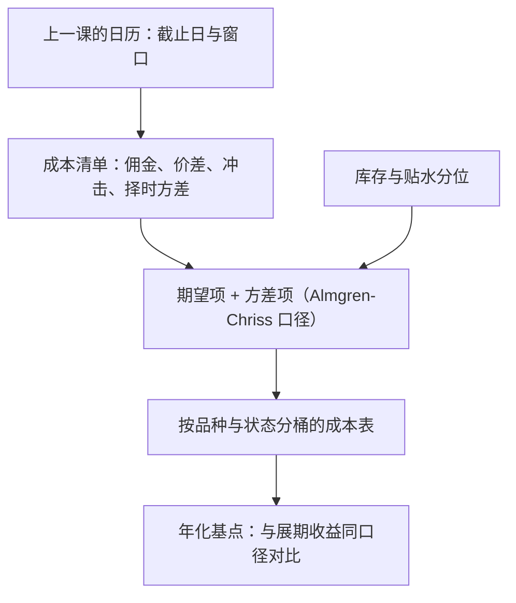
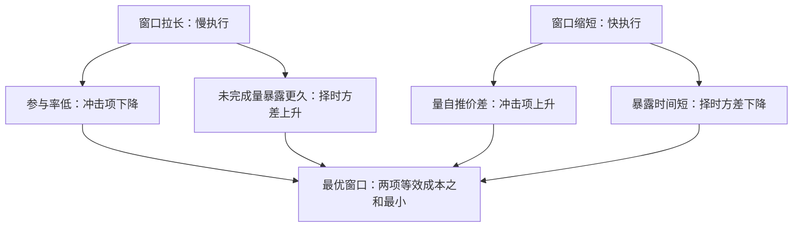

# 展期成本的建模

展期成本不是一次佣金，而是一张在窗口内分期兑付的账单：两条腿的价差、日历价差自身的宽度、冲击，以及没走完之前价差自己动的方差。

<footer>—— 据 Almgren and Chriss, Journal of Risk, 2000 的执行缺口口径整理；滚仓窗的冲击证据见 Bessembinder, Carrion, Tuttle and Venkataraman, JFE, 2016</footer>

[上一课](/quant/ft-roll-calendar-deep)把展期日历钉成一张表：截止日、切换判据、窗口长度。日历回答什么时候必须走，没有回答走这一趟值多少。缺口是价格账：同一条日历，一次走完与分五日摊薄、在官方日走与提前一周走，成本差得出几倍。[展期收益](/quant/roll-yield)已经把收益拆成现货腿与展期腿；本课写对称的成本账单，把它建成期望与方差两项，供下一课的执行方案优化。

## 问题

成本清单先列全。显性项只有佣金与交易所费用；准显性项是两条腿的半价差与日历价差报价自身的宽度；隐性项是冲击（你的量自己推的价差）、逆选择（窗口内与你同向的被动流让对手提高报价）、以及择时风险——未完成量暴露在价差波动下的方差。错法一：只拿佣金当成本，严重低估，商品远月腿的宽度加滚仓窗冲击常是佣金的十倍以上。错法二：把成本当常数。低库存年份的日历价差波动与宽度系统性更高（Ng 与 Pirrong 对金属的证据），滚仓窗内又比平日宽——常数模型会在最需要降速的年份把你推向高速执行。

数字实例：某商品期货佣金约万分之 0.5，而远月腿半价差加滚仓窗冲击合计常到万分之 5 以上——只记佣金就把成本低估一个数量级，「哪个方案更便宜」的排序也随之全错。

### 期望与方差分开记

参照 Almgren 与 Chriss 的执行缺口口径，展期总成本写成

$$
C \;=\; \underbrace{\tfrac{s_1+s_2}{2}+\eta(q,V)}_{\text{价差与冲击（期望）}}\;+\;\underbrace{\sigma_{\mathrm{sp}}\sqrt{\tau}}_{\text{择时风险（方差）}}\;+\;\text{佣金},
$$

其中 $s_1,s_2$ 是两腿半价差，$\eta$ 随参与率 $q/V$ 上升，$\sigma_{\mathrm{sp}}$ 是日历价差波动，$\tau$ 是执行期长。前一项是期望损失，后一项是方差；风险厌恶把方差折成等效成本后，最优窗口长度才存在——摊薄降冲击、抬方差，两端拉扯。

直觉类比：摊薄像搬一屋子书下楼——一次全搬完（快）累得腰疼（冲击大），一本一本搬（慢）路上失手摔书的概率不断累积（择时方差大）。箱子装多少最合适，取决于你有多怕摔：这正是「风险厌恶把方差折成等效成本」的含义。

直接成本应优先读日历价差的合成报价（买远卖近一笔成交），而不是两条腿各自报价的差。分开报价会把你自己的腿间冲击记两遍，把价差单的内部化好处记漏。

## 方法

先固定参照物：以「什么都不做」为基准（到期强平或被指派交割的后果），任何方案的成本相对它计。然后按品种建成本表：平日的两腿半价差、滚仓窗内的宽度与深度、日历价差的历史波动，按库存分位或贴水分位分桶给出——状态依赖留给第四课深化。年化口径统一：成本除以名义再折成年，才好与展期收益的年化斜率对着看。最后给冲击项定函数：参与率翻倍，冲击至少接近翻倍，线性近似够用；模型要的是方案排序正确，不是逐基点精确。

回测与实盘用同一张表：纸面回测若在结算价上瞬间换月，等于宣布冲击为零，展期腿收益会系统性虚高——这与[展期收益](/quant/roll-yield)对会计口径的警告同源。

## 机制

远月腿更贵的机制是深度分层：远月成交稀疏、做市存货风险高，宽度是补偿；「躲滚仓去更远合约」的策略先付这笔流动性折扣。窗口内成本状态依赖的机制是可预测流量：被动滚仓的方向事先公开，流动性供给者在窗前提价、窗内与被动者成交，宽度与冲击因此是日历的函数——[展期成交量与持仓](/quant/roll-volume-oi)已把这条订单流写成证据。逆选择的机制是同向性：你在窗内卖近买远，与指数同向，对手会把你的单当成知情于日历的流量定价。择时方差要折成成本，是因为它在实盘里以坏时点的止损成交兑现，不是以期望兑现。

常见误区：回测在结算价上「瞬间换月」，等于宣布价差、冲击、择时方差三项全为零，展期腿收益系统性虚高。实盘每期多付的几个基点逐年累计，正是回测与实盘收益差的主要来源之一。

## 边界

成本模型对上的是期望与方差的排序，不是保证：停板、负油价、交割地库存耗尽的日子在模型外，那些日子该触发的是停机规则。冲击函数用自己账户的成交记录校准，别人的 TCA 不能直接搬。会计上把实现展期与纸面斜率分开记账，否则成本模型的误差会藏进「模型误差」。本课不决定方案：单笔价差单、分腿、阈值触发怎么选，是下一课移仓执行的题目。

## 小结

- 展期成本是账单不是佣金：两腿半价差、日历价差宽度、冲击、择时方差，四项分开记。
- 按 Almgren–Chriss 口径写成期望项加方差项；风险厌恶折算后方差才能与冲击比较。
- 成本状态依赖：滚仓窗内更宽，低库存年份价差波动更高，常数模型在最贵的时候错得最狠。
- 优先用日历价差合成报价估直接成本；回测禁止结算价瞬间换月。
- 出处：Almgren and Chriss, *Journal of Risk*, 2000；Ng and Pirrong, *Journal of Business*, 1994；Bessembinder, Carrion, Tuttle and Venkataraman, *JFE*, 2016。
