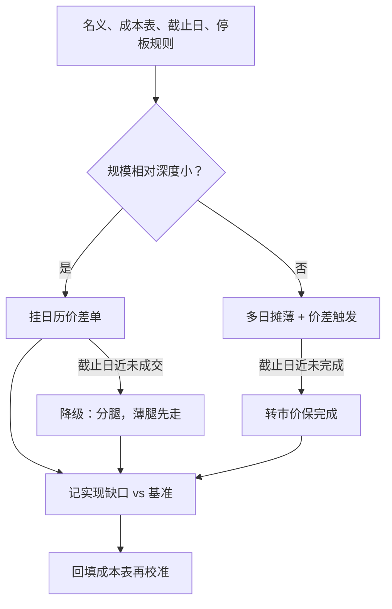

# 移仓的执行

移仓不是两笔交易，是一笔跨期交易的两条腿；把它拆开下的每一刻，你都在赌一条本想中性持有的价差。

<footer>—— 据 Almgren and Chriss, Journal of Risk, 2000 与 Harris, Trading and Exchanges, 2003 整理；滚仓窗流动性的证据见 Mou, 2011 与 Bessembinder, Carrion, Tuttle and Venkataraman, JFE, 2016</footer>

[上一课](/quant/ft-roll-cost-modeling)把展期成本写成期望与方差两项：价差、冲击、择时风险。缺口是把账单变成动作：同一张成本表下，一次成交、分腿、多日摊薄、阈值触发，哪个方案真的落在表上？执行层一旦随手，成本模型的精度只是自我安慰。本课写移仓怎么下：方案族、腿的次序、与基准的偏差记录。

## 问题

方案族有三支。其一，日历价差单：把卖近买远作为一笔价差单报进交易所，成交原子，交易所常对构成价差的持仓给保证金减免；代价是价差单的对手薄，大额挂单会挂在书里等波动。其二，分腿：两腿各自下单，可吃各自的深度，但在两腿成交的间隔里，仓位带价差敞口——你赌的是价差不动。其三，多日摊薄：把窗口拉长降冲击，代价是上一课的择时方差按 $\sqrt{\tau}$ 增长。

错在哪：先动厚腿，薄腿的价格等着你，价差在你腿间跑掉；全部挤在官方指数日成交，与被动流同向抢宽度——[展期成交量与持仓](/quant/roll-volume-oi)已证明窗口内供给弹性决定冲击大小；没有停板预案，一条腿被锁在涨跌停里，价差仓位瞬间变方向仓位。

### 腿的次序与触发

分腿时先走难走的腿：深度薄、宽度宽的那条先成交，厚腿随后用限价或价差触发条件收。理由是信息不对称的方向——薄腿的成交对价差的冲击大，先锁它，剩下的敞口在容易对冲的一侧。多日摊薄配阈值触发：价差相对上一课的公允参照便宜时加速、贵时减速，把窗口的形状交给市场定价，而不是均匀分配。每一步记实现缺口：相对基准（如官方日的价差结算价，或窗口起点中间价）的差，分日、分腿入账。

交易所价差单的保证金减免不是免费的流动性：价差单成交慢，挂着等成交期间你的移仓并未完成，截止日约束（第一课的日历）仍在收紧。挂价差单可以，但要在日历上预留「未成交则转分腿」的降级路径。

## 方法

把方案写成决策规则而不是当天的心情。输入：名义规模相对窗口深度、成本表、截止日、停板规则。输出：方案与参数——摊薄几日、每日参与率上限、价差触发的带宽、转分腿的触发价。规模小且价差单流动性够，价差单一次成交；规模大，摊薄加触发；截止日逼近且未完成，转入市价保完成——确定性与成本的取舍在截止日前面让路。事后核对账：期望成本（模型）对实现缺口（账本），偏差进入成本表的再校准，这正是上一课留的接口。

## 机制

摊薄降冲击的机制是市场深度的自我修复需要时间：参与率低，做市与套利者有间隙回补存货，你的临时冲击不转成永久冲击；代价是敞口时间变长，方差按执行期平方根增长——Almgren 与 Chriss 的最优解正是这对拉扯在给定风险厌恶下的驻点。薄腿先走的机制同上：冲击沿流动性差的腿传导进价差，先成交它等于把不可控的部分先定价。与指数错日的机制是[展期成交量与持仓](/quant/roll-volume-oi)的供给侧：别人必须走官方日，你不必，你提前或推后，就在向同向拥挤者卖流动性，冲击成本的一部分变成你的收入。

## 边界

跨交易所、跨时区的品种（伦敦金属对 COMEX、境外指数对中金所）价差单不可用，分腿是常态，腿间风险要单独限额。停板与涨跌停制度下，「保完成」可能做不到，预案要写明锁腿后的对冲工具（相关品种或期权）。价差保证金减免在交割月会被取消，别按窗内保证金外推。纸面回测不能假设价差单按报价全成：价差单的成交率本身是待估参数。本课执行的是给定状态下的方案；库存与仓单如何改变方案，下一课再探。

## 小结

- 移仓方案族三支：日历价差单、分腿、多日摊薄；原子性、深度、择时方差三者换手。
- 薄腿先走，厚腿收尾；摊薄配价差触发，窗口形状交给市场定价。
- 每次移仓记实现缺口并回填成本表，执行与建模闭环。
- 截止日约束优先于成本优化：临近时确定性让成本让路，停板预案先写好。
- 出处：Almgren and Chriss, *Journal of Risk*, 2000；Harris, *Trading and Exchanges*, 2003；Mou, 2011；Bessembinder, Carrion, Tuttle and Venkataraman, *JFE*, 2016。
