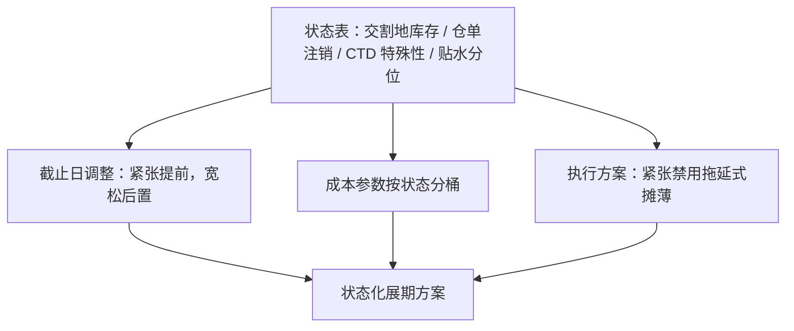
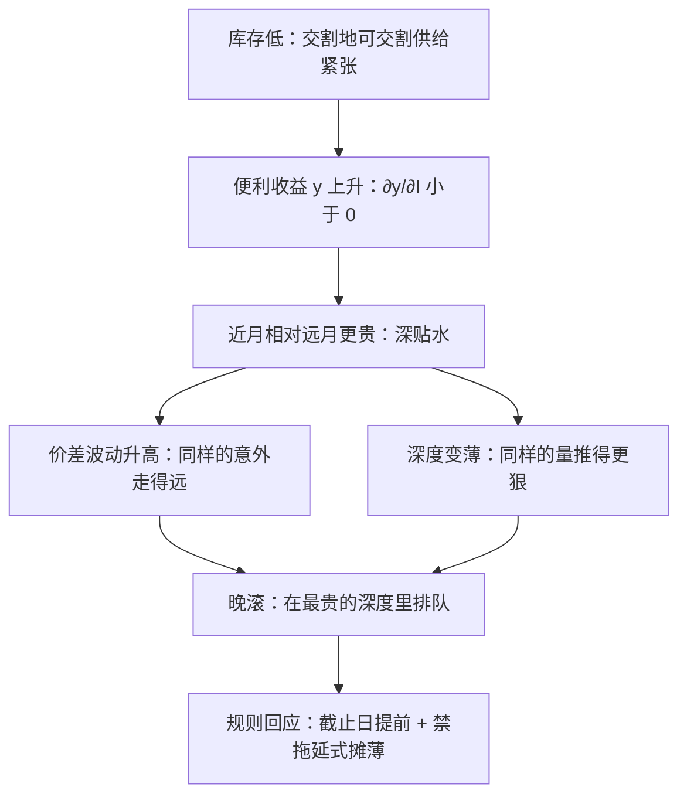

# 展期与库存再探

日历说哪天必须走，库存说哪天值得走；把两个变量写进同一条规则，移仓才从行政动作变成有观点的交易。

<footer>—— Working, The Theory of the Price of Storage, AER, 1949；库存与期货溢价的证据见 Gorton, Hayashi and Rouwenhorst, Review of Finance, 2013；Ng and Pirrong, Journal of Business, 1994</footer>

[上一课](/quant/ft-roll-execution)把移仓写成方案族：价差单、分腿、摊薄加触发，执行与成本表闭环。机制单元至此给了日历、成本、执行三件工具，但它们还是状态盲的——同一套规则跑在满仓年份与挤仓年份，参数不该相同。本课把主干写过的库存机制重新插回前三课：[库存报告与曲线](/quant/inventory-curve)把库存当成曲线的状态，本课问这个状态如何改截止日、成本参数与执行方案。

## 问题

状态盲的日历会在最差的窗口执行。低库存、交割地仓单被注销的年份，截止日附近的近月正是挤仓高发段：价差脱离仓储带、深度消失，机械摊薄把自己摊进风暴。反向的错误在深 contango 年份：高库存使远月升水接近全额持有成本，早滚等于在斜率最陡处锁价，晚滚还能收几天便宜——基准日历对此一律照旧。错在哪：把「什么时候必须走完」当成「什么时候走」，把无条件平均的价差宽度与波动当成成本表的参数。

术语翻译：「状态盲」就是规则里没写进「现在库存是高是低」这个条件。好比天气预报只告诉你本地年均降水 800 毫米，却不说今天下不下雨——平均值对今天的出行毫无用处，无条件平均的成本参数对这一期的移仓也毫无用处。

第二层是「相关库存」的识别。[库存报告与曲线](/quant/inventory-curve)已警告：全国周报不等于交割地库存，总库存不等于注册仓单。近月的挤仓风险跟着交割地可交割供给走。用错状态变量，调整方向整个反掉。

### 各板块的状态变量

商品读交割地库存与注册仓单，金属加读仓单注销率；国债期货没有库存报告，对应物是 CTD 券的回购特殊性与可获得量，见[最便宜可交割](/quant/ctd-cheapest)——可交割供给紧，近月对空头的交割选项贬值；股指期货读分红剩余与贴水分位，见[股指期货与贴水](/quant/cn-stockindex-basis)。同一个「可交割供给紧张」的抽象，落在三个板块是三套数据。

仓单注销（cancelled warrant）是挤仓前最便宜的信号：注销意味着有人把仓单转成提货意向。LME 市场惯用注销仓单占仓单比例做近月预警，比看总库存提前数日。

数字实例：某金属注册仓单共 10 万吨，注销比例从 5% 升到 25%，等于 2 万吨实货转成提货意向——可交割供给一夜少了五分之一，近月挤仓概率随之跳升。这比等下一期库存周报提前好几天。

## 方法

把状态写成第三张表：每品种列出状态变量、数据源与更新频率、分位口径（相对季节调整后的历史），然后三条调整规则。其一，截止日调整：可交割供给低于阈值分位，截止日提前；供给充裕且曲线深 contango，允许在窗口内后置。其二，成本参数调整：成本表按状态分桶取参——紧张状态下价差波动与宽度按高桶计，上一课的择时方差项随之放大，最优窗口自动变短。其三，方案调整：紧张状态禁用拖延式摊薄，改用[移仓的执行](/quant/ft-roll-execution)的价差触发加降级路径。

## 机制

机制仍是 Working 的仓储函数 $\partial y/\partial I\lt 0$：库存低，便利收益高，近月相对远月贵且对冲击敏感——同样的意外能让价差走更远，Ng 与 Pirrong 在金属上写的就是低库存、高价差波动这一通道。读成执行语言：紧张状态下，晚滚持有的不是「等待期权」，而是「挤仓空头的空头」——你在最贵的深度里排队。Gorton、Hayashi 与 Rouwenhorst 的证据补上另一层：库存分位还改变展期收益的条件期望，所以状态不只改「怎么走」，也改「该不该持有近月」——深贴水、低库存时近月的展期收益值得多持几天，contango 高企时近月只是负 carry 的载体。三条规则是同一机制在日历、成本、执行三个表面的投影。

直觉类比：库存是市场的减震器。满仓年份，一次供给意外被库存垫住，价差晃一下就回来；低库存年份减震器没了，同样的冲击直接把近月价差颠飞——「低库存、高价差波动」说的就是这条通道。

## 边界

状态数据滞后：库存周报、仓单日频但披露有时滞，分位要在 vintage 上算，否则回测用了未来数据。别过度反应：一次库存意外不是挤仓前兆，阈值分位过滤的是持续状态。政策库存（战略储备释放）不进商业仓单逻辑，[库存报告与曲线](/quant/inventory-curve)已单列。也别把「库存」扩到没有库存的市场：指数与利率期货用的是各自的可交割供给代理，硬套仓储公式是把隐喻当机制。本课管机制层的状态注入；策略层怎么用这些自由度，下一课进入指数展期。

## 小结

- 日历、成本、执行三件工具都要状态化：截止日、分桶参数、方案约束随库存状态调整。
- 状态变量按板块选对：交割地库存与仓单（商品）、CTD 特殊性（国债）、贴水与分红剩余（股指）。
- 机制是 $\partial y/\partial I\lt 0$：低库存使价差波动与宽度上升，晚滚等于持有负向选择权。
- 库存分位同时改条件展期收益——状态也回答「该不该持有近月」。
- 状态在 vintage 上算，阈值过滤持续状态；政策库存与无库存市场不套仓储公式。
- 出处：Working, *AER*, 1949；Ng and Pirrong, *Journal of Business*, 1994；Gorton, Hayashi and Rouwenhorst, *Review of Finance*, 2013。
