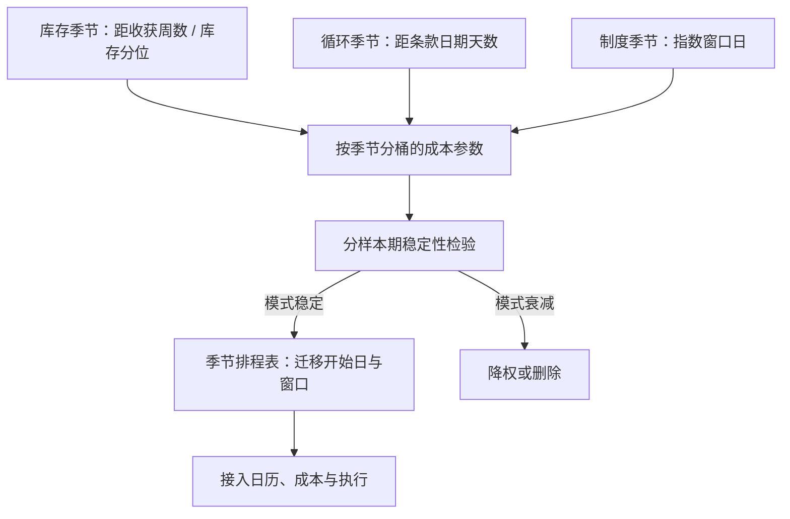

# 季节性展期模式

展期的季节不止一种：库存有季节，合约循环有季节，制度日程也有季节；三张日历叠起来，才知道哪些规律可交易，哪些只是日历的影子。

<footer>—— Working, AER, 1949；季节与库存的证据见 Gorton, Hayashi and Rouwenhorst, Review of Finance, 2013；基差的预测内容见 Fama and French, Journal of Business, 1987</footer>

[上一课](/quant/ft-calendar-arb-deep)把跨期价差写成带外加状态矛盾的判定，其中「避开滚仓窗与交割窗」一条还未展开，正是本课的对象。[季节性展期](/quant/seasonal-roll)已把商品库存季节写成一课：收获与取暖季经库存改曲线。本课把「季节」扩展为模式语言：不只问曲线形态的季节，也问展期活动本身的季节——迁移集中在哪些周、价差在哪些月份宽、哪些时点必须让路。

## 问题

展期活动的季节成分有三类。其一，库存季节：收获、取暖、驾驶季经库存路径改曲线形态与近月波动，[季节性展期](/quant/seasonal-roll)与 Gorton–Hayashi–Rouwenhorst 的证据都在这层。其二，合约循环季节：股指到期周五、国债季月的 CTD 切换段、商品的交割通知月，是制度安排的周期——迁移与价差波动跟着合约日历走，跟天气无关。其三，制度季节：指数年度调整、固定滚仓窗、保证金分档，规则可预期，流量就聚集，Mou 记录的抢跑前移是它的影子。

错在哪：三类机制塞进同一个月度哑变量回归，样本内显著、样本外消失；把循环季节当库存季节交易，会在交割月前做多本该避开的近月；把制度季节当恒定，规则一改模式立即失效。

### 事件窗对齐而不是墙钟月份

量化的正确对象是相对刻度。库存季节对齐「距收获的周数」或相对五年同期的库存分位；循环季节对齐「距最后交易日 / 通知日 / 到期周五的天数」；制度季节对齐指数方法论规定的窗口日。在各自刻度上做事件窗统计：宽度、深度、迁移完成度按相对日聚合，分制度断点前后检验稳定性，模式不重现的不入排程表。

国债期货的季月循环给出循环季节的干净样本：CTD 切换与移仓集中在换月前后各一两周，价差波动与久期跳变同时出现——这与天气无关，与转换因子和回购特殊性有关，见[最便宜可交割](/quant/ctd-cheapest)。

## 方法

产出物是一张季节排程表，与前几课对接。第一步，按品种列出三类季节的状态变量与刻度：库存分位（商品）、距条款日期天数（全部）、指数窗口日（被动品种）。第二步，事件窗统计：每个相对刻度上算[展期成本的建模](/quant/ft-roll-cost-modeling)那套参数——两腿宽度、日历价差波动、深度，形成按季节分桶的成本表，替代年度平均。第三步，排程：迁移开始日避开最贵的相对日，截止日照第一课的日历，触发阈值照第四课的状态。第四步，稳定性：每季度重估一次，分样本期报告各模式的显著性，显著衰减的模式降权或删除。

## 机制

三类季节的机制层次不同。库存季节是基本面：Working 的仓储函数使库存的条件均值随日历走，基差因而含可预期的季节成分，Fama 与 French（1987）在农产品上验证过基差的预测内容。循环季节是制度性聚集：合约循环把移仓需求压缩在固定时段，深度与宽度按合约日历而非墙钟重新分布——它可预期、可避开，但不提供方向。制度季节是规则与流量的合谋：窗口写入方法论，流量可预测，供给者与抢跑者把高峰前移；规则改，季节跟着改。三层只有第一层改条件期望，后两层改的是执行的时机与成本——把它们分清，季节信号才不会被错用成方向预测。

## 边界

制度漂移是主要威胁：种植带北移与气候改变农业季节，页岩改写天然气的季节振幅，指数规则修订重排窗口季节。季节是条件均值，不是每年的保证：报告意外与天气冲击随时覆盖季节基线。数据不足的月份与品种不硬估——三十个观测的「季节模式」是噪声。本课输出的是排程与分桶参数，不重新定义展期收益；库存季节对合约选择本身的含义，以[季节性展期](/quant/seasonal-roll)的口径为准。

## 小结

- 展期的季节分三类：库存季节改曲线与波动，循环季节压缩迁移时段，制度季节聚集流量。
- 量化用事件窗对齐相对刻度（距收获、距条款日期、距窗口日），不用墙钟月份哑变量。
- 产出是季节排程表加按季节分桶的成本参数，接入日历、成本与执行三张表。
- 分样本期检验稳定性；制度修订与气候漂移都会使旧季节失效。
- 只有库存季节改条件期望，循环与制度季节改执行时机——季节信号不是方向预测。
- 出处：Working, *AER*, 1949；Fama and French, *Journal of Business*, 1987；Gorton, Hayashi and Rouwenhorst, *Review of Finance*, 2013；Mou, 2011。
