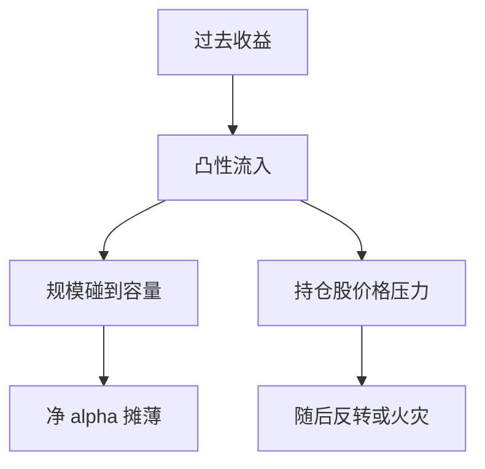

# 基金流与回报追逐

资金对过去业绩的反应是凸的：大赢家大进、中庸几乎不动、输家流出有限；于是行业的增量资金总是在追已经变贵的策略。

<footer>—— Sirri and Tufano, Costly Search and Mutual Fund Flows, Journal of Finance, 1998；均衡摊薄见 Berk and Green</footer>

[上一课](/quant/performance-persistence)把弱持续性留给资金流来完成故事。本课的缺口是**流本身**：申购赎回如何依赖过去收益，以及流如何反作用于价格与随后收益。Sirri–Tufano 记录凸性的业绩–流关系；Chevalier–Ellison 把它接到锦标赛激励。Coval–Stafford 写流出引发的被迫交易与火灾抛售。Lou 把流导致的持仓联动写成可预测的价格压力。本课接策略地图里的被动流与主题 ETF：零售与机构的主动流是同一管道的另一条。

## 问题

凸性意味着：去年的明星基金吸收不成比例的 AUM，容量约束立刻收紧，预期净 alpha 下降——这正是 Berk–Green 的机制。问题是可交易性：能否做「买流入、卖流出」？短期价格压力可能为正（流入推高持仓股），随后反转。这与 [指数纳入](/quant/index-inclusion-passive-flow) 同类，但流是内生的业绩函数，前视偏差更大。回测必须用滞后已公布的 AUM 与持仓，不能用期末同时流。

锦标赛：年中落后的经理加大风险，见激励费课的水位逻辑。流的凸性加 HWM，使行业在牛市同步加杠杆。

### 流不是 alpha 信号本身

把「聪明钱」流当因子，常常只是动量加规模。正交后再看残差。机构单独账户与共同基金的流信息含量不同，不可混成一个「资金流因子」去对抗价值。

火灾抛售提供流动性补偿，不是免费。承接赎回的人吃冲击、借券与污名风险，夏普要用事件窗口的缺口情景，不能用平静期。

## 方法

度量：滞后收益 → 流的回归（分段、凸性）。价格：流入基金重仓股的随后收益，控制动量。策略：只在可观测滞后上交易，容量按基金持仓可交易性。风险：同风格基金相关流（主题课）。与回购流、指数流分列归因。

## 机制

搜寻成本与广告使投资人追明星（Sirri–Tufano）。技能有限时，AUM 上升摊薄（Berk–Green）。被迫交易把流写成价格（Coval–Stafford）。于是业绩持续性在可投资端消失：你看到的热手，已经在吸收会毁掉热手的钱。

## 边界

本课不写如何利用未公开申赎清单。ETF 一级申赎与共同基金零售流机制不同，见被动流课。对冲基金的锁定期推迟流，改变凸性形状。

## 小结

- 业绩–流关系是凸的，增量资金追明星、摊薄技能。
- 流造成的价格压力可测，但须用滞后数据。
- 火灾抛售是流动性补偿，不是平静期 alpha。
- 出处：Sirri and Tufano, *JF*, 1998；Berk and Green, *JPE*, 2004；Coval and Stafford；Lou 对持仓流。
