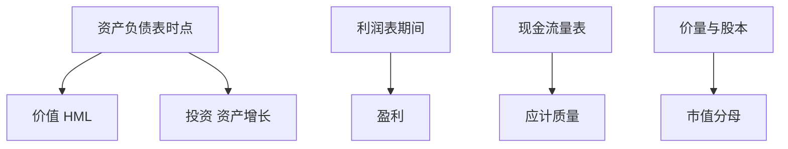

# 基本面因子从哪张表来

价值取资产负债表的权益，盈利取利润表的流量，投资取资产或资本开支的变化，质量常取应计这条勾稽差；字段来源一错，因子名字就只是标签。

<footer>—— 据 Fama and French, Journal of Financial Economics, 1993、2015；Hou, Xue and Zhang, Review of Financial Studies, 2015 整理</footer>

到上一课[行业分类与可比公司](/quant/industry-classification)为止，报表身份、PIT、幸存者、质量与预期都已具备。本课把常用基本面因子指回具体表与字段，当作本课程的索引，而不是再发明一套因子动物园。后课分部、租赁、少数股东只修正这些字段的口径，不改索引逻辑。

## 问题

Fama–French 三因子的 HML 用账面权益 / 市值：账面来自资产负债表（Compustat 权益类字段），市值来自价量库，六月形成、账面滞后一年报。五因子把盈利（利润表，常为营业收入减费用后的经营利润一类口径）和投资（总资产增长或资本开支相关变化）加进来。Hou–Xue–Zhang 的 q 因子用盈利与投资，字段选择与 FF 不完全相同。缺口是：每个因子先写**哪张表、哪个期间、哪个可用日期、哪个宇宙**，再写分位断点。否则「复制 HML」只复制了名字。

质量/应计来自本课程早已钉死的 $NI-OCF$ 或营运资本应计，不是五因子里的盈利。盈利高可以应计也高；来源不同，正交时才有意义。

### 因子名不是会计恒等式

「盈利因子」可能用 ROE、ROIC、营业利润/账面，分母有时是权益、有时是资产。名字相同，表不同。本课要求管道里每个信号有一张来源卡：表、字段、缩放、PIT、行业调整与否。没有来源卡，后课无法修正租赁资本化或少数股东——因为不知道该改分子还是分母。

French 数据库的 HML 说明明确写了 Compustat 账面与 CRSP 市值的匹配与滞后。复制因子等于复制这份说明，不是复制「低市净率」口诀。

## 方法

把主干信号按表归类。资产负债表时点：账面权益、总资产、净现金、递延税、商誉（用于调整）。利润表期间：收入、经营利润、税前/税后利润、减值与一次性项目。现金流量表期间：经营现金流、资本开支、分红与回购。价量库：市值、股本、退市回报。分析师库：共识与修正。每一项套用已有规则：可用日期、当时宇宙、股本口径、行业键。

形成日历与 Fama–French 对齐时：年报字段用 $t-1$ 财年、在 $t$ 年 6 月才进入；季报字段用各自可用日期。不要把季报盈利塞进「官方 HML 复制」还声称一致。

## 机制

因子收益对字段选择敏感，因为会计身份会把同一经济冲击记到不同表。并购抬高资产（投资）与商誉（账面），不一定抬高经营现金流（质量）。若投资因子用资产增长、价值用含商誉账面、质量用应计，三者同时被并购推动，看起来像三个 alpha，其实是一次收购会计。来源卡让你看见共线来自同一张表的同一事件。后课租赁入表会改资产与负债，从而同时改投资与杠杆；少数股东会改「归属母公司」的盈利与权益。索引先在，修正才有落点。

本课不进入权重量化，也不把因子当成神经网络特征工程。对象仍是可交易的会计字段与当时信息集。

每条信号一张来源卡：表、字段、缩放、可用日期、宇宙、行业键、NCI 与税务口径。复制 French 库 HML 时，对照其账面定义与六月形成，不要用「低市净率」口诀替代。盈利与应计不要共用同一个利润字段还起两个名字。并购年、准则切换年在卡上留标记，便于后课租赁与商誉修正时知道该改哪一行，而不是再发明一个因子。

## 边界

不估计全部异象清单，不比较哪些因子「还有效」。分部与地域、租赁表外、合并少数股东是本课序剩下三课，专门修口径。后课默认：提到任何基本面因子，都能指回表、字段、PIT 与宇宙；无法指回的，不当作可复制信号。

后三课只修正口径：分部改暴露，租赁改资产与负债，NCI 改要求权层。索引本身——价值来自账面、盈利来自利润表、投资来自资产变化、质量来自应计——不再改名。无法指回来源卡的信号，后课默认不当作可复制因子。

## 小结

- HML 来自账面（表）对市值（价量），六月滞后是构造的一部分。
- 盈利来自利润表流量；投资来自资产或资本开支变化；质量来自应计差。
- 名字相同可以来源不同；来源卡先于分位断点。
- 同一并购可同时推动价值、投资与质量，共线要能指回字段。
- 后三课只修正口径，不改这张索引。
- 出处：Fama and French (1993, 2015)；Hou, Xue and Zhang (2015)；French 数据库构造说明。
