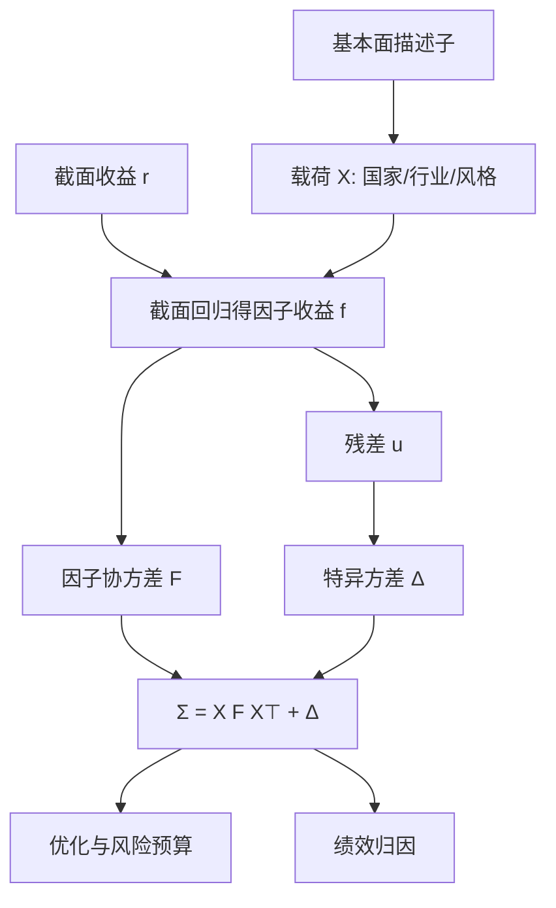

# Barra / 基本面风险模型

风险模型要回答的不是明天谁会涨，而是组合收益的协方差从哪些可命名的共同源里来；把行业、国家与风格写成因子，特异风险留给对角。

<footer>—— Rosenberg 以来的基本面因子协方差，今称 MSCI Barra</footer>

组合优化、指数增强与绩效归因，都需要一张股票协方差矩阵。直接用历史收益估 $N\times N$ 的样本协方差，在 $N$ 上千、有效样本只有两三年时是病态的。Barr Rosenberg 在 1970 年代把基本面特征写成因子载荷，用低维因子协方差加特异方差去逼近。后来的 BARRA、MSCI Barra USE3/USE4、GEM 与各市场本地模型（如 CNE），走的都是这条基本面风险模型（fundamental risk model）的路：载荷可解释，因子有名字，风险预算可以对着风格和行业说人话。

## 问题

股票 $i$ 的超额收益写成

$$
r_i = X_i^\top f + u_i,
$$

其中 $X_i$ 是载荷向量（行业哑变量、国家、风格描述子），$f$ 是因子收益，$u_i$ 是特异收益。组合权重 $w$ 的预测方差为

$$
w^\top \Sigma w = (X^\top w)^\top F (X^\top w) + w^\top \Delta w,
$$

$F=\mathrm{Cov}(f)$，$\Delta$ 近似对角。问题从「估 $\Sigma$」变成三块可维护的工程：怎么定义 $X$，怎么估 $F$，怎么估特异波动。相对纯统计 PCA，基本面模型牺牲一部分样本内拟合，换取稳定的经济含义与跨期可比的归因。

若没有这张结构，优化器会在噪声相关上下重注：两只历史上碰巧一起动的股票被当成对冲对，样本外一起崩。Grinold 与 Kahn 把主动组合管理写成「对风险模型负责的 alpha」，不是修辞——没有可信的 $\Sigma$，信息系数再高也无法变成可执行的权重。

### 载荷必须先于收益

基本面模型的关键约束是：$X$ 在期初已知。行业分类、账面市值比、历史波动、动量，都用当时可获得的数据。因子收益 $f$ 则由截面加权回归从 $r$ 里拆出，而不是先对收益做特征分解再事后贴标签。这样归因时可以说「这段回撤来自动量因子」，而不是「来自本周符号又翻了的第三主成分」。

Barra 不是一个因子，是一套模型族。美国、全球、中国的风格个数、行业分类、半衰期与调整项不同。口称「Barra 中性」却不写模型版本，暴露数字无法审计。

## 方法

因子结构。典型拆分是：市场或国家、行业、风格。风格包括 beta、市值、非线性市值、价值、动量、波动、流动性、盈利、成长、杠杆等。描述子往往先在截面标准化，再对行业与市值正交，避免价值因子里夹进银行、动量里夹进小票。行业常用完整的哑变量集，并处理线性相关（市场加全部行业会共线）。

因子收益。每日或每月做一次截面回归，$r = X f + u$，权用市值或根号市值，有时对特异波动做 GLS。得到的 $f_t$ 序列再估 $F$。协方差常用指数加权移动平均，半衰期几十个交易日量级，并对 $F$ 做特征值调整、Newey–West 式的序列相关修正。Menchero 等在 MSCI 方法论里系统写过 Eigenfactor 调整：样本特征值过大的方向要压缩，过小的要抬升。

特异风险。$\Delta_{ii}$ 不能只用短期实现波动。基本面模型通常把特异波动对一组风险特征回归（规模、波动、流动性），再 Bayesian 收缩到截面预测值，并单独处理发行、停牌、结构性断点。非对角的特异协方差偶尔以行业内残差相关的形式加入，但主体仍是对角——否则又回到高维估计。

### 优化与归因共用一套 $X$

风险预算把 $X^\top w$ 当成暴露向量，限制某些风格接近基准。归因则把已实现收益拆成 $\sum_k (X^\top w)_k f_k$ 加特异项。若研究用自制因子、风控用供应商模型，两边的 $X$ 旋转不一致，alpha 会漏到「无法解释」。工程上应让选股中性化所用的行业与风格，尽量是风险模型描述子的子集。

因子协方差的半衰期短，能跟上波动集群；载荷的定义应慢，才能让「动量」这个词今年和五年前指同一件事。快协方差、慢含义，是基本面模型相对 PCA 的产品差异。

## 机制

基本面模型能工作，是因为股票的共同变动确实沿着可观测特征走：同业、同规模、同杠杆的公司对宏观冲击的反应更接近。Chen–Roll–Ross 的宏观因子与 Rosenberg 的特征因子是同一观察的两面——宏观冲击通过公司特性进入截面。特征比宏观变量更容易每日更新、也更容易对每一只股票赋值。

估计理论上，这是有约束的因子模型：载荷被钉在 $X$ 上，因子收益是截面 GLS 的结果。当 $X$ 设错（漏掉真实共同源，或放入无关列），$F$ 会把误差赶进 $u$，特异风险被低估或出现假的残差相关。因此模型要定期做因子检验：增加候选风格是否显著降低残差相关，行业切分是否过细到噪声。

### 与 alpha 模型的边界

风险因子不必是定价因子。动量在风险模型里是为了解释共同波动，即使你相信动量有 alpha，仍可能对它设置暴露上限——因为拥挤时它的 $F_{kk}$ 会升。反过来，没有写进 $X$ 的选股信号，其波动会进入 $\Delta$ 或漏到最近的风格上，优化器会误判对冲。新 alpha 要先做正交化，再决定是进入风险模型还是只留在预期收益。

## 边界与工程取舍

供应商模型是黑盒：描述子细节、特征值调整、新股处理都在手册里，但仍有版本漂移。自建模型透明，却要长期维护行业分类映射、财报时点与异常值规则。无论哪条路，最大的失败模式是用风险模型当收益模型：把低风险的风格当成免费 alpha，或把因子收益的历史均值外推。$F$ 描述的是二阶矩，不是 $E[f]$。

A 股还要处理涨跌停、停牌再开、北向与指数扩容。特异风险在这些事件上不连续，线性因子结构会暂时失效。另一边界是因子拥挤：当大量资金对着同一套 Barra 风格中性化，残留相关会从 $u$ 里冒出来，2007 年量化震荡就是统计套利策略在共同残差上踩踏。模型不会预先把「拥挤」写成一列，除非你另加。

验收风险模型不要看样本内 $R^2$ 最大化。看：预测跟踪误差与已实现跟踪误差是否校准、压力周因子贡献是否可解释、换一个行业分类暴露是否乱跳。校准比拟合重要。

## 小结

- 基本面风险模型用可观测载荷加低维因子协方差与特异方差，逼近高维股票 $\Sigma$，使暴露可命名、可约束、可归因。
- MSCI Barra 一类模型把国家/行业/风格写入 $X$，描述子常先标准化并对行业、市值纯化；因子协方差用 EWMA 并做特征值调整。
- 载荷须期初可观测；因子收益由截面回归拆出，这是它与 PCA 统计模型的根本差别。
- 风险因子不是定价承诺；优化与归因必须共用同一套 $X$。
- 版本、分类、半衰期与新股规则决定数字；用风险模型外推因子溢价是误用。
- 出处：Rosenberg 基本面因子模型传统；Grinold and Kahn, *Active Portfolio Management*；MSCI Barra 方法论（USE4 / GEM / 本地模型，含 Eigenfactor 等调整）。
