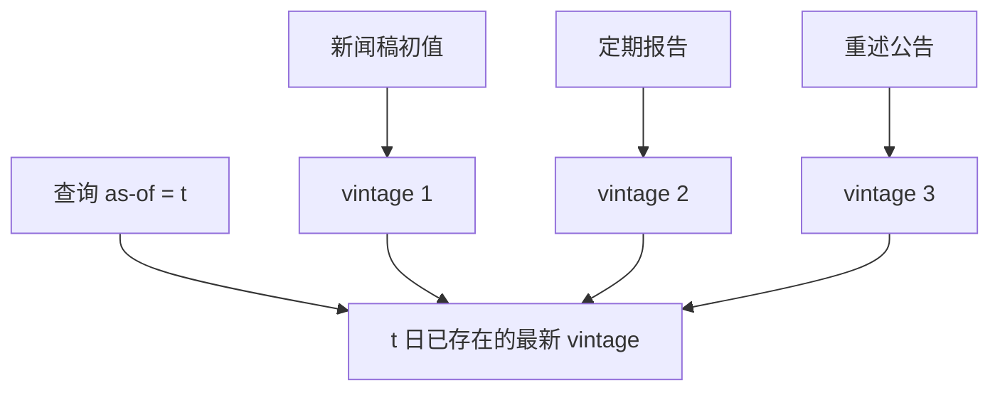

# 基本面数据与重述

财报有初值与此后多次重述。用今天的 Compustat 行去模拟十年前的决策，等于让当时的组合经理读到未来的更正。

<footer>—— Croushore and Stark, A real-time data set for macroeconomists, Journal of Econometrics, 2001；Hennes, Leone and Miller, The Importance of Distinguishing Errors from Irregularities in Restatement Research, TAR, 2008</footer>

[上一课](/quant/taq-processing)处理高频磁带。[CRSP 对齐](/quant/crsp-compustat)已要求按可知日连接会计。本课的缺口是**同一会计科目的版本**：重述、差错更正与舞弊更正。Hennes、Leone 与 Miller（2008）强调把差错与违规分开，否则重述样本的经济含义被混在一起。Croushore–Stark 在宏观上证明修订改变政策规则结论；微观会计同一机制。后课分析师共识是另一条「当时可知」的盈利路径，常比定稿更早。

## 问题

供应商终端里的盈利、营收、资产负债，默认是最新修订后的数字。点-in-time 数据库则保留每个字段的 `value`、`as_of`、`vintage`。没有 vintage，价值因子、应计、盈利动量都可能含前视：重述若把去年盈利调低，事后面板在「当时」就已经调低，策略会避开或做空一个当时市场上尚未知道的污点。问题是定义可知集：SEC 提交日、新闻稿日、供应商入库日，三者可以差很多天。应选用策略当时能订阅的那一个，并在文档里写死。

重述原因不同。会计差错、准则变化、与欺诈调查，对后续收益与诉讼风险不同。把所有重述当同一哑元，事件研究的平均处理效应没有对象。Hennes 等提供的分类是一种可引用的划分，不是唯一划分，但必须有划分。

### 初步盈利、10-Q/10-K 与供应商标准化

公司新闻稿的初步数、监管文本中的数、Compustat 标准化后的数，口径不同：非公认会计科目、一次性项目处理、合并范围。因子若混用 IBES 实际值与 Compustat，SUE 的分母会错。本课管供应商会计版本；下一课管分析师路径。两者的「实际盈利」字段不要同名不同义。

A 股对应的是公告日、定期报告、事后更正公告与问询函。更正公告是公开的 vintage。用最新年报回填三年前的季度因子，同样是前视。

## 方法

存储：会计事实表以 `(gvkey, period, item, vintage_ts)` 为主键。查询 API 只接受 `as_of`，返回当时已发布的最新 vintage。回测日 $t$ 的账面市值用 $t$ 日可知的账面，而不是用财政年度结束后供应商最终版。宏观对照：不要用修订后 GDP 去训当时的交易规则，Croushore–Stark 数据集是模板。

事件研究：重述公告日是事件，不是 `datadate`。分类：差错 vs 违规（或监管调查）。控制同期市场与行业。把重述当特征进入截面因子时，只能用公告后的信息，并注意稀疏与选择——会重述的公司不是随机样本。

### 与退市、并购的交互

重述常伴随退市或并购，链接表同时失效。流水线应在重述窗口检查 CCM 是否仍有效，避免把继承主体的新会计接到旧 permno 上。这是上一课链接问题的动态版。

## 机制

前视重述让策略在信息集之外选择。样本内 IC 变好，因为「质量」被未来的审计意见擦干净了。样本外失效，因为实盘读不到未来 8-K。宏观实时数据文献把这称为实时 vs 修订；交易台上名字叫 point-in-time。机制不新，只是会计科目比 GDP 更多、更易被终端「帮你更新」。

应计异常、盈利质量一类策略对会计应计定义敏感。定义若建立在最终版应计上，而交易建立在初值上，异常的可交易性被高估。应在 PIT 数据上重新估计，而不是只换一个供应商名字。

## 边界

本课不讨论如何利用未公开的重述信息或抢披露。供应商之间的标准化差异会使「同一科目」不可横比，对照见后课数据商。非美 GAAP/IFRS 切换是结构断点，须分段而不是静默重述。

## 小结

- 会计必须带 vintage；用最终版回测是前视。
- 重述要分差错与违规；事件日是公告日。
- 查询接口强制 as-of，与宏观实时数据同一纪律。
- 出处：Croushore and Stark, *Journal of Econometrics*, 2001；Hennes, Leone and Miller, *TAR*, 2008。
