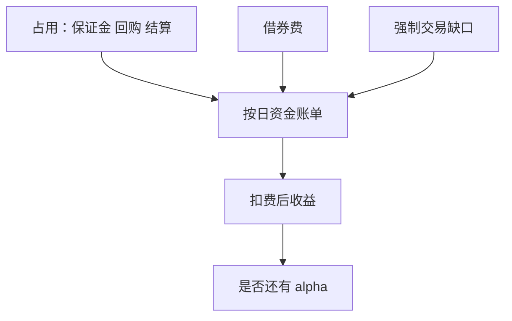

# 资金成本作为 alpha 底

纸面超额收益要先减去当时占用资金的成本，剩下的才可能是 alpha；成本随保证金、借券、回购与结算占用而变，不是一个常数无风险利率。

<footer>—— 据 Frazzini and Pedersen, Journal of Financial Economics, 2014；Brunnermeier and Pedersen, 2009 整理</footer>

到上一课[结算周期](/quant/settlement-cycle)为止，占用的来源已经拆开：股票维持保证金、强平缺口、借券费、回购 haircut、CCP 保证金、在途结算。本课把它们乘上**当时资金价格**，收成策略的底。后面事件课默认：事件收益若不算资金与可成交约束，只是研究 CAR，不是可交易 alpha。本课不重推各占用公式。

## 问题

因子回测常对超额收益相对市场或相对 Fama–French，分母是名义本金，分子不含融资。Frazzini–Pedersen 的 Betting Against Beta 把杠杆约束放进资产定价：受约束的投资者买高 beta，低 beta 需要杠杆才有吸引力。本课不复制该因子，只用同一思想：没有廉价杠杆，低波动多头与高换手多空的纸面夏普不可实施。缺口是给每条策略路径一条资金账单，账单用 PIT 利率与 PIT 占用，禁止用样本均值利率或用后来的政策利率回填危机月份。

无风险利率只覆盖「自有现金的机会成本」；杠杆腿还要加信用利差、special 费、保证金利息规则。

### Alpha 底不是无风险利率

把超额收益定义成 $r-r_f$ 只扣了现金的机会成本，没扣空头借券、没扣 haircut 上升导致的强制去杠杆损失。后者是路径依赖的，不能在期末用一个平均费率相减来替代——去杠杆发生在波动最高的日子，平均费率会低估。本课要求按日：占用$_t$ × 利率$_t$ + 借券费$_t$ + 已实现缺口。

同一策略在自有资金 100% 与杠杆 2 倍下，纸面 alpha 可以相同（若按名义缩放），扣资金后符号可以相反。报告时要声明资金来源。

## 方法

每日账单至少四项：（1）融资负债 × 当时融资利率；（2）空头市值 × 当时借券费；（3）CCP/期货保证金占用的机会成本或明确的保证金利息；（4）因 haircut/维持线/召回导致的强制交易，按缺口价计入，不摊进「成本率」。求和后从策略收益中扣除，再谈是否覆盖 Fama–French。利率与费率全部 as-of，危机月用危机月的 GC 与 special，不用十年均值。

若无法得到费率，给出上限/下限两套账单，而不是默认零。零是最强的前视：假设你永远是 GC、永远有无限授信。

## 机制

资金底解释了为何许多异象集中在难融资的一侧：纸面空头赚的是租金加价格，扣费后只剩价格，甚至为负。杠杆约束还改变组合形状：你无法按理论权重持有低保证金消耗与高消耗的名字，于是行业中性、价值多空在实施时偏向易融资端。财务课的质量空头与本课相接：低质量往往 special、haircut 高、公告跳空大，三条账单同时变厚。

后课事件策略换手更高、占用更短、但跳空更频。底的结构不变，只是缺口项权重大于借券项。

按日加总：融资负债×当时融资利率，空头×借券费，保证金占用×机会成本或保证金利息，外加已实现强平/召回缺口。全部 as-of。报告三列：纸面超额、$r-r_f$、扣完整账单后。零费率只作为对照。杠杆 1× 与杠杆 2× 分开报告，避免把不可得的杠杆夏普写进结论。事件策略同样走这张账单，只是缺口项权重大。

## 边界

不估计完整的中介资产定价模型，不把本课写成 BAB 因子复制。下一课起对象换成事件日历：业绩公告、并购、指数。后课默认：凡称可交易 alpha，已扣 PIT 资金账单；只报 CAR 的，须标明未扣资金与冲击。

后课事件策略换手更高，账单结构不变。凡称可交易 alpha，三列收益里至少要有扣完整账单的一列。零费率、常数杠杆、无缺口强平，从本课起视为制度前视，不是「简化假设」。财务质量空头与本课相接：special、高 haircut、公告跳空常同时出现。

## 小结

- 占用来源已拆开；本课乘上当时价格，收成账单。
- $r-r_f$ 不是完整的资金底。
- 按日 PIT 计费，不能用均值费率代替路径依赖的去杠杆。
- 零费率零 haircut 是最强制度前视。
- 事件课开始：研究窗口 ≠ 扣费后的可交易收益。
- 出处：Frazzini and Pedersen (2014)；Brunnermeier and Pedersen (2009)；前几课制度文献。
