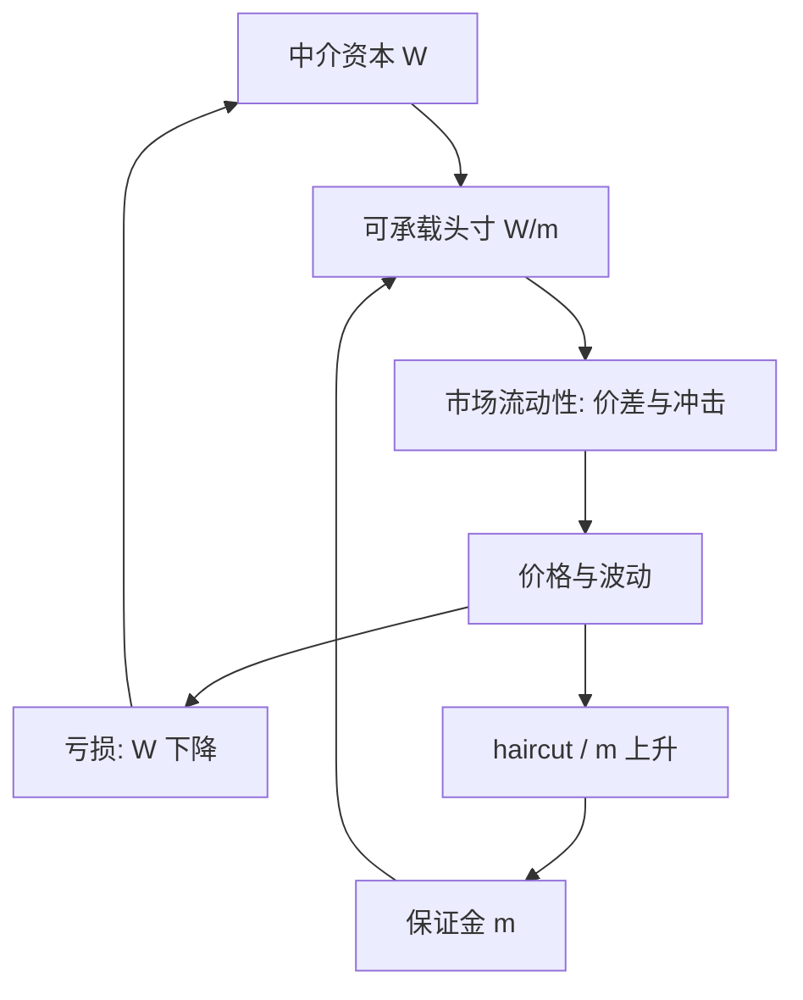

# 资金流动性因子

    
做市商用自己的资金与抵押融资来提供市场流动性；保证金与资本收紧时，市场流动性与资金流动性互相放大，形成亏损螺旋与保证金螺旋。

    <footer>—— Brunnermeier and Pedersen, Market Liquidity and Funding Liquidity, Review of Financial Studies, 2009</footer>

[上一课](/quant/tail-risk-factor)用月内截面左尾的 Hill 估计共同尾厚度 $\lambda_t$，再按对 $\lambda$ 创新的 $\beta$ 构造因子；溢价应在控制市场、规模、流动性与下行 $\beta$ 之后报告。缺口是中介能不能借到钱。[Amihud 非流动性](/quant/liquidity-factor) 度量的是成交时价格被推动多少；资金流动性问的是保证金、haircut 与回购能否维持那笔做市头寸。本课写 Brunnermeier–Pedersen 的约束与可观测代理。不重估 Hill 的 $K$。后课默认已经读完：两套「流动性」不是同一条腿。

## 问题

[尾部因子](/quant/tail-risk-factor)问的是共同崩盘有没有被定价；本课问的是中介约束。无摩擦模型里，套利者可以无限融资，价差只反映信息或库存的瞬时风险。现实里，头寸要交保证金，抵押品有 haircut，回购市场会停。当资金充裕，中介把价差压薄，市场流动性好；当资金紧，即使基本面未变，中介收缩报价，冲击变大，价格更偏离基本面。需要一个框架同时解释：为什么流动性有共同性、为什么危机会从抵押品市场传到现货、为什么「质量」资产在压力期变得更流动而投机级资产蒸发。

定价问题是构造可观测的资金状态，并估计资产对它的 $\beta$。TED 利差、LIBOR–OIS、经纪商杠杆（Adrian–Shin）、主经纪商余额、央行常备借贷便利用量，都是代理，没有一个等于理论里的影子资金成本。问题不是找「真正的」单一利差，而是声明代理所对应的约束（无担保银行间、抵押融资、还是中介资产负债表），再看截面溢价是否稳健。

### 市场流动性与资金流动性不是同义词

市场流动性是用很小的价格冲击完成一笔交易的难易；资金流动性是用抵押或无担保债务为这笔库存融资的难易。Brunnermeier–Pedersen 证明二者可以同向强化：资本减少 → 做市减少 → 价格更波动、更偏离 → 保证金公式给出更高 haircut → 资本相对要求更不足。也可以暂时脱钩：央行把资金利率压低，但交易者仍不敢做市，市场流动性未必立刻恢复。Amihud 的 ILLIQ 捕捉的是前一半的事后冲击；资金因子捕捉的是中介约束的共同冲击。把两个组合画在同一张累计收益图上互相替代，会把持有成本与融资约束混成一个 $\alpha$。

「流动性」在因子动物园里至少三套：Amihud 特征、Pástor–Stambaugh 市场流动性创新、资金约束（TED、经纪商杠杆、BAB 背后的杠杆意愿）。下载因子前必须写清是哪一套。本篇只写第三套的机制与代理，不重写 ILLIQ 的构造。

## 方法

理论对象是投机者的价值函数在保证金约束下的影子价格 $\phi$。$\phi$ 高表示多一单位资本极值钱，等价于资金紧。均衡中，对 $\phi$ 敏感的资产要求更高超额收益。实证上用代理 $F_t$ 代替 $\phi$：

- 银行间：TED、LIBOR–OIS、欧元区 Euribor–OIS，刻画无担保资金。
- 抵押：GC 回购与一般抵押利差、国债–MBS 基差、证券出借费率。
- 中介：经纪自营商杠杆的逆、主经纪商客户保证金、Hedge fund 的资金加权。

创新取差分或对宏观的残差，避免把利率下行趋势当成「资金一直在松」。个股或组合的资金 $\beta$ 用超额收益对 $F$ 创新回归，控制市场。按 $\beta$ 排序的多空是交易型资金流动性因子。Frazzini–Pedersen 的 [BAB](/quant/low-vol-bab) 把同一约束从 $\beta$ 斜率切入：不能加杠杆的人挤进高 $\beta$，能融资的人做多低 $\beta$；资金因子则直接对融资状态定价。

### 亏损螺旋与保证金螺旋

设投机者权益为 $W$，保证金比例为 $m$。可承载的头寸约 $W/m$。价格不利变动 $\Delta P$ 使 $W$ 下降（亏损螺旋），同时波动上升使 $m$ 上升（保证金螺旋）。两道门同时关，去杠杆量是

$$
\Delta \text{Position} \approx -\frac{\Delta W}{m}-W\frac{\Delta m}{m^2},
$$

第二项在 $m$ 已经不低时可以超过第一项。这解释了为什么「只亏了一点点资本」会引发不成比例的抛售。奔向质量：保证金对基本面波动敏感、对流动性溢价更敏感的资产，$m$ 升得更快，中介更愿把剩余资本配到国债与高评级抵押品上，投机级市场的流动性先蒸发。

## 机制

资金紧缺是状态变量：消费资本资产定价里它像一个衰退因子，但衰退通过中介资产负债表而不是通过股息。资产若在 $\phi$ 高时收益更低（高资金 $\beta$），则像卖出了资金保险，应有正溢价。杠杆 ETF、可转债套利、统计套利库存、做市商的方向性残留，都是高 $\beta$ 的候选。国债、高评级公司债在奔向质量时受益，资金 $\beta$ 为负，均衡收益更低——这是便利收益的一部分，不是久期意外。

共同性来自同一批中介、同一套保证金模型、同一央行走廊。电子化之后市场平均价差变窄，但资金冲击仍能在几小时内把冲击函数抬起来，因为资本比撮合引擎更稀缺。因此「价差历史低位所以资金因子死了」并不成立；要看杠杆与抵押市场是否还能同时抽紧。

Brunnermeier–Pedersen 的保证金可以是基本面波动的增函数（稳定型）或对价格偏离敏感（不稳定型）。实证代理分不清两种公式，只能看到结果：压力期利差与 haircut 一起升。不要把 TED 的每一个基点都解释成理论里的 $\phi$；它还含银行信用风险，2008 年后更混进监管流动性覆盖。

### 与信用、波动、规模的共线

资金紧的月份，信用利差、VIX、小盘非流动性通常一起动。资金因子的 $\alpha$ 必须对信用与波动风险溢价做正交，否则只是把 [低波动](/quant/low-vol-bab) 或信用因子换了个名字。规模上，小盘更依赖经纪商融资，资金 $\beta$ 往往更高；价值加权会显著削弱等权溢价。报告时应同时给出 TED 类利差因子与经纪商杠杆因子，二者在 2009 年后相关结构已变：政策利率近零时 TED 压缩，杠杆与监管资本约束仍在。

## 边界与工程取舍

LIBOR 停用后，代理要迁到 SOFR、€STR 与相应的跨币种基差；历史 TED 序列不能无说明地接到 SOFR–OIS 上。中国市场的资金状态更接近回购利率走廊、票据与结构性存款，而不是 TED；照搬美国利差会测到错误的约束。涨跌停与 T+1 改变了中介库存的隔夜风险，保证金螺旋的速度与美股不同。

不要用资金因子去替代交易成本模型：它解释的是状态依赖的冲击与融资成本，不是某一笔单的有效价差。也不要把 Brunnermeier–Pedersen 写成「提供了 TED 因子的官方定义」——论文是机制，因子是后续实证的代理选择。回测里假设任意杠杆、无限借券，等于关掉了论文的约束，溢价会被高估。

真实出处：Brunnermeier and Pedersen, *Review of Financial Studies*, 2009。相关实证包括 Adrian and Shin 的经纪商杠杆、Fontaine and Garcia 的国债便利收益、以及 Frazzini–Pedersen 的 BAB。Kyle 与 Amihud 回答的是冲击函数，不是融资约束。

## 小结

- 资金流动性是中介为库存融资的难易；市场流动性是交易冲击。二者可通过资本与保证金互相放大。
- Brunnermeier–Pedersen（2009）给出亏损螺旋与保证金螺旋，以及奔向质量。
- 实证用 TED/OIS、抵押利差、经纪商杠杆的创新构造资金因子，按 $\beta$ 排序。
- 与 Amihud、Pástor–Stambaugh、BAB 同属「流动性」家族但持仓与机制不同，必须分开报告。
- 代理含信用与监管成分；LIBOR 停用后要重写利差定义。
- 出处：Brunnermeier and Pedersen, *RFS*, 2009；对照 Amihud（2002）与 [流动性因子](/quant/liquidity-factor)；杠杆约束对照 Frazzini and Pedersen, *JFE*, 2014。
