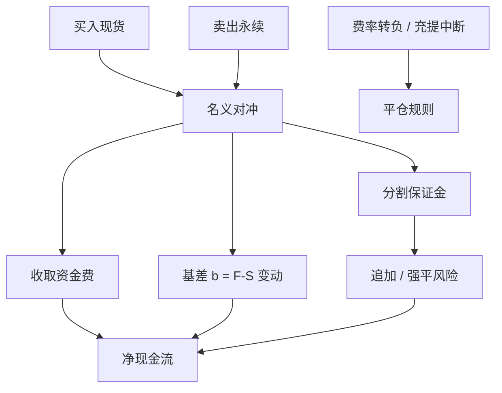

# Funding rate 套利

    
一边持有现货、一边空永续，把资金费当成收租；租是否收得到，取决于基差怎么走、保证金能不能撑过反向波动，以及现货腿是否真的锁得住。

    <footer>—— 据永续资金费的公开会计与经典期现套利的持有成本逻辑整理</footer>

当永续相对现货持续升水，公开公式让多头向空头支付资金。一个自然的市场中性结构是：买入可交割（可转让）的现货，卖出同等名义的永续，赚资金、对冲价格。贴水时方向相反——空现货、多永续——但现货可空往往更紧。这与商品 [期现套利](/quant/cash-and-carry) 同构：现货加持有成本对照合成远期；此处「远期」是永续，「持有成本」的可观测部分主要是资金费，另加现货融资、手续费与滑点。本篇写锁定价差的条件、破裂模式与容量，对象是公开机制下的基差交易。它不是无风险利率，也不讨论跨所搬砖的撮合漏洞或盗用接口。

## 问题

理想锁定：现货成交价 $S$、永续成交价 $F$，净基差 $b=F-S$。持有期间每个资金时点收取（升水时）$r_{\mathrm{fund}}$，同时 $b$ 会变。到期日不存在，没有交割把 $b$ 强制打到零。利润来自资金累计减去基差不利变动，再减去开平仓成本与现货腿的融资或机会成本。问题是：在什么时候 $b$ 与 $r$ 的组合给出正的期望净现金流，以及哪些约束使纸面年化费率不可兑现。

纸面错误通常有三类。用预测资金费当已实现；忽略现货买入冲击与永续空头冲击不在同一毫秒；把资金年化成三位数却用日波动 5% 的保证金去扛，路径上先被强平。第三类把策略从套利变成短波动：你在赌清算不发生。正确的问题陈述必须包含保证金缓冲与基差方差，而不是只报「当前资金年化」。

### 没有交割日，收敛是激励而不是合同

期现套利的硬收敛是仓单交割。永续的软收敛是：升水越大，空头收的租金越高，更多资本愿意空永续买现货，从而压 $F$、抬 $S$。若现货买不进（提币排队、场所停充）、或永续空头深度不够，软收敛可以很慢，期间 $b$ 可以继续扩大。扩大时标记价格相对现货的偏离增加，空永续腿出现未实现亏损，触发追加保证金——即使现货市值也在涨。两边都涨时，现货盈利与永续亏损大致对冲，但保证金在永续账户，现货在钱包或现货账户，**现金不能自动净额**。这是结构的第一风险：分割的保证金，而不是价格方向。

跨场所做「现货在 A、永续在 B」时，还有指数不一致：B 的永续钉的指数未必等于你在 A 的成交价。资金费按 B 的公式结算，你的现货腿按 A 的价格变动。基差应定义成「可成交现货对可成交永续」，再单独跟踪指数偏离。

## 方法

检查单。第一，确认现货可买、可托管、可在需要时卖出，充提状态与确认时间写入约束。第二，确认永续可空、费率公式、结算时钟、标记价格、维持保证金。第三，把往返手续费、滑点、现货融资或稳定币利率计入带的半宽。第四，只有当预期资金收入在持有地平上覆盖半宽加基差不利的压力分位，才开仓。第五，事先规定退出：费率转负、基差扩大超过缓冲、$m$ 倍维持保证金、充提中断。

仓位大小由三道紧约束的最小者决定：现货可买深度、永续可空深度、保证金缓冲能扛的基差与波动压力。缓冲应用历史基差变动与价格波动的联合情景，而不是用「价格对冲所以波动为零」。对冲的是 delta，不是保证金时间错配。回测按结算时点累加**实际**资金，开仓决策只用当时已公开信息，见 [永续合约资金费率](/quant/crypto-perp-funding) 的未来函数警告。

### 贴水腿与借贷腿

贴水时理论上空现货、多永续，收取资金（空头付多头）。现货空头需要借币。借币费率是便利收益的可交易版本：借得贵，说明现货紧，贴水该存在，资金收入可能被借贷费吃光。无法借币时，纸面贴水套利不存在，只剩方向性做多永续或等待。不要用「永续低于指数」当作自动多永续空现货的指令。升水腿的现货融资同样真实：用稳定币或法币买现货的利息，应从资金收入里扣。稳定币自身的脱锚是额外的计价风险。

容量随拥挤下降。同一升水被许多账户同时做多现货空永续时，$F$ 被压回、$r$ 下降，你开仓时看到的年化不是你持有期的年化。应跟踪永续未平仓量、资金费的持续性，而不是把瞬时 $r$ 外推一年。这与 Perold–Salomon 的容量逻辑相同：边际租金被实施与拥挤吃掉。

## 机制

策略的机制是提供永续多头想要的负库存，并在现货市场持有对冲库存，从而把杠杆多头的租金转成自己的现金流。价格风险在理想锁定下接近基差风险： $S$ 与 $F$ 的差，而不是 $S$ 的方向。基差风险来自资金夹紧（公式罚不满剩余升水）、来自指数与可成交价偏离、来自两条腿成交时滞、来自清算与 ADL 改变永续仓位。Brunnermeier–Pedersen 的融资流动性在这里具体化为：永续账户的保证金要求随波动上调，现货不能冲抵，迫使在基差最宽时平掉「仍然正确」的仓位。

与交割期货的 [加密期现基差](/quant/crypto-basis-trade) 相比，资金费套利的现金流更密、方向更随 $r$ 的符号翻。季度期货的升水一次锁在买入基差里，持有到交割；永续的租金每期重定价。前者像锁息票，后者像浮动利率。浮动意味着你在赚的是**拥挤的镜像**——多头杠杆需求强时租金高，需求崩溃时租金消失甚至反号，而你的仓位可能仍在。

保险基金与自动减仓（ADL）会在对手方穿仓时改写你的永续仓位，对冲不再是一比一。这是公开清算机制的一部分，应计入尾部，而不是假设永续腿永远按你的数量存在。详见清算连锁篇。

### 破裂：充提、停开、费率转负、强平

充提暂停使现货腿无法在场所之间移动，跨所结构变成两笔方向性仓位。停开仓使你无法加对冲或无法退出。费率转负时，升水结构开始付出租金，应触发退出或反转规则，而不是「均值回归还会回来」地等待——等待消耗缓冲。强平发生在永续腿：价格急跌时升水结构的空永续盈利，急涨时亏损；急涨叠加资金即将支付（多头付）对你有利，但保证金可能先不够。急跌时现货减值，若现货还作了借贷抵押，两边同时紧。退出规则必须覆盖这些角点，而不能只覆盖「费率的中位数」。

## 边界与工程取舍

对手方与托管是这一策略的真实风险预算：现货放在何处、永续在哪一场所、稳定币在哪条链。把历史资金收当作夏普，隐含假设场所持续兑付。会计应分列：资金、基差、费用、滑点、借币、事故（暂停、ADL）。不要用一个「套利收益」掩盖单列亏损。监管与产品合同若不允许永续，纸面策略不可交易；回测宇宙要与可交易宇宙一致。

不要把资金费套利写成无风险。无风险需要交割强制收敛、统一保证金净额、无对手方。三者在典型永续结构里都不满。不要用高杠杆去「提高资金年化的权益回报」：杠杆提高的是触及强平的概率，租金的期望可能仍在，路径上权益为负。Kelly 在有强平角点时不适用未加约束的分数，见 [杠杆与强平](/quant/leverage-liquidation)。

本篇描述如何把公开资金费当成持有成本来检查期现结构，不提供针对特定清算阈值或指数权重的攻击性交易路径。

用自己的大单去「制造升水再收资金」是操纵叙事，不是套利。套利假定升水由他人需求给出，你是租金的供给方。冲击自己的标记与指数，既不满足无操纵的冲击约束，也通常违反场所规则。

## 小结

- Funding 套利的原型是升水时多现货空永续，收资金、对冲价格；经济上近乎无到期日的期现。
- 没有交割强制收敛，基差可以扩大；永续与现货保证金通常不能净额，现金错配是第一风险。
- 决策用已公开信息，记账用实际结算资金；瞬时年化不可外推为持有期收益。
- 贴水腿依赖借币，借贷费可以吃光资金；无法借贷则不是套利。
- 容量随拥挤下降；未平仓量与费率持续性比瞬时 $r$ 更重要。
- 充提暂停、ADL、强平是否定路径上「无风险」的制度事实，必须写入退出规则。
- 出处：永续资金费公开机制；Hull 与 Working 对期现 / 持有成本的论述；Perold and Salomon, *Financial Analysts Journal*, 1991；Brunnermeier and Pedersen, *Review of Financial Studies*, 2009。
