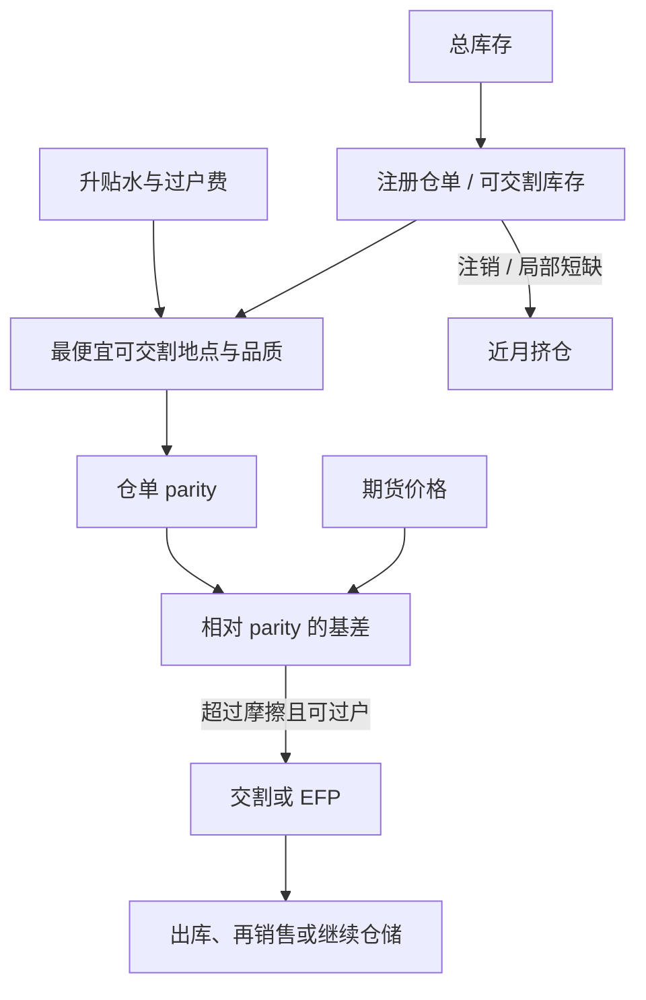

# 仓单与交割

期货把现货的品质、地点与时间选择权写进交割程序；仓单是这些选择权的凭证，不是仓库里吨数的同义词。

<footer>—— Hull 对交割与基差的制度描述；选择权见 Gay & Manaster；仓储见 Working</footer>

[上一课](/quant/calendar-spread-arb)交易同一商品不同到期的价差，经济对象是仓储与便利收益的时间差分，不是无条件均值回归；交割选择权与挤仓会改写这条价差。缺口是收敛锚：没有仓单与交割规则，[期现套利](/quant/cash-and-carry) 没有句点，曲线也失去可检验的现货。本课钉仓单：期货对齐最便宜可交割凭证，不是全国库存或现货指数。不重讲 Working 持有费的跨期表述。后课保证金默认交割月仓位已经带地点、品质与时间期权。

## 问题

跨期价差对齐的是仓储的时间差分；没有可交割仓单，这条差分没有现货锚。仓单代表特定地点、特定品质、特定仓库的存货，通常还附带生成、注销、转让的程序与费用。期货价格对齐的是「最便宜可交割的那张仓单」，不是全国产量或某个现货指数。问题因而永远是：有多少库存是注册的、在哪个地点、升贴水表如何把不同仓单折成合约标准品。可交割库存远小于总库存时，曲线可以在宏观供给宽松时仍出现近月挤兑。反向地，注册仓单很多但都在错误的港口，对需要另一港口现货的贸易商等于没有库存。

交割还有时间期权：空头选择在交割期内的哪一天交、有时还有意向通知与匹配规则。国债期货的时间期权与万能牌期权有 Kane–Marcus、Hemler 的定价文献；商品上同等重要，只是名字叫通知日、仓单配对与滞期。忽略时间，把交割月当成一个点，会低估空头的期权、高估多头接货的确定性。现金结算合约把问题换成结算价窗口是否可操纵、是否与可交易现货同步，那是另一套基差，不能用仓单逻辑去套。

### 注册、注销与「纸库存」

仓单可以生成（现货入库检验后注册）也可以注销（提出仓库、转为普通现货）。注销使可交割供给突然下降，近月可以跳涨，而总库存报告尚未变化。这是[库存报告与曲线](/quant/inventory-curve)必须把「总库存」与「可交割库存」分列的原因。纸货市场（远期船货、场外仓单转让）与期货仓单之间有基差；贸易商在两条市场之间套利，受检验、运输与信用约束。把 LME 仓单、CME 交割地点、上期所指定交割仓库当成同一个存量，地点期权会被写丢。

交易所公布的仓单周报是滞后且分类粗的。真正能交的是你名下或可买到的特定仓单。用周报总量去做交割月空头，等于用全国住房存量去交割某一小区的期货。

## 方法

交割流程应写成状态机：持仓进入交割月 → 意向通知 → 匹配 → 仓单过户 → 货款与升贴水 → 出库或继续持有仓单。每一步有截止时间与失败罚则。期现与跨期的风险系统必须在进入交割月前把期货仓位标成「或有实物」，保证金、限额与是否允许继续持有空头，都要切换规则。EFP、EFS 与场外基差合同是把期货换成现货的平行通道，往往比官方交割更常用；它们的价格应进入公平价值，而不是把官方交割当成唯一收敛。

品质与地点升贴水表是定价输入。空头会交最便宜的合格品，这就是商品 CTD。计算每一种可交割仓单的净发票金额，取最小者，得到期货应对齐的现货。升贴水若长期不更新，期货会系统性地偏离开真实贸易现货，套利资本会把货物运向被高估的交割地——直到仓库或规则调整。容量是可生成仓单的速度与可注销的速度，不是期货名义。

### 交割选择权如何进入期货价格

Gay–Manaster 的品质期权降低空头愿意接受的期货价格（相对标准品现货），因为空头持有一篮子交割权。地点与时间期权同理。存货低、合格品牌少时，期权价值下降，期货更贴近特定现货；存货高、清单长时，期权价值上升，期货可以持续低于你盯着的那一种现货。这不是错误定价，是选择权。国债上的对应物是转换因子与 CTD 切换，见[最便宜可交割](/quant/ctd-cheapest)。商品没有转换因子表时，升贴水表扮演近似角色，但通常更粗、调整更慢。

## 机制

收敛机制：若期货明显高于最便宜可交割仓单加交割摩擦，买仓单空期货并进入交割；反向则在可借仓单时反向操作。摩擦包括过户费、检验、出库排队与资金占用。Working 的仓储在交割地被局部化：全国库存高而交割地库存低，局部持有费可以与宏观叙事相反。挤仓机制：控制可交割仓单的一方迫使空头在期货上平仓，近月脱离仓单 parity。Pirrong 分析角落与挤压时强调可交割供给的弹性；弹性低，操纵或挤兑的空间大。监管与持仓限额、交割月加严的保证金，是对这一机制的制度回应，也会改变合法套利的容量。

仓单与融资相连。仓单可质押，贸易商用仓单融资做期现；融资冻结时，本可交割的库存无法被套利资本调动，基差张开。这与[保证金与盯市](/quant/futures-margin)的资金螺旋是同一类约束，只是抵押品从现金变成了铜和大豆。

### 破裂：检验失败、堵港、规则修改

检验不合格使仓单作废或降级，升贴水突变。港口拥堵使出库权利无法在需要时行使，多头接货后持有的是被困存货。交易所修改交割地点、品牌清单或升贴水，CTD 切换，旧的期现账立即重估。现金替代或强制结算在极端行情出现时，实物收敛被行政替换，基差停在当时的窗口价。这些不是尾部花絮，而是交割策略的一等情景。

多头在交割月接货若没有下游、没有库容、没有资金，接货就是亏损。期货多头的「权利」包含了承担实物操作的义务。把交割月多头当成现金指数的跟踪，会在第一次匹配到仓单时发现跟踪误差以吨计。

## 边界与工程取舍

不要用现货指数替换仓单 parity。不要假设所有公布库存都可交割。不要在交割月沿用非交割月的日历价差模型。成本含仓单过户、检验、出库、滞期、以及接货后的再销售折价。容量受指定仓库库容与注册速度限制；未平仓量大于可交割库存时，多余的仓位必须在期货上平掉，价格发现会离开现货、留在挤仓。

与股指期货现金结算相比，商品交割把微观结构从订单簿延伸到码头。风险报告应列出：注册仓单、可生成潜力、CTD 地点、升贴水、以及本账户是否具备接货资质。没有接货资质的账户不应把交割月持仓当成套利，只应当成必须在进入交割前退出的金融合约。Hull 的教材章节足够建立语言；具体市场必须读该交易所的交割手册，而不是用另一个交易所的仓单故事外推。

EFP 成交价可以长期偏离官方交割 parity，因为场外信用、增值税与运输被写进 EFP。把 EFP 当「免费期现」而不检查对手方与货物，是把信用风险叫做套利。

## 小结

- 仓单是指定地点与品质的可交割凭证；期货对齐的是最便宜可交割仓单，不是现货指数或全国库存。
- 空头持有品质、地点与时间选择权（Gay–Manaster）；升贴水表与交割程序决定期权价值。
- Working 的仓储必须局部化到交割地；可交割供给弹性低时出现挤仓（Pirrong 一类分析）。
- 生成/注销、检验、堵港与规则修改是破裂模式；无接货能力则交割月仓位不是套利。
- 出处：Hull, *Options, Futures, and Other Derivatives*；Working, *AER*, 1949；Gay and Manaster, *JFE*, 1984；Pirrong 对挤压与可交割供给的分析；Kane and Marcus, *Journal of Finance*, 1986（时间/万能牌期权的利率期货对照）；交易所交割手册为制度细节的第一来源。
