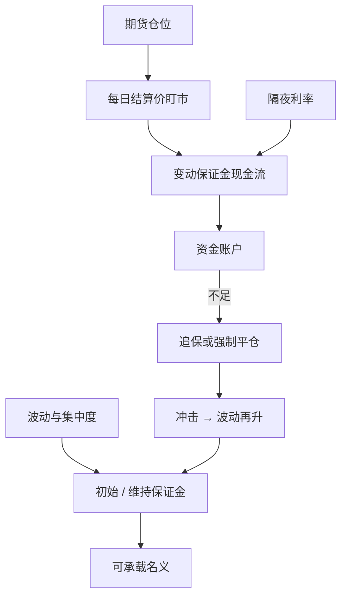

# 保证金与盯市

期货每天按结算价兑付盈亏，远期通常到期才结算；同一承诺在两条合同下的价值可以不同，因为盯市把利率路径写进了基差。

<footer>—— Black, The Pricing of Commodity Contracts, Journal of Financial Economics, 1976；Cox, Ingersoll & Ross, 1981</footer>

[上一课](/quant/futures-delivery)把仓单写成指定地点与品质的可交割凭证；空头持有品质、地点与时间选择权，无接货能力则交割月仓位不是套利。缺口是路径上的现金：期货与远期在确定利率下可以同价，盯市利息与保证金螺旋使两者分开，期现、跨期、CTD 若只报「到期收敛」会漏掉追保。本课钉保证金与每日结算。不重讲升贴水表。后课 CTD 默认杠杆是状态变量，不是常数成本。

## 问题

仓单给出到期收敛的对象；盯市让盈亏变成每日现金，路径上的保证金可以先于交割打穿套利。一张在 $T$ 交割的远期，盈亏是 $S_T-K$ 或 $F_T-K$ 在 $T$ 的一次性支付。期货每天把结算价变动记入保证金账户，账户余额按隔夜利率计息（或占用）。若利率与期货价格相关，每日损益的再投资使期货价格 $F$ 不等于远期价格 $G$。CIR 给出

$$
F_{t,T}=G_{t,T}+\text{凸性 / 利率相关调整},
$$

调整的符号依赖价格与利率的协方差。利率期货上这一项就是大家熟悉的凸性偏差；商品上若能源价格与融资条件同向，调整同样存在，只是实务里常被价差淹没。问题对交易者更硬的部分不是定价公式，而是现金流：你可能在现货腿尚未变现时，因期货盯市而必须立即支付现金。期现、跨期、CTD 基差在风险系统里若只报「到期收敛」，会漏掉路径上的流动性。

第二层问题是保证金的内生性。交易所与清算所按波动、集中度、交割月调整保证金。波动升 → 保证金升 → 杠杆降 → 抛售或减仓 → 波动再升。Brunnermeier 与 Pedersen 的保证金螺旋是一般理论；期货市场的公开案例包括 1987 年、2008 年商品与金属、以及若干交割月挤仓时对空头加严。保证金不是常数成本，是状态变量。

### 初始、维持与价差优惠

初始保证金决定开仓杠杆，维持保证金决定追保阈值，变动保证金是每日盯市本身。日历价差、期现组合常有保证金抵减，因为清算所承认部分对冲。抵减使[跨期套利](/quant/calendar-spread-arb)看起来资本效率高，但也在近月与远月相关性断裂时造成保证金跳升——优惠被取消，两腿按单边收。交割月往往有更高的保证金，这是对仓单与挤仓风险的定价，不是对波动率的重复计算。账户若按非交割月保证金去规划交割月容量，会在规则切换日被迫减仓。

结算价不是最后成交价。它由规则在收盘窗口决定，可以与你可成交的报价不同。盯市按结算价，你的平仓按买卖价。把两者的差当成模型 alpha，是把清算所规则写成了信号。

## 方法

估值上，短到期、利率稳定时，用期货价格当远期是可接受的近似；长到期、利率期货、或要与场外远期对锁时，必须做 CIR/凸性调整，或直接用期货对远期的市场基差。风险上，现金流引擎应按每日结算路径模拟：价格路径、保证金路径、融资利率路径一起抽。只模拟到期基差、不模拟追保，会低估期现与国债基差交易的破产概率。

保证金预测应接入清算所的算法版本（SPAN、SIMM 对场外、各交易所自有系统），用情景而不是用「保证金 = 名义的 5%」。集中持仓、交割月、 holidy 会触发附加。容量曲线要把保证金当作随 $A$ 与市场状态上升的函数：同样的基差机会，在 VIX 或原油实现波动翻倍后，可承载的名义可能减半。Figlewski 提醒保证金与市场完整性之间的权衡：过低损害清算所，过高把套保者赶出场外，价格发现离开交易所。

### 期货—远期基差与资金台

当期货比远期便宜或贵，表面上可以锁定期货与远期的差。这要求场外远期的信用、CSA 与期货保证金之间的资金可以内部转移。没有统一资金池，两边都要求抵押，所谓套利是双重占用。商品贸易商的银行授信与期货保证金往往来自同一授信额度，价格未动，额度重估也会强制减仓。这是容量的机构约束，ADV 看不出来。

## 机制

盯市机制把期货变成每日重置的远期：每天的结算使剩余合同的约定价格回到市场价格，盈亏已现金化。因此期货价格是每日标记的鞅（在适当测度下），远期价格是到期支付的鞅。利率进入两者的换算。Black 对商品合约的处理把便利收益与持有成本放进期货定价，但仍保留盯市结构。实务中，便利收益主导商品曲线形状，利率调整是二阶，直到你把商品期货与长到期场外掉期对锁。

螺旋机制：亏损导致追保，流动性差时变现冲击价格，保证金再升。套利资本是螺旋的参与者而不是局外人：期现者在现货跌、期货相对更强时可能两边同时需要现金。清算所是中心对手方，转移了双边信用，但把流动性需求集中到同一时刻。Telser 讨论保证金与投机；当代的问题是高频与指数化之后，保证金对冲的是波动，也会在库存报告日这类可预测信息事件上提前抽走杠杆。

### 破裂：涨跌停、无法盯市、货币错配

涨跌停使结算价触及停板，期货停住，现货或场外仍在走，基差爆炸，追保却按停板结算——你无法在期货上止损，现货腿继续。停市、技术故障、节假日长周末让盯市间断，重开时跳空一次结算。货币错配：商品以美元计价，保证金可能是本币，汇率把追加金额变成随机。交割匹配后，仓位从期货变成实物加应付货款，保证金规则切换，现金需求突然变成货款全额。这些路径在到期收敛模型里为零，在资金模型里是主风险。

把「期货有保证金所以比远期安全」写成无条件句，忽略了安全性属于清算所，流动性属于会员。会员在同一日被抽走变动保证金时，安全的系统可以杀死健康的套利账。

## 边界与工程取舍

不要用国债利率贴现期货的期望盈亏却用信用利率去融资保证金。不要在风险报告里把价差保证金优惠当成永久。不要把 Black 或 CIR 的期货—远期差别当成可自由收割的套利：执行它需要场外信用额度。成本项：保证金占用的资金成本、额外保证金的期权价值（波动升时被抽走的杠杆）、以及结算价与可成交价的差。容量随清算所保证金乘数下降；拥挤时所有套利者同时追保，基差向不利方向走的速度比开仓时快。

与[隐含回购利率](/quant/implied-repo)的联系：国债基差交易把隐含回购与实际回购比较，但盈亏路径仍是期货盯市加债券融资。回购市场冻结时，隐含回购看起来很美，现金却凑不齐。商品期现把仓单融资换成贸易融资，结构相同。报告应有：保证金情景、融资利率情景、停板情景，而不是只有到期基差情景。

Hull 的章节把保证金写成制度。工程上应把它写成与波动、集中度、交割月耦合的状态过程。常数保证金回测会高估危机中的杠杆，从而高估套利策略的夏普。

## 小结

- 期货每日盯市，远期通常到期结算；Black 与 Cox–Ingersoll–Ross 说明利率随机时两者价格可以不同。
- 对套利者，更硬的约束是路径上的现金：现货或债券腿未变现时，期货腿已要求付款。
- 保证金随波动、交割月与集中度内生变化，形成去杠杆螺旋；价差优惠在相关性断裂时取消。
- 停板、长周末与货币错配使盯市间断或错配，到期收敛模型覆盖不了这些破裂。
- 出处：Black, *JFE*, 1976；Cox, Ingersoll and Ross, *JFE*, 1981；Telser, *Journal of Futures Markets*, 1981；Figlewski, *Journal of Futures Markets*, 1984；Brunnermeier and Pedersen, *RFS*, 2009；Hull, *Options, Futures, and Other Derivatives*。
