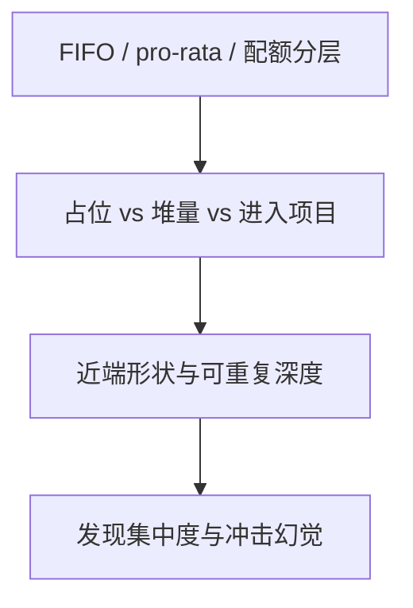

# 期货交易所匹配算法

股票微观结构直觉多半来自价格–时间优先。期货撮合常常是 FIFO、pro-rata、分配给指定做市商的配额，以及它们的分层组合。同一宏观信息，扫簿形态可以完全不同。

<footer>—— 据 Harris, Trading and Exchanges 对优先规则与期货市场的论述；对照 Cordella and Foucault, JFQA, 1999</footer>

[收盘竞价](/quant/closing-auction-design)谈股票参照价。缺口是期货：指数、利率、商品的价格发现大量发生在期货领先现货的结构里，而匹配算法不是单一 FIFO。本课把[价格–时间对 pro-rata](/quant/price-time-pro-rata)落到交易所设计：为何利率产品爱比例分配、股指期货常偏 FIFO、顶层混合如何改变做市激励。不重画 LOB 阶梯，不写某个月的参数表。

## 问题

期货合约同质、tick 相对波动往往较粗，同一价位容易堆积。FIFO 下堆积变成极端占位竞赛，托管租金高。pro-rata 让大做市商用资本换份额，近端看起来极厚，真实可重复深度取决于撤余。设计者还要养活指定做市商：给他们保证分配（allocation）再对其余 FIFO 或 pro-rata。问题是算法如何服务三类用户——套保者的大单、高频做市、小投机——以及跨品种套利在不同算法之间如何踩空。

闪电崩盘发生在 E-mini 上，匹配是 FIFO 为主的股指期货。不能把那条空簿路径归因于 pro-rata；但利率期货的「假厚」会给出另一条幻象。

### 分层算法

常见结构：第一层满足做市商义务配额，第二层 pro-rata，残差 FIFO；或反向。分层创造两场博弈：先成为有配额的人，再决定展示量。进入做市项目的固定成本，是 Grossman–Miller 进入的制度版。

Globex 等系统的具体名称与比例随合约而变。教学只保留分层逻辑。写进生产代码前必须读该合约当前规则。

## 方法

比较同一信息跳下的成交分配：FIFO 把量给队头少数订单；pro-rata 把量洒到许多大单。账户层若可得，看集中度。市场质量：近端深度、撤单率、小单限价比例、有效冲击。粗 tick + pro-rata 预测：深度高、限价小单少、消息率高。细 tick + FIFO 预测：深度分散、速度竞赛更纯。

与现货套利：期货算法决定谁先获得领先价格的成交。若期货 pro-rata 让许多做市商同时成交，领先信息的分配更分散；FIFO 让最快的人定义价格。信息份额会随算法变，而不只随品种。

## 机制

匹配算法分配瞬时租金，从而决定谁愿意在 Grossman–Miller 意义上在场。股指期货用户更杂、对「公平次序」更敏感，FIFO 更常见；利率期货做市更机构化，pro-rata 用资本换持续报价。混合试图两者都要：义务商保证在场，其余用速度或尺寸竞争。

对执行：在 pro-rata 上「排队到队头」不是目标，展示量与是否愿意被分配到的随机一刀才是。切片算法从股票 FIFO 复制过来会系统性错。隐藏流动性在期货上更贵（份额损失），可见堆量更极端。

## 边界

算法与手续费、托管、数据源打包，单改匹配可能被费用抵消。期权到期日、交割规则会临时改变用户结构，同算法不同日不可比。国债期货与商品期货的客户风险偏好不同，同样 pro-rata 结果不同。本课不评估哪一种算法「更好」，只说明它是一等设计对象。

看见第一档上万手，先问算法再问「流动性好」。这是优先规则课在期货上的重复，值得再写一次，因为发现往往从这里传到股票。

期权把「一笔指令」变成一篮子腿，FIFO 还是 pro-rata 都无法单独提供同时性。下一课的复杂订单簿是匹配对象的维度变化，不是再调一层分配比例。

## 小结

- 期货匹配常在 FIFO、pro-rata 与做市配额之间分层，改变占位、堆量与进入。
- 近端厚度在 pro-rata 下不可按 FIFO 直觉解读为可重复深度。
- 算法影响谁定义领先价格，从而影响现货信息份额。
- 出处：Harris, *Trading and Exchanges*；Cordella and Foucault, *JFQA*, 1999；排队与比例见本站优先规则课。
