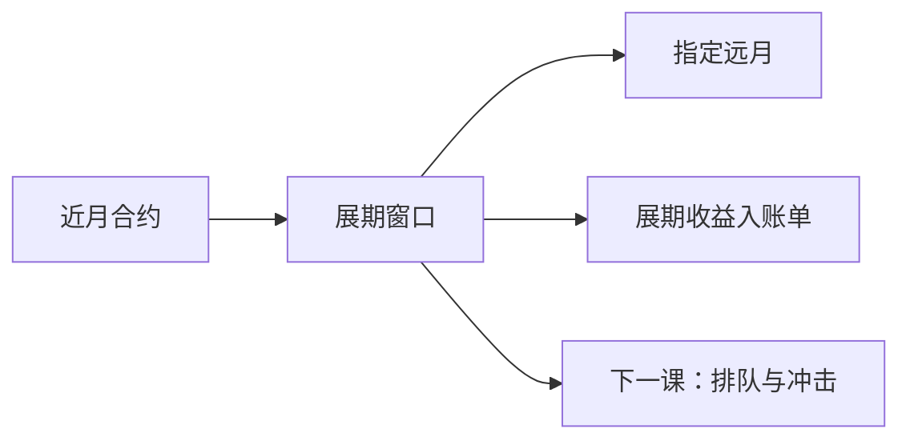

# 期货交割与展期日历

连续暴露必须在到期前把近月换成远月；展期规则决定你付的是哪一段期限结构。把近月价格串成连续合约却不声明何时换月，回测不可复现。

<footer>—— 据 Duffie, Futures Markets；Harris, Trading and Exchanges 对展期与日历价差整理</footer>

上一课[期权行权与交割](/quant/option-exercise-settlement)处理期权到期后的现金或股票腿。期货到期要么现金结算，要么进入实物交割流程；要保持暴露就必须展期。本课是制度课程最后一课：把**展期日历**写成回测规则。下一课[Limit order book 结构](/quant/lob-structure)进入微观结构；撮合、排队、价差冲击交给那边，本课不重写。

## 问题

CTA 与指数期货策略需要一条「连续价格」。常见做法是把近月收盘接上远月收盘，跳空全部算进收益。跳空里有一块是期限结构（展期收益），有一块是流动性从近月迁到远月时的冲击。不声明换月日、换月窗口、按成交量还是按日历切换，别人无法复制你的收益，你也无法把展期收益从 alpha 里拆出。缺口是规则化：在到期前第 $n$ 个交易日、或近月持仓量跌破阈值时，把仓位迁到指定远月，成交按当时可成交价，并走保证金与 CCP 占用。

商品实物交割还有交割月持仓限制与通知日：拖到交割月还当金融期货持有，可能被迫进入交割或被交易所强制平仓，这是缺口强平的日历版。

### 展期收益不是预测 alpha

Contango 下换月常付负的展期收益，backwardation 相反。这是持有期货而非现货的成本或收益，应进资金/持有账单，不应进「信号 alpha」。把未声明的近月拼接收益当成趋势策略的技能，是把期限结构记错科目。

股指期货多为现金结算、季度周期（H-M-U-Z）；商品各有自己的交割月与最后交易日。全局一个「到期前五天展期」会对某些品种落在流动性已经消失之后。

## 方法

每品种写日历：最后交易日、第一通知日、结算价定义、允许持有的最晚日期。展期窗口内按预先规则把近月减仓、远月加仓，两腿都过当时保证金与涨跌停。回测保存两条序列：近月真实价格（用于盯市）与按规则拼接的连续序列（用于信号）。信号若用连续序列，必须用当时已实现的拼接，不能用后来才知道的「哪个月份最终更活跃」来选择历史近月。

与期权课衔接：到期周与期权行权、期货展期叠在同一日历上（四巫日），事件策略要声明避让或承担。资金占用在展期窗口双倍（两腿同时有仓）直到迁完。

## 机制

展期把期限结构变成已实现损益，把流动性迁移变成执行问题。纸面用收盘价在同一根 K 线上完成两腿，等于假设近月与远月同时可按收盘全额成交——在商品远月这通常不成立，且不进入本课的 LOB 细节，只要求降规模或加惩罚。CCP 保证金在展期窗口按两腿收取，直到净仓迁完，资金底在窗口内变厚。制度课在此收口：前面所有占用、可成交、日历规则，在换月日同时出现。

下一课从连续价格换成限价簿对象：价、量、队列。展期日的冲击来自簿上流动性，不再用日线收盘假装换月完成。

连续收益里的跳空要拆科目：期限结构进持有账单，执行冲击留给下一课 LOB。本课至少不得把全额收盘换月当成零成本。四巫日与期权到期叠历时，事件策略要声明避让或承担双倍占用，不能把两个日历当成互不相关的净值来源。

## 边界

不展开库存理论或完整远期曲线定价，不写各商品交割品级。不重写撮合、排队、最优限价——那是[Limit order book 结构](/quant/lob-structure)的第一课。后课默认：连续期货暴露必有书面展期规则与当时日历；未声明的近月拼接不是可复制策略。信号用当时拼接，不事后挑选活跃月。拖入交割月按强制事件。制度课结束；微观结构开始。

股指期货现金结算相对干净，商品通知日与持仓限额会把「还能当金融合约持有」的窗口提前结束。全局一套「到期前五天展期」往往在某些品种上已经踏进交割流程。规则按品种写，日历按当时交易所公告，不能用今天的最后交易日表回填十年前的合约。连续合约若用于信号，拼接必须在当时信息集上完成：不能用后来才知道「哪个月更活跃」来挑选历史近月。

## 小结

- 期货到期必须结算或展期；连续暴露是规则，不是自然序列。
- 展期收益进持有账单，不进未声明的 alpha。
- 换月日、合约选择必须 PIT，不能事后挑选活跃月。
- 展期窗口双腿占用保证金；拖进交割月有强制风险。
- 撮合与排队交给下一课 LOB，本课止于日历与资金。
- 出处：Duffie, *Futures Markets*；Harris, *Trading and Exchanges*。
