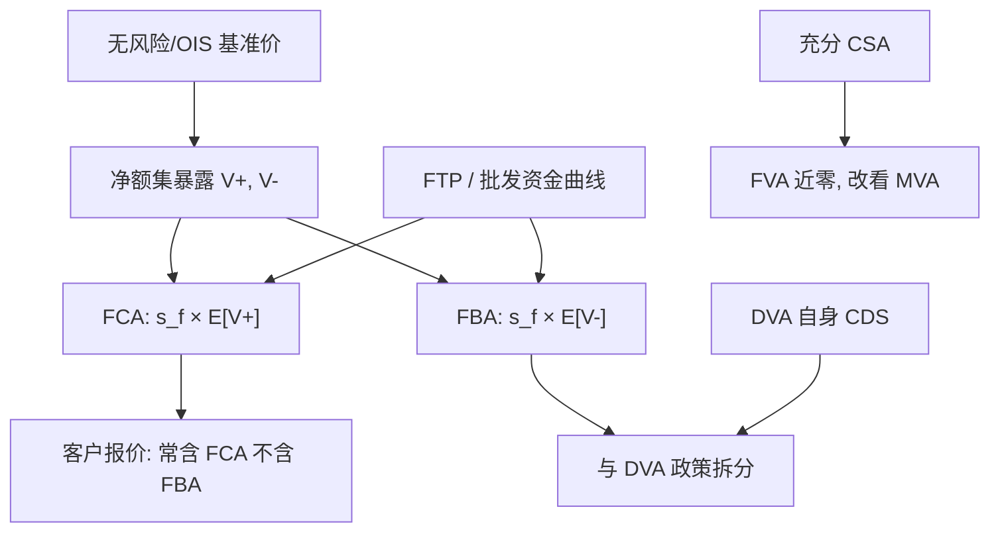

# FVA 融资估值调整

无抵押衍生品的复制需要现金，现金有内部资金成本；是否把这条成本写进公平价值，曾经把市场分成「台子已经在收」和「理论认为不该收」两派。

<footer>—— 对照 Hull & White, The FVA Debate, 2012；以及 Gregory 在 xVA 中把 FVA 当作可运作调整的立场</footer>

[CVA 要点](/quant/cva-lite) 要求先把单边暴露与对手方信用做对，再决定哪些字母进入转移定价。FVA（Funding Valuation Adjustment）把自身融资利差作用在衍生品产生的无抵押现金上：正暴露要融资买入对冲，负暴露释放现金、减少批发融资。Burgard–Kjaer 一类 PDE 把资金账户写进复制；Hull 与 White（2012）争辩：在有效市场里，衍生品公平价值不应依赖交易商自己的融资曲线，否则同一合同每个卖方一个价。Gregory 记录的现实是：2008 之后资金台已经对无 CSA 组合收费，FVA 进了估值与投标。本篇写 FCA/FBA、与 [DVA](/quant/dva-own-credit) 的重叠、以及曲线选择；不重复 EE 剖面的模拟细节。

## 问题

有完美 CSA 且只收现金、无门槛时，衍生品的变动保证金与对冲的现金大致闭环，融资利差不应进价格（忽略初始保证金，那是 [MVA](/quant/mva-initial-margin)）。无抵押或门槛很高时，正市值等于向对手方发放了一笔没有债券文件的贷款，银行要用无抵押负债为这笔「贷款」筹资；负市值等于从对手方借款。资金台用内部资金转移定价（FTP）对这两笔现金收费或补贴。问题是：FTP 利差 $s_f$ 是否进入给客户的公平价值，还是只进入管理会计。

Hull–White 的论点：若交易可以在无风险或隔夜指数上对冲，增量资金成本是公司金融的资本结构问题，不应污染衍生品价格，否则自身信用越差报价越贵、市场更不流动。对立论点：股东要求补偿实际现金成本，投标时不加 FVA 会赢下无法融资的生意。Gregory 把 FVA 写成与 CVA 平行的调整，用暴露剖面乘资金利差，承认它是转移价格而不假装成无套利唯一价。

### FCA 与 FBA 不是对称的「自身 CDS」

常见分解：

$$
\mathrm{FCA}\approx\sum_i \mathrm{DF}(t_i)\,s_f(t_i)\,\mathbb{E}[V_{t_i}^+]\,\Delta t_i,
$$

$$
\mathrm{FBA}\approx\sum_i \mathrm{DF}(t_i)\,s_f(t_i)\,\mathbb{E}[V_{t_i}^-]\,\Delta t_i.
$$

FCA 是正暴露的融资成本，FBA 是负暴露的融资收益。$s_f$ 若取自身无抵押利差，FBA 与 DVA 用了同一条经济曲线的不同叙事：一个说「自身违约减免负债」，一个说「负暴露节省批发融资」。两者加总会双计。政策通常是：FBA 用资金利差、DVA 不用；或 DVA 用 CDS、FVA 只用资金曲线超出 CDS 的那一段（流动性与期限溢价）。没有唯一正确拆分，但必须有一份书面拆分。

$s_f$ 不是 CDS 升水。资金曲线含流动性、结构债 premia、内部缓冲。把 CDS 平价升水当 FTP，会把信用风险已经进 CVA/DVA 的部分再送进 FVA。

## 方法

**暴露接口。** FVA 与 CVA 共用净额集与 CSA 逻辑，但积分核是资金利差而不是违约密度。有抵押时，残余暴露仍在门槛与 MPOR 内，FVA 变小但不为零。部分 CSA（只单边、只国债、有争议）按实际现金缺口而不是法律名义。货币错配：美元 CSA 与非美对冲会产生交叉货币融资，FVA 要按币种账户，不能只用本币 $s_f$。

**Burgard–Kjaer 复制。** 在 PDE 里引入银行自身债券账户：对冲衍生品时，正融资用自身无抵押债，负融资可减发债。解出的价格等于无风险价减 CVA 加减与资金有关的项。该框架澄清符号与边界（自身违约时账户如何关闭），但校准仍要一条 $s_f(t)$ 与回收。它不解决「该不该向客户收」的治理问题，只解决「若要收，复制一致的公式是什么」。

**投标与存量。** 新交易 FVA 用增量暴露（与存量净额后的 EE 之差），不是孤立新交易的 EE——否则会惩罚本可抵消存量负暴露的新正暴露，或反过来。存量 FVA 随资金曲线与市场因子每日变动，形成 FVA PnL。对冲：资金曲线本身难以用 CDS 精确对冲，常用自身债、期限资金工具或近似指数，残差进资金台。利率对冲仍来自暴露对曲线的敏感，与 CVA 的市场对冲类似，但权重是 $s_f\Delta t$ 而不是 $\Delta Q$。

### 与 CVA、DVA 的会计三列

一套完整报告至少三列：CVA（对手方）、DVA（自身信用，若会计要）、FVA（资金，按内部政策）。客户报价可能是单边 CVA+FCA、不含 DVA/FBA，以免把「我们可能倒」的收益让给客户。同业双边可能含 DVA 而不含 FBA，或相反。CCP 清算把无抵押 FVA 换成保证金融资（变异保证金几乎是 OIS，初始保证金是 MVA）。不要把清算后的组合还按无抵押 $s_f$ 收 FVA。

多曲线：贴现在有 CSA 时用 OIS，无 CSA 时有人用 LIBOR 或资金曲线「一锅炖」。一锅炖把 FVA 藏进贴现，无法对冲分解，也无法与 CVA 分列。Gregory 主张显式调整：OIS 贴现给出无信用无资金的基准，再加 CVA/FVA。这与利率前台的 OIS 贴现一致，避免同一条曲线既当预测又当资金。

## 机制

机制是复制的现金账户不再免费。无摩擦 BS/HW 对冲假设借入贷出都是 $r$。危机之后，无抵押借贷是 $r+s_f$，且额度有限。正暴露路径消耗额度，要求补偿；负暴露路径提供现金，补偿归谁（股东、资金台、交易台）是组织问题。Hull–White 担心的「自身信用差则卖价高」确实发生：资金差的交易商在无抵押长到期上失去竞争力，生意流向资金好的清算会员与 CCP。这是市场结构，不是公式错误。

双计的机制：自身强度 $\lambda_B$ 既提高 DVA（违约减免）又提高 $s_f$（发债更贵）。对负暴露，DVA 与 FBA 同向；对正暴露，CVA 是对方的 $\lambda_C$，FCA 是自己的 $s_f$，一般不双计信用，但 $s_f$ 里若含一般信用指数成分，会与 CVA 的指数对冲重叠。拆分原则是看现金流：对手方违约损失进 CVA；自身破产减免进 DVA；未违约期间的资金利息进 FVA。

内部 FTP 若含资本附加，会把 KVA 塞进 FVA。字母再次黏连。资金曲线应尽量接近可观察的批发融资，资本附加单列，否则无法解释「资金曲线没动、资本规则变了」的 PnL。

### 增量、净额与错向融资

FVA 必须在净额集上算增量：一笔新的反向交易可能降低 FCA。孤立定价会系统性拒绝压缩风险的交易。错向融资：当市场使 $V^+$ 变大时 $s_f$ 也上升（危机里同时发生），FCA 大于独立公式。这与信用错向平行，却用资金曲线而不是 CDS。压力 FVA 应让 $s_f$ 与市场因子共跳，而不是只冲击 EE。

## 边界与工程取舍

不要用无风险贴现的前台价加上「经验 15bp」当 FVA。不要把 DVA 与 FBA 同时全额计入。不要对有充分现金 CSA 的组合仍按无抵押 $s_f$ 积分。不要让每个交易台自己选 FTP 版本。国内资金曲线常不可对冲，FVA 更接近管理加价，应披露不确定性，而不是假装与 CVA 同样可对冲。

Hull–White（2012）的警告仍然有效：FVA 使价格依赖卖方身份，退出与转仓时买卖价差含双方资金差。合同应写清估值是否含 FVA，以免争议时用「市场标准」各说各话。实现上 FVA 引擎与 CVA 共用暴露，积分核与曲线版本必须分开配置。

出处：Hull & White, *Risk* / *The FVA Debate*, 2012；Burgard & Kjaer 的复制 PDE；Gregory, *The xVA Challenge*。实务接受 FVA 不等于理论争论结束，报告应写明采用哪一派的拆分。

## 小结

- FVA 把无抵押（或残余）暴露上的内部资金利差标进转移价格；FCA 对应 $V^+$，FBA 对应 $V^-$。
- 是否计入公平价值存在 Hull–White 与交易台实务的争论；公式可以一致，治理必须书面化。
- FBA 与 DVA 可能双计同一自身信用，须拆曲线或禁其中一个。
- 用增量净额暴露，有 CSA 则按现金缺口；清算后无抵押 FVA 应关掉。
- 显式 OIS 价加调整，优于把资金利差藏进贴现曲线。
- 出处：Hull & White, 2012；Burgard–Kjaer；Gregory 的 xVA 论述。
