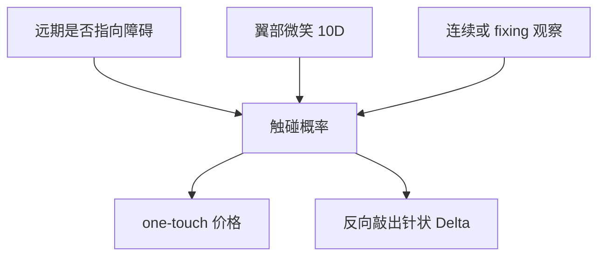

# FX 障碍与触碰

一触即付是障碍的数字；外汇里它与香草同样常见，价格由触碰概率与翼部微笑共同决定。

<footer>—— 连续障碍见 Reiner–Rubinstein；FX 触碰与反触碰见 Wystup, FX Options and Structured Products</footer>

[上一课](/quant/fx-vol-quotes)把微笑钉在 ATM/RR/BF。FX 障碍与 one-touch / no-touch / double-no-touch 的缺口是：**触碰是路径事件，翼部与漂移（远期）一等重要。** 股权障碍解析解课已写反射；本课只补 FX 市场的合约惯例、反向敲出与触碰的报价，不重推八公式。

## 问题

OTC FX 大量交易：RKO（反向敲出）、one-touch（触碰即付现金）、DNT（双无触碰）。GK 闭式在无微笑下给出触碰概率的贴现。有微笑后，局部波动与随机波动对触碰的分歧往往大于对香草，正是 [模型风险](/quant/derivative-model-risk) 的典型对象。问题是生产：至少两套动态，对照触碰市价（若有）或对照 Vanna–Volga / 混合，禁止只用 ATM vol 进 Merton 公式去报 one-touch。

观察：许多 FX 障碍是连续（或近似连续）美式触碰，与股权权证的日频收盘不同；也有在 Tokyo fixing 上离散观察的。时钟必须写进确认书，见 [障碍监控](/quant/barrier-monitoring)。

### 反向敲出的 Delta 会变号

障碍在价内、敲出后权利金作废时，现货向障碍走，价值先升后崩。Delta 在壁前变号，对冲变成「越接近壁越要反向」。这是 FX 做市的经典针状风险，不是 GK 的 $N(d_1)$。对冲用香草加 touch 或用窄价差，并在缓冲带减仓。

双无触碰是区间计息结构的零件，对两边翼部与波动水平都敏感，BF 报价对它是一等输入。

## 方法

无微笑：Reiner–Rubinstein / GK 障碍与触碰闭式当基准。有微笑：局部波动 PDE 或 MC，对照随机波动。市场若报 touch 价格，应纳入校准或作为模型带的锚。Quanto 与交叉（用第三货币结算）按 quanto 课调整漂移。假期与连续/离散在引擎里当合同状态，不要当全局开关。

## 机制

触碰概率对漂移极敏感：远期若指向障碍，触碰变贵。FX 的 $r_d-r_f$ 由掉期点给出，基差一动，触碰跟着动——这是股权障碍较少面对的利率/FX 混合。微笑的翼部改变局部漂移与局部 vol，从而改变首次命中时间。ATM/RR/BF 三因子对触碰不够：10Δ 与超出 10Δ 的外推决定贵贱。

## 边界

Last look、fixing 操纵争议、以及障碍附近的流动性空洞，使连续触碰的复制有残差。模型带应进限额。结构化零售产品里的触碰与批发 one-touch 的条款差在返现时间与数字名义，拆解课的时钟原则适用。

本课不写如何把即期扫过障碍。对象是定价与对冲结构。

## 小结

- FX 触碰与反向敲出是路径产品，ATM 公式不够，翼部与远期是一等输入。
- 观察时钟按确认书；连续与 fixing 不是同一合约。
- 至少两套动态对照；Delta 在反向敲出壁前可变号。
- 出处：Reiner and Rubinstein, *Risk*, 1991；Wystup, *FX Options and Structured Products*。
