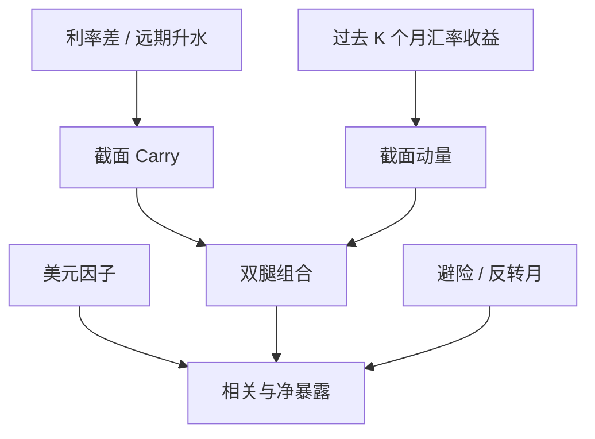

# 外汇 Carry 与动量

利率差是价格不变时能赚到的部分；过去收益的符号是价格已经走了的部分。外汇里这两条腿相关有限，崩溃月里却会同时翻脸。

<footer>—— 据 Lustig, Roussanov & Verdelhan 的货币风险溢价与 Menkhoff, Sarno, Schmeling & Schrimpf 的汇率动量事实整理</footer>

[上一课](/quant/trend-vs-roll)在商品期货上把现货腿与展期腿拆开：TSMOM 用总收益，Carry 用曲线斜率，二者不是自动正交。缺口是外汇截面上同一对问题：套息用利率差排序，动量用过去收益排序，崩溃月可以同亏。本课写 **外汇 Carry 与动量**如何并存、如何叠加。不重讲 backwardation 记账。不要把 G10 套息的夏普抄到新兴市场货币动量上，也不要把 CTA 的外汇趋势当成截面赢家减输家。

## 问题

商品上已经要求并列总收益趋势与事前斜率。外汇没有仓储曲线，排序键换成利率差与过去收益。UIP 说利差应被预期贬值抵消，远期溢价对后续即期变化的回归斜率应为正；Fama（1984）以来斜率常为负，套息赚到均值。缺口立刻变成两条：第一，这个溢价是灾害风险（高息货币在全球去杠杆时崩）还是行为（投资者高估利差持续性）？第二，价格路径本身有没有独立的可预测性？若动量在控制 Carry 之后仍显著，则外汇超额至少有两维，不能把所有「做多高收益货币」都叫做套息。

第二个识别问题来自构造。汇率没有一个全球无风险的「市场组合」。Lustig、Roussanov、Verdelhan 把货币按利率差排序，得到美元因子（所有外币对美元的平均超额）与 HML-FX（高息减低息）。动量则按过去收益排序，多强势货币、空弱势货币。两套排序的交集不空：高息货币可以同时是过去的赢家，也可以正在崩。必须先分开排序键，再谈相关与崩溃。

### 利率差不是过去收益

记货币 $i$ 对美元的一个月超额为 $rx_{t+1}^i \approx i_t^i - i_t^{\mathrm{USD}} - \Delta s_{t+1}^i$（$s$ 为美元标价的外币）。Carry 信号是 $i_t^i - i_t^{\mathrm{USD}}$ 或远期升水；动量信号是 $\sum_{k=1}^{K} rx_{t-k+1}^i$ 的符号或排序。$K$ 常用 1、3、12 个月；Menkhoff 等人的主结果在一个月持有、三到十二个月形成期。Carry 可以在汇率几乎随机游走时仍为正；动量要求价格已经走了一段。把十二个月总收益里的利差成分再叫一次动量，会双计。

静态套息（永远多澳元空日元）与每月重排的动态 Carry 不同。动量更必须动态：赢家名单会换。报告夏普时写清重排频率、是否波动缩放、是否含新兴市场。1990 年代日元融资不是全部样本。

## 方法

资产池：G10 即期或可交割远期，另列一套含新兴市场的对照。信号在每个月末计算，持有约一个月。Carry 腿按利率差或远期升水截面排序，多最高一组、空最低一组；动量腿按过去 $K$ 个月即期收益或超额收益同样排序。仓位常按实现波动缩放，使高波新兴货币不主导。检验包括：单腿的均值与偏度、双腿回归里的增量 $t$ 值、以及与美元因子的相关。

组合层有三种合法加法。等权：Carry 组合与动量组合各一半风险预算。条件：只在动量不与 Carry 打架时加重套息——高息且过去仍升值。正交：先把动量收益对 Carry 回归，用残差当第二腿。三种相关结构不同，不能只报一个「Carry+Mom 夏普」。与[时间序列动量](/quant/tsmom)对照：TSMOM 对每个汇率看自身过去收益的符号，可以在「所有货币对美元都在涨」时全员做多外币；截面动量强制多空资金中性，净美元暴露更弱。

### 崩溃月必须单独成表

Brunnermeier、Nagel、Pedersen 指出套息的左尾厚：避险潮里低息货币升值、高息货币被平仓。动量在趋势反转时也亏，但亏的状态不同——V 型反弹打的是趋势，不是利差本身。危险的是两者同时为负：高息货币已经涨过、拥挤之后突然反转，Carry 与动量一起砍仓。1998、2008、2013 年 Taper 一类月份应单独报告，而不是埋进全年夏普。若去掉崩溃月后 Carry 溢价消失、动量仍在，两条腿卖的尾部不一样。

## 机制

风险叙事：高息货币在全球风险偏好下降时提供负收益，投资者要求溢价；动量则像反应不足或趋势追逐，中期延续、长期减弱。资金叙事：套息是杠杆策略，融资货币在保证金上升时被强制平仓，价格路径出现动量崩溃。微观叙事：央行干预与资本管制让汇率对利差的调整滞后，形成可交易的趋势，但干预方向一旦反转，两条腿一起失效。三条可以共存：G10 更像灾害与杠杆，新兴市场更像干预与不可兑换。

与[跨资产 Carry](/quant/carry-everywhere) 的分工：那里 Carry 是统一的收入定义，外汇只是一列；这里要回答外汇内部第二因子是不是动量。与[价值与动量无处不在](/quant/value-momentum-everywhere)对照：AMP 的外汇价值常用实际汇率或购买力平价偏离，不是利率差。Carry 高的货币按 PPP 往往偏贵，价值腿与 Carry 腿可以负相关。三因子（价值、Carry、动量）同时出现时，应报告相关矩阵，而不是把价值改名为「便宜的套息」。

### 波动缩放改变权重，不改变 UIP 检验

不加缩放时，土耳其里拉一类高波货币主导盈亏，样本变成少数新兴市场事件。缩放后更接近「每单位风险的利差与趋势」。缩放会在波动冲高时降杠杆，这既减套息崩溃的一部分，也可能在趋势加速的初段少赚钱。UIP 回归用的是未缩放的汇率变化，策略夏普用的是缩放后的组合；两者不可互相替代。复制应提供有无缩放、是否含新兴市场两套表。

远期升水在危机后含交叉货币基差，不再等于存款利率差。用 CIP 偏离当 Carry，对象变成资金约束，不是经典套息。写方法时必须声明信号来自存款利率、OIS 还是 FX 掉期隐含利率。

## 边界与工程取舍

交易成本：即期点差在 G10 小、在新兴市场与压力月里可以吃掉动量的一截。容量：套息名义大，但拥挤本身就是崩溃机制的一部分。交易时间：外汇是 OTC 加若干期货，价格发现在伦敦—纽约重叠时段最密，用纽约收盘排序与用东京收盘排序不是同一截面。NDF 货币没有可交割远期，信号与执行要对齐到同一合约。

不要把美元空头叫做 Carry——那是美元因子，所有外币平均超额。不要把 12 个月均线金叉叫做截面动量。不要在已经做了 TSMOM 的外汇期货组合上，再叠加同一批货币的截面动量而不做净暴露诊断。A 股不可兑换，在岸人民币不是 G10 套息样本；离岸 CNH 的点差与干预节奏要单独建模。

出处：Lustig, Roussanov & Verdelhan 的货币因子；Menkhoff, Sarno, Schmeling & Schrimpf, *Currency Momentum Strategies*, Journal of Financial Economics, 2012；套息崩溃见 Brunnermeier, Nagel & Pedersen。跨资产 Carry 见 Koijen 等，2018。不要把 2012 年动量论文写成套息的首次发现。

## 小结

- 外汇 Carry 用利率差或远期升水排序，动量用过去收益排序；两者相关有限，崩溃月可以同亏。
- 美元因子是所有外币对美元的平均，不是套息；HML-FX 才是高息减低息。
- 截面动量与外汇 TSMOM 的净美元暴露不同，不可互换标签。
- 机制可以是灾害风险、杠杆平仓与干预滞后；去掉崩溃月是必要的敏感性，不是作弊。
- 信号利率必须与执行工具一致；危机后 CIP 基差会改写 Carry 的含义。
- 波动缩放改变的是组合权重，不是 UIP 回归本身。
- 出处：Lustig–Roussanov–Verdelhan；Menkhoff–Sarno–Schmeling–Schrimpf, JFE 2012。
