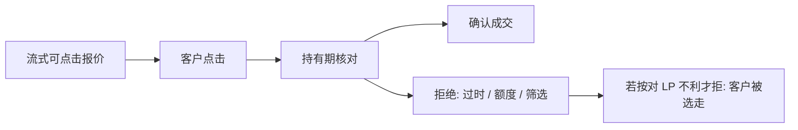

# FX last look

Last look 把可点击报价写成带有拒绝权的期权：客户点了，流动性供给方仍可在短窗内确认或撤销。它可以被用来挡住延迟套利，也可以被用来在信息到达后单方面改写成交。

<footer>—— 全球外汇委员会《FX Global Code》对 last look 的指引；机制对照 Foucault, Kozhan and Tham, Toxic Arbitrage, Review of Financial Studies, 2017</footer>

[外汇市场结构](/quant/fx-market-structure) 里，客户面对的常常是流式报价而不是保护 NBBO。缺口是这层报价的法律与经济含义：许多流动性提供者（LP）在被点击后保留 last look——一段持有期（hold period）内决定成交或拒绝。全球外汇委员会的《FX Global Code》要求 last look 不得被用来获取额外信息优势，并应向客户披露。本课把拒绝权写成市场设计，对照股票里过时报价的狙击与 [IEX 颠簸](/quant/speed-bump-iex)。不重写三角套利，不把宏观汇率模型再来一遍。

## 问题

流式报价在聚合器上以毫秒更新。更快的一方看到银行间或另一 ECN 已经跳价，去点尚未更新的客户报价，就是 Foucault–Kozhan–Tham 意义上的有毒套利：吃的是过时承诺。LP 若必须成交，等于无补偿地卖出 BCS 式期权。Last look 的政策叙事是：用对称的短窗去核对价格是否仍有效、信用额度是否仍在，从而愿意把价差报得更窄。问题是拒绝规则的条件。若拒绝只在*自身报价已相对参照市场过时*时发生，它接近颠簸：保护更新跑赢吃单。若拒绝还条件于*客户这笔单随后的方向*或窗内新到达的信息，它变成单边期权，客户的有效价差被选走——成交留下的是被筛选过的流，拒绝留下的是有毒腿。

股票公开限价单没有这种事后拒绝；保护规则要求成交或不在该价上展示。FX 客户层把「展示」与「承诺」拆开。这与经销商 RFQ 的沉默同族，只是发生在已经显示的可点击价格上。

### 持有期、参照与披露

设计旋钮：持有期长度、参照何处（本行内部簿、EBS、聚合器）、拒绝是否必须对称（买与卖同一规则）、是否向客户实时披露拒绝原因。窗太短，挡不住跨场所延迟；窗太长，客户承担单边价格风险，即时性名存实亡。Code 强调：不应在持有期内利用该询价去对冲或再报价来伤害客户。这是透明与最佳执行在 OTC 上的版本，不是股票 Rule 611。

历史上 NYSE 专家也曾有过类似的「最后一看」。对象不同，但经济同构：谁在成交前仍拥有选择权。

## 方法

把每次点击写成：报价、点击时戳、确认或拒绝、持有时长、拒绝时参照市场已移动的方向与幅度。质量：客户成交的有效价差（含被拒后的再点击）、拒绝率、拒绝后参照收益对客户方向的回归（有毒则拒绝应集中在对 LP 不利的跳）。对照：无 last look 的 ECN 限价簿、有固定进场延迟的场所、内部化但不披露拒绝规则的 LP。Butz 与 Oomen 把电子 FX 内部化写成执行对象：拒绝是成本，不是道德标签。

回测若把流式中间价当可成交，等于假设拒绝率为零、持有期内价格不变。实施缺口会系统性偏乐观。

## 机制

Last look 把相对速度从「谁先到引擎」改成「谁在短窗内拥有撤销权」。对有毒套利，它接近 IEX 式不对称保护：LP 更新参照的路径短于客户吃单被确认的路径。对非知情客户，同一权利是延迟税与成交不确定性：被拒后价格已经走掉，必须再点更差的报价。均衡价差可以更窄（LP 少付期权金），有效成本对客户是否下降，取决于拒绝规则是否只过滤延迟套利、还是也过滤信息流。批发商内化里的择单是亲戚：成交样本被选过，实现价差看起来很好，未成交腿不进分母。

对聚合器：多家 LP 同时 last look，客户的「最优可点击」在确认前都不是承诺。全国最优在 FX 里本来就不存在；last look 让瞬时最优更加是分布而不是数字。

## 边界

银行间主撮合通常没有客户式 last look，优先规则更接近连续簿。Code 是行业规范，不是单一司法的硬法，执行靠披露与关系。加密撮合、股票 ISO 扫单都不是这一对象。本课结束「规则与场所」序列；后课进入金融结果上的推断——成交与拒绝都是事后才观测到的结果，方差结构不齐。

不要把拒绝当「降低毒性」的处理、再用同期收益当结果而不谈选择。识别问题留给计量课；本课只要求：拒绝规则是价差的一部分。

## 小结

- Last look 是可点击报价上的事后拒绝权，可挡有毒套利，也可筛选客户流。
- 持有期、参照与是否对称决定它更像颠簸还是更像单边期权。
- 流式中点在确认前不是可执行价格；拒绝率必须进入执行会计。
- 出处：Global Foreign Exchange Committee, *FX Global Code*（last look 指引）；Foucault, Kozhan and Tham, *RFS*, 2017；Butz and Oomen, *Quantitative Finance*, 2019。
