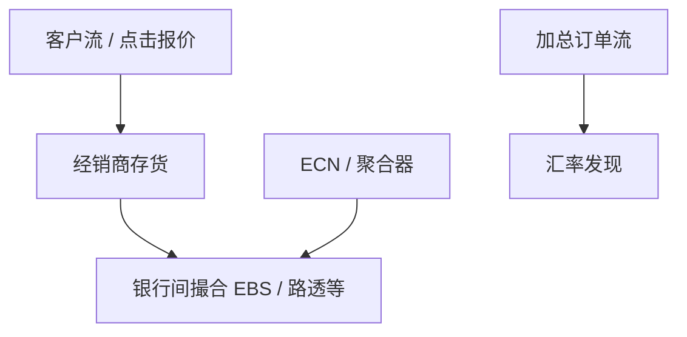

# 外汇市场结构

外汇没有一张全国限价簿。即期价格写在银行对客户的报价、银行间电子撮合、以及一簇 ECN 上；订单流本身携带关于汇率的信息，而不是宏观消息的残差。

<footer>—— Lyons, The Microstructure Approach to Exchange Rates, 2001；Evans and Lyons, Order Flow and Exchange Rate Dynamics, Journal of Political Economy, 2002</footer>

[债券电子化](/quant/bond-electronification) 是 OTC 走向电子匹配的一条路径。缺口是外汇：电子化更早、交易几乎全天连续，但层级仍在——客户市场与银行间市场不是同一张簿。Lyons 把汇率写成存货与信息的微观结构对象；Evans 与 Lyons（2002）表明订单流对汇率变动有解释力。本课写场所分层与流的信息含量。利率平价、购买力平价是别的栏的宏观约束，这里不重做；三角无套利见 [交叉汇率](/quant/fx-triangle)，只当报价一致性，不当本课主干。

## 问题

传统两层：客户向经销商询价或点击流（streaming）报价；经销商再在银行间市场（EBS、路透撮合一类）卸库存、发现价格。后来的 ECN 与聚合器让部分客户直接碰到银行间风格的簿，层级被打薄，但没有股票式 NBBO 与订单保护。谁看见哪一层报价、报价对谁可执行、尺寸一变是否仍有效，决定「市场价」三字。问题是：价格发现发生在哪一层；客户流与银行间流谁更知情；以及 24 小时季节（伦敦–纽约重叠最厚，亚洲时段某些货币对极薄）如何改写深度。

King、Osler 与 Rime 的综述把参与者、电子化与演变收在一起。Rime 与 Schrimpf 等在国际清算银行的市场调查提供份额事实：电子占比升，并不等于客户已经面对一张公共 LOB。

### 流是信息，不只是存货

Evans–Lyons：客户订单流加总后，与同期汇率变动相关，因为流把分散的宏观解释带进价格，而不必等待公开新闻。这与 [Kyle](/quant/kyle-model) 的「噪声掩护知情」同族，但外汇的「价值」是宏观状态，知情分散在公司、资产管理者与银行客户里，不是单一内幕者。不要把单期 Kyle 的 $\lambda$ 直接装到 EURUSD 上：没有统一的公开 $y$，聚合器里每家银行看见的流不同，存货模型与信息模型缠在一起。Lyons 的经销商存货仍重要——美元作为媒介货币承担最多库存，交叉盘常被合成，这已在三角课点过，此处只保留：媒介货币的银行间簿更厚，不是因为宏观更简单。

「即期收盘」在外汇里常常是某个窗口的定盘（WM/R 一类），机制更接近参照拍卖，而不是股票官方收盘。定盘窗的同步冲击是执行对象，不是发现的全日充分统计量。

## 方法

描述一只货币对：银行间主场所、主要 ECN、客户电子渠道、定盘机制、交易季节。质量分层：银行间价差与深度、客户加价、聚合器上可点击量。发现用领先滞后或信息份额时，必须声明用的是哪一层报价——客户流报价滞后银行间若干毫秒到数十毫秒是常态，不是套利残差。订单流回归（Evans–Lyons 风格）用的是经识别的买卖发起，字段来自平台而非公开 NBBO。

跨场所：同一货币对在多家 ECN 上的簿不同步，相对速度竞赛与股票碎片化同构，但没有 Rule 611。过时报价靠后课的 last look、内部化与延迟来处理。

## 机制

银行间电子撮合接近连续限价簿，FIFO 或类似优先规则，速度竞赛存在。客户层仍是经销商：报价可以是流式、可撤销、对客户类型歧视。电子化让客户加价下降，也让延迟套利更容易打到流式报价上——与股票跨所狙击同族。伦敦–纽约重叠提供噪声与存货周转，像 Admati–Pfleiderer 的厚时段；亚洲午后某些交叉盘接近盘后股票：发现若发生，流动性不必跟随。

对执行：聚合器上的「最优」是多层报价的拼装，尺寸与信用额度一变即失效。把一层 ECN 的中点当全球公允，会低估客户层加价、高估可成交深度。

## 边界

NDF、在岸/离岸、资本管制下的货币对，层级与可兑换性先于微观结构。本课不讨论宏观汇率决定，不把 vNM 偏好搬进来。加密货币 24/7 撮合不是 FX 银行间。下一课专写客户电子渠道里最特殊的设计旋钮：last look——报价被点击之后仍可被拒绝。

把 FX 当成「没有开盘收盘的股票」会漏掉两层市场与定盘窗。时钟是全球的，场所仍是分层的。

## 小结

- 外汇是分层 OTC：客户报价、银行间撮合与 ECN 并存，没有全国保护簿。
- 订单流携带分散信息，Evans–Lyons 把发现写成流的函数，而不是新闻残差。
- 电子化压低加价，同时把相对速度问题送进流式报价。
- 出处：Lyons, 2001；Evans and Lyons, *JPE*, 2002；King, Osler and Rime 对外汇市场结构的综述；BIS 外汇市场调查。
