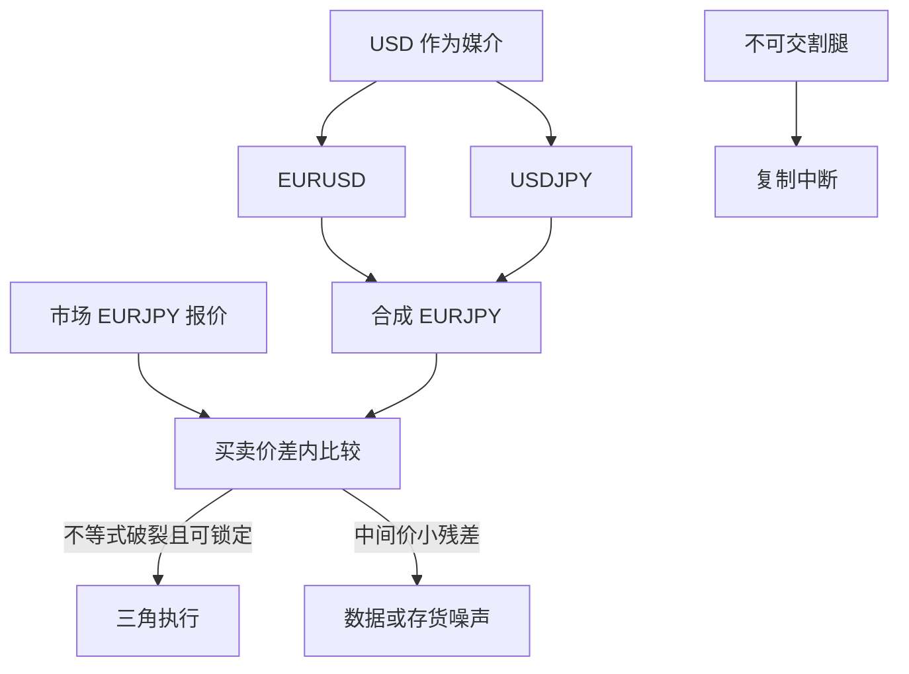

# 交叉汇率三角

三种货币只应有两个独立的即期；第三条必须是前两条的乘积，否则三角本身就是一台印钞机——直到价差、延迟与不可兑换把它关掉。

<footer>—— 无套利会计；高频下的可执行性见 Akram, Rime & Sarno, Journal of International Economics, 2008</footer>

在美元、欧元、日元之间，市场同时报 EURUSD、USDJPY、EURJPY。无套利要求交叉汇率等于媒介路径的乘积：$\mathrm{EURJPY}=\mathrm{EURUSD}\times\mathrm{USDJPY}$（在一致的标价法下）。任何第三种报价若持久偏离这一乘积，理论上可以买便宜边、卖贵边，三角闭合。现实里，偏离首先被买卖价差吃掉，其次被延迟吃掉：你看到的三角在你的市价单到达时已经平了。Akram、Rime 与 Sarno（2008）把显微镜对准 CIP 与相关平价，结论是可执行的利润短促且微小。Lyons（2001）的外汇微观结构把价格写成存货与信息的函数：媒介货币美元承担了最多的存货，交叉盘往往是被合成出来的。本篇写三角作为**报价一致性约束**，以及它在 NDF、离岸—在岸、延迟套利下如何变形。

## 问题

$N$ 种货币有 $N(N-1)/2$ 个货币对，但只有 $N-1$ 个独立汇率（选定计价货币之后）。多余的报价必须与生成树一致。交易系统若把每个货币对当成独立布朗运动去校准波动与相关，造出的协方差矩阵会给三角套利留出正的特征值——那是模型错误，不是交易机会。问题是把一致性写进曲线与风险：即期三角、远期三角、波动三角（交叉的隐含波动由两边与相关决定）是同一逻辑的三层。

第二层是执行。三角套利不是无风险的三笔同时成交，除非你在同一主经纪商或同一 ECN 上拥有锁定的组合报价。跨平台「看见」的三角，是过时信息。Foucault、Kozhan 与 Tham（2017）讨论有毒套利：吃到过时报价的一方，把延迟当收费。把教科书三角当成稳定 alpha，会变成给更快的人输送流动性。

### 标价法与倒数

EURUSD 是一欧元的美元价，USDJPY 是一美元的日元价，乘积才是一欧元的日元价。若有人把 GBPUSD 与 EURGBP 混用倒数，会凭空造出「三角破裂」。所有检查必须先把报价换成同一方向的价格（货币 $i$ 以货币 $j$ 计），再比

$$
S_{ik}\stackrel{?}{=}S_{ij}S_{jk}.
$$

买卖价差下，无套利是不等式：买入交叉的卖价，不能低于两条腿买入的合成卖价之外再加费用。点估计的「中间价三角」可以每天都有几个基点的残差，而买卖价差三角仍然成立。

中间价残差用于数据清洗很有用：持续几十个基点的破裂通常是标价反了、小数位错了、或把 NDF 与可交割即期拼在一张表里。不要把它直接当成交易信号。

## 方法

数据层：对每个时间戳，用同一来源的买卖报价检查不等式。残差超过阈值先当数据错误，再当机会。风险系统：选一棵生成树（例如所有货币对美元），其余汇率由乘积定义；观测到的交叉与合成交叉之差，列为基差风险，而不是又一个独立因子。这与固定收益里用折现因子生成远期、把存款与期货的差列为凸性或基差是同一思维，见 [即期、远期与折现](/quant/spot-forward-df)。

远期层：CIP 对每个货币对给出远期，三角必须在远期也闭合，否则可用即期三角加掉期合成。交叉货币的流动性薄，市场用两条美元 FX 掉期合成交叉远期，残差进入交叉基差，见 [利率平价](/quant/irp) 与 [交叉货币基差](/quant/xccy-basis)。波动层：交叉的隐含波动 $\sigma_{ik}^2=\sigma_{ij}^2+\sigma_{jk}^2+2\rho\sigma_{ij}\sigma_{jk}$（对数汇率、在相关性定义一致时），报价的交叉风险逆转与蝴蝶必须与两边的风险中性相关可对上，否则是波动三角套利（仍受买卖与对冲误差限制）。

### 媒介货币与合成

大多数机构客户的交叉盘，银行用美元（或欧元）做媒介内部对冲。客户看到的 EURJPY 报价，已经包含了两条腿的库存与相关风险的加价。三角「破裂」在客户报价上可以是合理的存货溢价。可交易的三角只存在于银行同业或 ECN 的最优买卖之间。研究应使用同层级报价；把对客报价与同业中间价比三角，会得到虚假的稳定利润。

## 机制

无套利机制是复制。买 EURJPY 等于买欧元卖日元；若 EURJPY 贵，可卖 EURJPY、买 EURUSD、买 USDJPY（方向按标价调整），现货交割后货币头寸为零。约束生效的速度取决于清算与授信：即期 $T+2$ 交割，三笔必须进同一套额度。资本管制下，某一条腿根本不能交割，复制断了——这正是 [NDF](/quant/ndf) 的世界：韩元 NDF 与美元、离岸人民币之间的「三角」不必等于在岸可交割三角。

微观结构机制是延迟与存货。Lyons 强调做市商用价格管理存货；三角的短暂破裂可以是某一条腿刚吃进大单、尚未更新交叉。更快的相对价值交易者把三条腿重新对齐，赚的是存货调整过程，不是发现了新的宏观信息。这与统计套利里的指数套利同一家族，只是这里的「公平价格」由乘法表给出，而不是由篮子成分。

加密货币交易所上的三角更脏：提币延迟、停牌、记账单位不是同一美元。传统外汇的三角文献不能直接搬到「BTC–ETH–USDT」。本篇只讨论银行间与 ECN 外汇。

### 波动三角不是即期三角的平方

相关 $\rho$ 可以变。欧元—日元的隐含相关在风险偏好崩溃时会跳，交叉波动的「公平」值跟着动。用历史相关去算交叉的理论隐含波动，再当三角套利，会把相关风险当成 alpha。正确做法是把交叉期权与两边期权联立，解出风险中性相关，再问报价是否离开这个曲面足够远、且你能对冲三条 vega。没有期权账簿时，不要做波动三角。

## 边界与工程取舍

不可兑换、在岸午盘停报、央行干预、fixing 窗口，都会让某一条腿的可交易性下降，三角不等式的前提消失。伦敦下午与纽约重叠时段，美元媒介最深，三角最紧；亚洲早盘交叉更宽。回测若用每分钟中间价、假设三腿同时成交于中间，会高估几个数量级。应至少用买卖价、假设吃价、并加一条保守延迟。

风险管理不要把 EUR、USD、JPY 的即期风险当三个独立 01。一致的做法是持有 $N-1$ 个美元交叉的风险，交叉盘自动映射。否则同一欧元空头会在 EURUSD 与 EURJPY 上被算两次，或对冲时买错腿。

Deardorff（1979）指出单向套利（用商品或证券市场绕过外汇）会进一步收紧平价带。对 G10 即期，这一层通常已被价差覆盖；对有资本管制的货币，单向路径（通过不可交割、通过离岸存款）才是真正的边界，应与 NDF 篇一起读。

## 小结

- $N$ 种货币只有 $N-1$ 个独立即期；交叉必须等于媒介路径乘积，否则存在三角。
- 可执行性受买卖价差、延迟与授信约束；中间价残差多用于清洗，少用于交易（Akram, Rime and Sarno, 2008）。
- 远期三角与 CIP、交叉基差是同一致性的到期版本；波动三角还依赖隐含相关，不能只用历史相关。
- 资本管制下 NDF 与在岸不必闭合三角；那是市场分割，不是免费印钞。
- 风险应在生成树上记账，避免交叉盘与媒介盘重复计算。
- 出处：Akram, Rime and Sarno, *Journal of International Economics*, 2008；Lyons, *The Microstructure Approach to Exchange Rates*, 2001；Deardorff, *Journal of Political Economy*, 1979；Foucault, Kozhan and Tham, *Review of Financial Studies*, 2017；CIP 背景见 Keynes, 1923 与 Fama, 1984。
