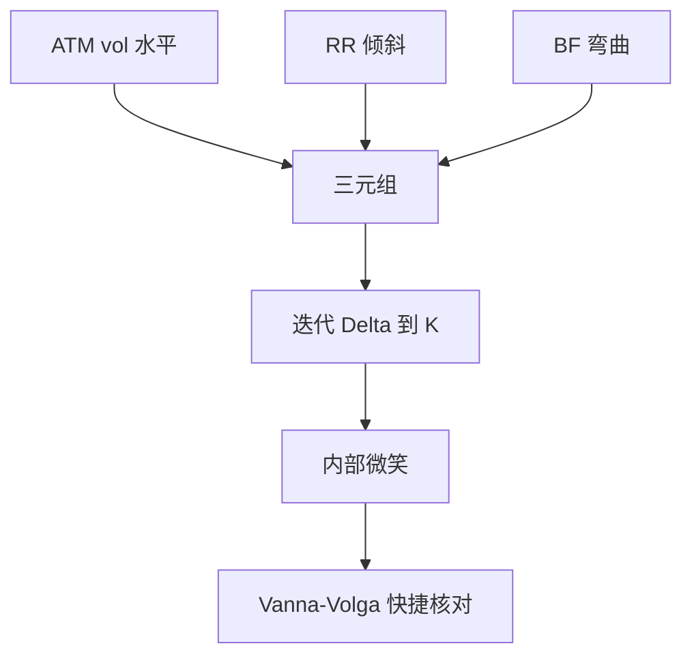

# FX 波动率报价 ATM / RR / BF

外汇微笑不按执行价报，而按 ATM、风险反转与蝶式三个可交易结构报；它们近似水平、倾斜与弯曲。

<footer>—— Malz, Estimating the Probability Distribution of the Future Exchange Rate from Option Prices, Journal of Derivatives, 1997；Clark, Foreign Exchange Option Pricing</footer>

[上一课](/quant/garman-kohlhagen)给出无微笑的 GK。本课把 [报价惯例](/quant/quoting-conventions) 在 FX 上展开：ATM vol、25Δ risk reversal、25Δ butterfly。缺口是这三件事如何还原出 $K\mapsto\sigma(K)$，以及 Vanna–Volga 一类快捷法与完整曲面校准的分工。后课 FX 障碍依赖翼部，不能只盯 ATM。

## 问题

做市商报 $\sigma_{\mathrm{ATM}}$、$\mathrm{RR}_{25}=\sigma_{25c}-\sigma_{25p}$、$\mathrm{BF}_{25}=\tfrac12(\sigma_{25c}+\sigma_{25p})-\sigma_{\mathrm{ATM}}$（定义有变体）。三个数交易的是三个流动性最好的组合，不是三个独立执行价。问题是反解 $\sigma_{25c},\sigma_{25p}$ 再插值整张微笑：Delta 与 $K$ 的映射依赖 vol 自身，方程是隐式的，要迭代。用股权那套「按 $K$ 扫隐波」去读 FX 经纪人屏幕，会对不上任何一笔成交。

Malz 用 RR/BF 近似风险中性密度的偏度与峰度。快捷，但不是无套利曲面。生产仍应映到内部 $(K,\sigma)$ 再做无套利检查。

### Vanna–Volga 是快捷，不是模型

用 ATM、RR、BF 三笔的市场价格去配三个权重，修正 GK 价格的 Vanna 与 Volga 项，得到一阶微笑调整。对香草好用，对障碍与触碰会漏掉触碰概率对翼部的依赖。后课障碍不要只用 Vanna–Volga 当官方模型；它是报价核对。

10Δ 的 RR/BF 流动性差、噪声大，却决定触碰价格。校准若只配 25Δ，应对 10Δ 加正则或单独限额。

## 方法

Adapter：报价三元组 → 迭代求解对应 $K$ 与 $\sigma$ → 用 SABR 或三次样条在 Delta 或 $K$ 空间插值 → 输出内部曲面。日间 bump 应 bump ATM/RR/BF 再映射，这样桶与经纪人结构一致，见 [Vega 桶](/quant/vega-buckets)。对冲：用 ATM 跨式、RR 结构、BF 结构去减三因子，而不是买一堆零散 Delta。

期限结构：每个到期一套三元组，远期微笑由动态模型负责，不要在每个到期独立插值后再假装无日历套利。

## 机制

ATM/RR/BF 是市场选择的主成分交易方式。PCA 课里的水平、倾斜、弯曲在 FX 上几乎被直接上市。因此 FX 簿的风险报告天然是三因子加翼部残差。把它们拆成许多 $K$ 再独立 bump，会破坏做市商实际能成交的方向。

## 边界

定义变体（包括/不包括 ATM 的 BF、Delta 是否 premium-adjusted）在确认书里，代码必须按对手切换。新兴市场只报 ATM 与 RR、没有 BF，弯曲来自先验。跳与 fix 事件（非农、央行）让短到期微笑的 BF 爆炸，三因子不够，应加事件情景。

## 小结

- FX 微笑的市场坐标是 ATM、RR、BF，不是执行价网格。
- Delta 与 $K$ 互相依赖，必须迭代；对冲用这三种结构。
- Vanna–Volga 适合香草核对，不适合当障碍官方模型。
- 出处：Malz, *Journal of Derivatives*, 1997；Clark, *Foreign Exchange Option Pricing*。
