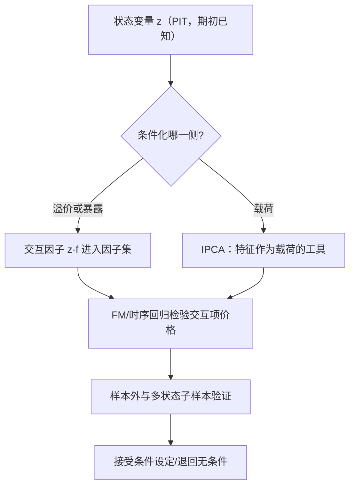
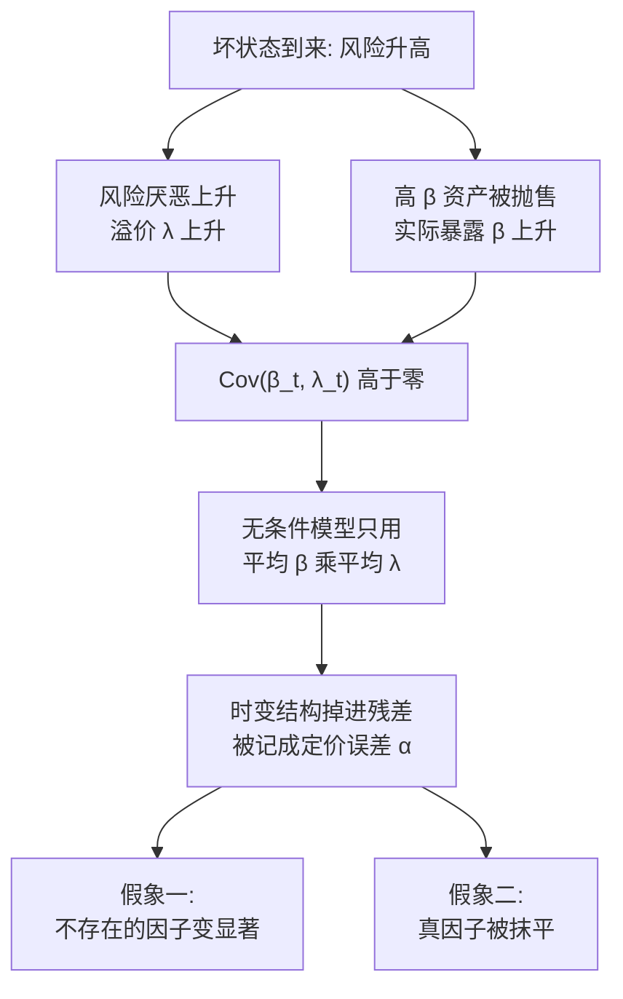

# 条件因子深化

无条件模型把时变压进 α：载荷随状态变、溢价随状态变，两者在平均里互相抵消或互相伪装。条件化的本质是把协方差项显式建模，而不是任它掉进定价误差。

<footer>—— 据 Cochrane, Asset Pricing, 2001；Lettau & Ludvigson, Journal of Political Economy, 2001 整理</footer>

[上一课](/quant/fz-macro-style)末尾把风格收益对宏观状态回归，得到条件刻画——那是描述版。本课把条件化写成模型：载荷与溢价随状态变量变化时，无条件检验为什么系统性失真，条件假设怎么变成可检验的回归，工程上怎么构造条件因子而不掉进未来函数。[条件 CAPM](/quant/conditional-capm) 与[风险溢价时变](/quant/time-varying-rp)讲过基础设定；本课深化到管理组合技巧与载荷条件化的工具。

## 问题

无条件因子模型假设 $E[R_i]=\beta_i^\top\lambda$，$\beta$ 与 $\lambda$ 都是常数。实际上两者都随状态移动：杠杆约束紧的市场里 β 的风险价格高，衰退逼近时防御家族的溢价抬升。把时变硬压进无条件矩，误差不是零均值的：条件模型的无条件含义是 $E[R_i]=\bar\beta^\top\bar\lambda+\mathrm{Cov}(\beta_t,\lambda_t)$，最后一项是被丢掉的时变结构——它会被误记为定价误差。于是出现两种假象：不存在的因子因为时变「显著」，真因子因为时变被无条件检验抹平。缺口是把条件化写成回归能检验的形状。

术语翻译：条件化就是「让模型的参数跟着状态走」——β 和风险价格不再固定为常数，而是状态变量 $z_t$ 的函数；无条件模型则把一切平均掉。类比体温：全年平均 36.5 度不代表可以按平均穿衣，发烧日的暴露要单独建模。

### 管理组合技巧

Cochrane 的技巧：若期望收益随状态 $z_t$ 线性变化，把交互项 $z_t\cdot f_t$ 当作新因子加入因子集，条件模型就变成一个更大的无条件模型——「要不要条件化」变成「交互项有没有溢价」，仍用 FM/时序回归检验。代价：每个候选 $z$ 都是一次新试验。

设状态变量 $z_t$ 在 $t$ 期期初已知。若载荷随 $z_t$ 线性变化，则收益的条件期望可以写成 $\beta_i^\top\lambda+z_t\cdot(\delta_i^\top\lambda)$ 的形式——等价于在因子集中加入交互因子 $z_t f_t$，各资产对它的载荷是 $\delta_i$。检验条件模型就是检验交互项的风险价格是否非零，全部仍在标准框架内。这是条件化最干净的可检验形式。策略侧的对应物是条件构造：按 $z_t$ 缩放因子暴露（波动目标、估值信号），可行性与成本另见[因子择时的可行性](/quant/factor-timing-feasibility)。

数字实例：设 $z_t$ 是取 0 到 1 的风险厌恶指标，市场因子月超额 $f_t$。交互因子 $z_t f_t$ 在平静月（$z=0.2$）只记录 0.2 倍市场收益，在恐慌月（$z=1$）记录全额——它把「坏月份的市场」单独拎出来当一只新因子。若回归显示它的风险价格显著为正，说明坏月份里的市场风险确实更贵。

## 方法

工程上三条纪律。第一，状态变量的可得性：$z_t$ 必须在 $t$ 期期初公开可得——发布滞后、修订与口径变化都要按 [point-in-time](/quant/point-in-time) 处理，否则条件化是披着模型的未来函数（[无未来函数](/quant/no-future-function)）。经典候选如 Lettau–Ludvigson 2001 的 $cay$（消费—财富—收入比），其价值在于状态变量的构造与检验是公开可复制的。第二，载荷条件化的工具化：[IPCA](/quant/ipca) 把特征当作载荷的工具变量，让 β 随可观测特征演化，避免「先分状态再分组」的自由度爆炸。第三，验证协议：条件设定必须在样本外与多个状态子段上复验（[walk-forward](/quant/walk-forward)），样本内显著的状态交互是多重检验的高危区。

## 机制

为什么无条件检验的失真是系统性的？看协方差项：若 $\mathrm{Cov}(\beta_t,\lambda_t)\gt 0$——风险高的状态里风险厌恶也高——无条件 $\alpha$ 会系统性偏离；动量的条件结构（崩盘尾部集中在衰退后段，见[动量崩盘](/quant/momentum-crash)）就是载荷时变与溢价时变叠加的例子。条件化的收益是把这项从「误差」变成「参数」：交互项显著意味着时变结构可预测，交互项不显著则支持无条件设定——两种结果都是信息。危险不在检验本身，在搜索：$z$ 的候选空间近乎无限（宏观、情绪、估值、波动），试一百个 $z$ 挑最显著的一个，等于把多重检验折价置之不理；[PBO](/quant/pbo)、[CSCV](/quant/cscv) 与状态变量的[预注册](/quant/hypothesis-preregistration)在这里不是装饰，是必要条件。

常见误区：初学者容易以为「多试几个状态变量，总能找到一个显著的交互项」是勤奋，其实是搜出来的显著性——100 个相互独立的候选 $z$ 在 5% 水平下平均有 5 个纯靠运气「显著」。预注册、PBO 折价与样本外复验，就是给这扇后门上锁的三道工序。

## 边界

条件化不是免费午餐：每加一个交互项，样本的有效信息被摊薄，估计方差上升；状态变量之间的相关（估值与信用价差常同向）让交互项彼此难以区分。它也不解决因子择时的执行问题：即使交互项真实，按它调仓的成本与容量是另一门工程。最后，条件因子模型的报告必须附带状态变量的构造细节——本课程报告规范课对 $z$ 同样适用：一个无法 PIT 复现的状态变量，足以推翻整个条件设定。

## 小结

- 无条件模型丢掉 $\mathrm{Cov}(\beta_t,\lambda_t)$，时变被误记为定价误差。
- 管理组合技巧：交互因子 $z_t f_t$ 把条件假设变成可检验回归。
- 状态变量必须期初可得（PIT），载荷条件化用 IPCA 类工具控制自由度。
- 条件化的主要风险是搜索 $z$ 的多重检验，预注册与折价计算不可省。
- 出处：Cochrane, *Asset Pricing*, 2001；Lettau & Ludvigson, *JPE*, 2001。
