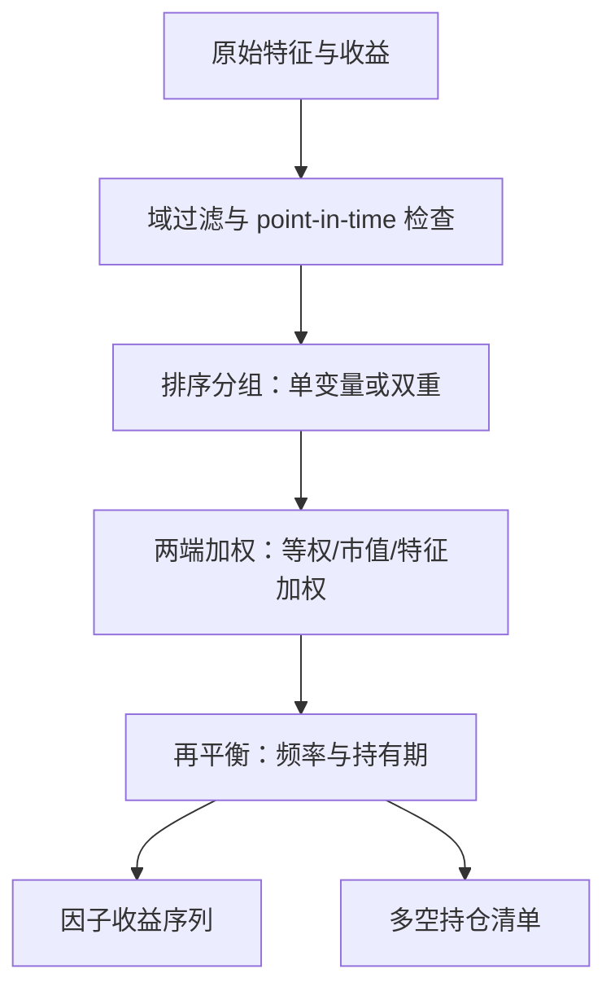
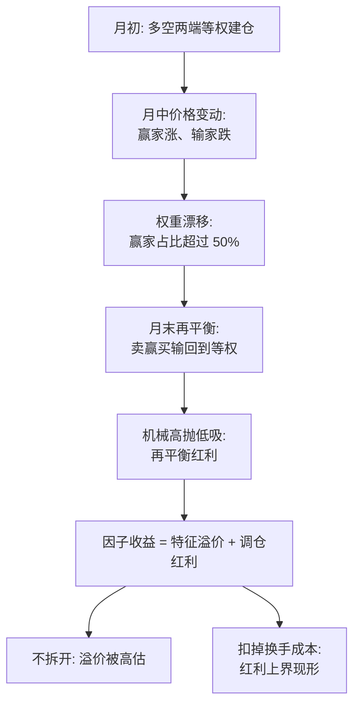

# 因子构造的方法论

因子不是从数据里「发现」的，而是被一整套排序、加权与再平衡的约定「制造」出来的；同一个思想，两种构造，可以给出两个不同的溢价。

<footer>—— 据 Fama & French, Journal of Financial Economics, 1993；Carhart, Journal of Finance, 1997 的构造约定整理</footer>

[上一课](/quant/ex-case-map)把交易执行深钻收束：算法谱系、暗池与竞价、TCA 的陷阱、成本预测与最优转换，最终归档成案例集——执行侧回答的是「怎样把目标仓位换成成交」。缺口在上游：仓位背后的研究对象从哪来。本课是「因子研究深化」的第一课，把因子构造的约定一次钉死：投资域、排序方式、加权与再平衡。后面十一课默认你已掌握这套词汇；构造的完整参数清单，也是本课程报告规范课与复现练习课的接口。

## 问题

「便宜的股票跑赢」是一个思想；落成数字要经过一串自由度：在哪个域里选股、用什么口径定义便宜、切几档、两端怎么加权、多久再平衡。每个自由度都移动溢价估计。麻烦不在于数字会变，而在于不同自由度混入的「额外收益」不同：等权加月度再平衡的组合隐含「卖涨买跌」的反转操作，市值加权的组合没有；独立双重排序的两端格数不均，会把规模暴露漏进所谓「纯价值」。构造不透明，后续的正交化、拥挤、衰减都没有共同基准；因子动物园里的争吵，一大半是两套约定的争吵。

直觉类比：因子构造约定就像同一道菜的火候与克数——「便宜的股票跑赢」是菜名，域、切档、加权、调仓频率是配方细节。换了配方，「同一个菜」端上来味道（溢价）可以差出一半；两篇论文吵价值因子死没死，常常只是配方不同。

### 三层自由度

第一层，域与数据：可投资域的流动性下限、退市与停牌处理、特征的 point-in-time 可得性（见[无未来函数](/quant/no-future-function)）。第二层，排序：单变量十分位，或双重排序；独立排序（先全市场按规模切，再各自独立按 B/M 切）与条件排序（先切规模，再在每组内切 B/M）答案不同。第三层，加权与再平衡：等权、市值加权、特征加权；持有期与调仓频率。三层全部写下来，构造才算被定义。

独立双重排序会产生空格与两端失衡：按市值与 B/M 各切三档后，超小盘的高 B/M 格可能只剩几只票，多空两端的市值分布也偏。条件排序保证每格有样本，但结果依赖「先按哪个变量切」——两种都是合法构造，报告必须写明是哪一种。

数字实例：Fama–French 1993 的经典配方是「NYSE 中位数切规模、30%/70% 分位切 B/M」，得到 $2\times3=6$ 个市值加权组合；SMB = 三个小盘组合的均值减三个大盘组合的均值，HML = 两个高 B/M 减两个低 B/M。每个参数（NYSE 分位而非全市场、6 月末而非月末重构）都是声明过的选择。

## 方法

把构造写成一句可执行的话：因子收益是权重向量的时间序列 $f_t=w_t^\top R_t$，而 $w_t$ 由排序规则从特征生成。方法论就是对生成 $w_t$ 的每一处自由度给出显式声明。Fama–French 1993 的示范是：用 NYSE 分位点把市值切两档、B/M 切三档，构成六个市值加权组合，每年 6 月末重构一次，SMB 与 HML 是这六个组合的线性组合。Carhart 1997 把动量以同样的语言接入：按过去 12 个月（跳过最近 1 个月）收益排序，多空两端构成 WML，月度重构。两条构造被文献复用三十年，正因参数被完整写死。

产出有两个，同等重要：收益序列 $f_t$ 与每期多空持仓清单。后者是正交化、拥挤度量与暴露检查的原料；只交收益序列，后半程研究全被堵死。

## 机制

为什么这些约定不是「实现细节」？因为每一处都在改变 $w_t$ 与价格的互动方式。等权月度调仓的 $w_t$ 每月向初始权重回归，机械地做空近期上涨者——它把短期反转溢价计入了因子收益，这部分收益不来自「便宜」，来自调仓动作本身。市值加权不再平衡，权重随价格漂移，没有这种红利；等权溢价系统性高于市值加权的部分，是再平衡红利而非特征溢价。识别的方法是问：这笔收益要求我做什么交易？月度等权每月换手，成本后溢价缩水多少就是红利的上界。同样的追问适用于每一层自由度。

常见误区：初学者容易把「等权因子溢价更高」解读为「这个特征更有效」，实际上多出的部分是每月卖涨买跌的反转红利——是调仓动作赚的，不是「便宜」赚的。检验办法：把调仓频率降到年度，若溢价大幅缩水，缩掉的就是红利加成本。

## 边界

本课只定义构造，不做评估：单因子怎么打分见[单信号评估](/quant/single-signal-eval)，特征回归与 β 回归的区分见 [Fama–MacBeth](/quant/fama-macbeth)。构造层面的中性化（行业、规模残差化）留给下一课的正交化；组合层面的暴露控制是本课程后段的主题。因子择时与容量不是构造问题，后面各有专课。还有一个诚实的提醒：构造自由度本身就是多重检验的入口——「换一种切法显著了」不是新发现，试了多少次切法要记下来。

## 小结

- 因子是被约定制造的：域、排序、加权、再平衡四类自由度必须显式声明，否则不可复现。
- 等权与月度调仓混入反转与再平衡红利；市值加权是更保守的默认。
- 独立与条件双重排序答案不同，两端失衡会把规模暴露漏进因子。
- 产出是收益序列加持仓清单，两者缺一不可。
- 出处：Fama & French, *JFE*, 1993；Carhart, *JF*, 1997；构造细节据原文构造节整理。
