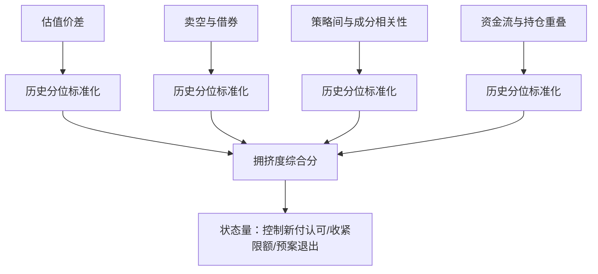
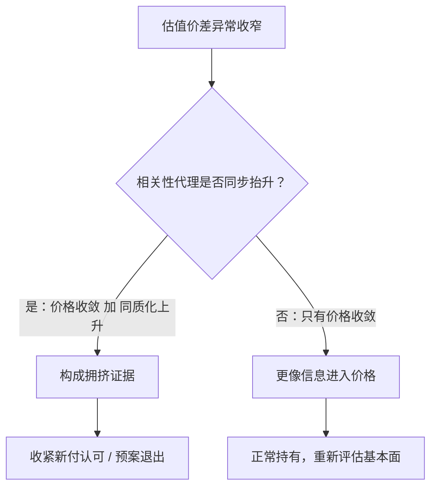

# 因子拥挤的度量

拥挤不是一句「人多的地方别去」，它是一组可测的量：仓位已在场的证据写在估值价差、空头账本与相关性矩阵里——但没有哪一个代理能独自看见全部。

<footer>—— 据拥挤度实务指标（估值价差、卖空与借券、持仓相关）与 Grinold & Kahn, Active Portfolio Management 的容量口径整理</footer>

[上一课](/quant/fz-orthogonalization)把新因子的价值写成「相对控制集的增量」，但增量是时变量：一个因子被广泛采用之后，同样的正交化残差会从显著走向消失。[alpha 的拥挤与衰减](/quant/crowded-alpha-decay)讲过衰减的机制与挤兑的形态（[拥挤螺旋](/quant/crowding-spiral)）；本课深入度量本身——拥挤怎么被拆成可观测的代理量，代理怎么合成，以及每个代理看不见什么。

## 问题

拥挤的直接定义是「太多资本执行同一策略」，但没有机构申报「我在做价值」。于是度量只能是间接的：从价格、持仓与相关性里找仓位已在场的证据。困难有三层。其一，每个代理只见一面：估值价差看见价格，看不见杠杆；空头数据看见做空端，在融券受限的市场干脆缺席。其二，拥挤与正常状态难分：价差收窄既可能是拥挤，也可能是基本面真的变化。其三，后果有两个维度：既压缩未来溢价（[策略容量](/quant/strategy-capacity)与[容量衰减](/quant/strategy-capacity-decay)），又抬高尾部风险（集中退出）。度量必须服务于这两个不同的问题，混在一个数里会两头都错。

### 四类代理

估值价差的常用口径：多空两端各取特征加权的估值倍数（如 EV/EBIT 或 B/M），价差取对数差 $S_t=\log v_{\text{贵端},t}-\log v_{\text{便宜端},t}$。用对数差消除量纲与市值漂移；看它的历史分位数而不是绝对水平，因为不同因子族的健康价差天然不同。

第一类是估值价差：便宜端相对贵端被买到什么程度。采用资金涌入时，买入端估值被推高、做空端被压低，价差异常收窄。第二类是做空与借券：空头占比、借券费率、利用率，直接读做空端的仓位压力。第三类是相关性：同类策略管理人收益两两相关上升、多空两端成分股相关性抬升——同质化的直接证据。第四类是资金与持仓：smart beta 产品流入、基金持仓重叠度。工程上把四类各自标准化（历史分位），加权合成拥挤度状态量，并保留分项供异常时溯源。

## 方法

「状态量」的直觉翻译：它不是「买/卖」的开关，更像天气预报里的湿度——不直接告诉你下不下雨，而是改变你对下雨概率的判断。保留分项也同理：体检报告不能只看一个综合健康分，肝病指标异常而其他平静，与全面异常，要去的科室完全不同。

合成有两个纪律。第一，分项保留：综合分方便比较，但决策与复盘要能回到分项——估值价差走到极值分位而空头分项平静，与两者同时极端，含义完全不同。第二，阈值按用途定：放行新资金可以宽，强制降杠杆必须结合流动性与退出时间——退出需要几天的仓位，阈值就设在那几天能走完的距离内。拥挤度是状态量不是判决书：它改变继续持有的条件分布，不是「因子已死」的结论。

## 机制

价差收窄的两种成因可以类比菜市场：某种菜突然便宜了，可能是新到一批货（基本面信息进入价格），也可能是所有摊主同时抢着甩卖囤货（拥挤者集体行动的前兆）。区分办法是看摊主们是否「同步行动」——对应到市场，就是策略间与成分股相关性是否抬升。

为什么估值价差是主要代理？溢价本身就是价格的函数：两端的钱已进场，未来溢价要在更贵的一端兑现，数学上必然更薄。这是拥挤压缩溢价的机制通道，不依赖任何行为假设。但它有一个诚实的漏洞：价差收窄不区分「聪明钱提前定价」与「杠杆钱拥挤进场」，前者甚至该加仓。所以价差要与相关性类代理交叉：价格收敛加上同质化上升，才构成拥挤证据；只有价格收敛，更像信息进入价格。这个交叉验证的逻辑，是拥挤度量区别于普通估值择时的核心。

## 边界

拥挤度量不给时点：没有代理能回答「崩盘哪天来」，它只抬升条件概率；把拥挤度当开关，会在阈值两侧反复进出，把信号变成交易成本。

常见误区：把拥挤度设成单一阈值开关。指标恰好在阈值附近抖动时，你会被反复触发加减仓，每次进出都付手续费与冲击成本。实务做法是设缓冲带——例如 90 分位进入观察、95 分位才真正降杠杆——并按退出所需天数倒推阈值：仓位要三天才能走完，阈值就要设在三天内能安全走出的位置。融券数据在受限市场不可得或代表性差，代理集要按市场裁剪。拥挤与基本面变化在单期内不可完全区分，度量只能给证据权重而不是判定；退出路径的设计属执行与容量主题。

## 小结

- 拥挤不可直接观测，度量靠四类代理：估值价差、卖空借券、相关性、资金与持仓。
- 代理标准化后合成状态量，但必须保留分项用于溯源与交叉验证。
- 估值价差是主要代理：它通过「溢价在更贵的价格上兑现」的机制压缩未来收益。
- 价差收窄要搭配相关性证据，才能与「信息进入价格」区分开。
- 拥挤度是状态量：改变持有条件与限额，不当择时开关。
- 出处：据拥挤度实务指标与 Grinold & Kahn 容量口径整理；衰减机制见站内拥挤衰减课。
