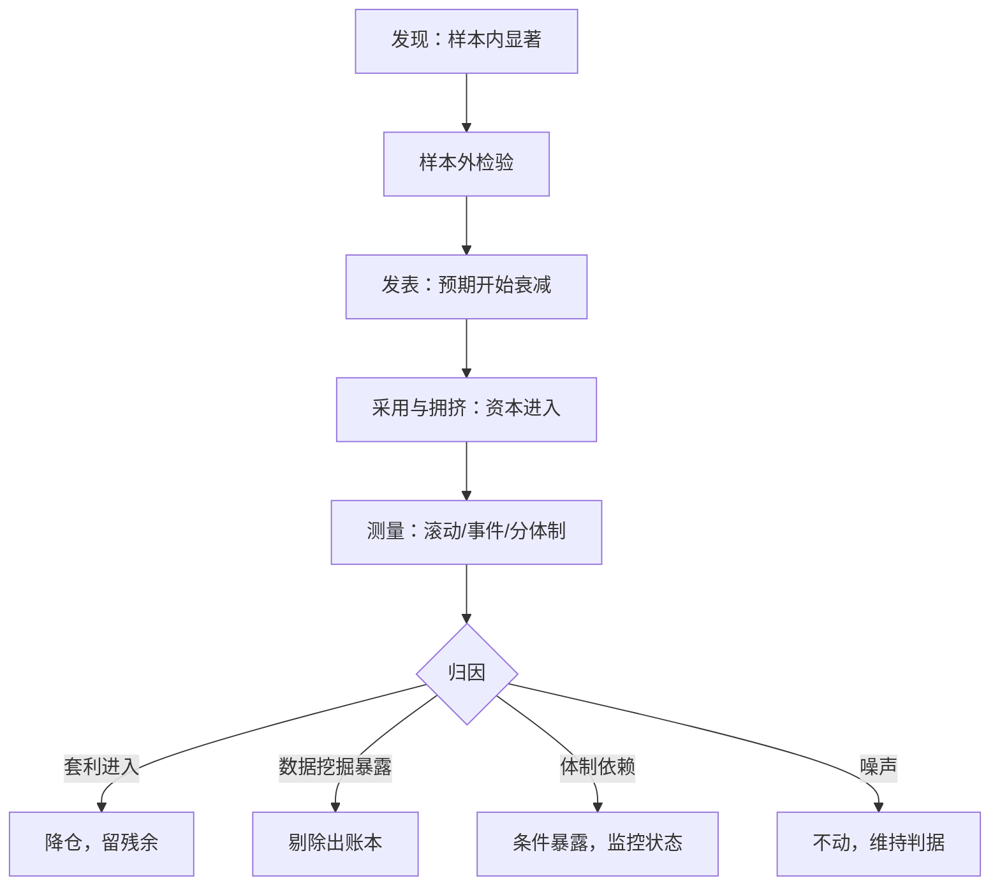
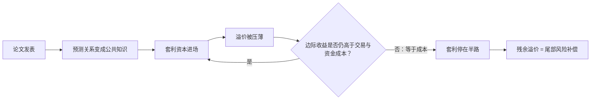

# 因子衰减与生命周期

因子像资产一样有生命周期：发现、发表、采用、拥挤、衰减。衰减几乎必然，死亡很少；把「降了一半」读成「已经归零」，是把尾部风险溢价白白送人。

<footer>—— 据 McLean & Pontiff, Journal of Finance, 2016；Harvey, Liu & Zhu, Review of Financial Studies, 2016 整理</footer>

[上一课](/quant/fz-crowding-metrics)把拥挤写成状态量；把状态量放上时间轴，就是生命周期。[换手与衰减](/quant/factor-decay-turnover)讲过持有期维度的信号衰减；本课把「衰减」本身作为研究对象：怎么测、归因于什么原因、对应什么动作。核心是把一个常被滥用的词变成可估计的量，并把「衰减了多少」与「死了没有」分开。

## 问题

因子溢价不是常数，但「这段回撤是衰减」是一种无法证伪的叙事：回撤既可能是套利资本进入压薄溢价，可能是异象本来就是数据挖掘，也可能只是体制暂时不利，或者干脆就是噪声。四种解释对应四种动作——减仓、剔除、条件化、扛住——混着谈就只剩一种动作：情绪化地进出。缺口因此有两个：把衰减变成可估计的量（幅度与速度），以及把估计出的衰减归因到原因上。发表是文献里少有的可定位事件，让第二个缺口有了干净的识别点。

### 测量

McLean & Pontiff (2016, JF) 对 97 个学术异象的组合收益做了样本内外与发表前后的对比：样本外收益约低 26%，发表后约低 58%。衰减显著但远非归零；残余部分与放弃交易后的尾部风险并存——动量发表数十年后仍有[崩盘](/quant/momentum-crash)。

测量从三个口径展开。滚动口径：滚动 IC 与多空收益均值，估半衰期——把溢价写成 $\mu_t=\mu_\infty+(\mu_0-\mu_\infty)\,e^{-t/\tau}$，$\tau$ 是衰减速度的尺度；样本短时只能给区间，不要点估计。事件口径：以论文发表（或策略进入大机构）为事件点做前后对比，这是 McLean–Pontiff 的做法，识别最干净，但每个因子只有一次事件。体制口径：按状态（波动、信用价差）分块的子样本均值，回答「溢价是死了，还是在另一个状态下活着」。三个口径合起来，才够支撑归因。

## 方法

归因是治理动作的入口。

「半衰期」的数字实例：把溢价写成 $\mu_t=\mu_\infty+(\mu_0-\mu_\infty)\,e^{-t/\tau}$，取 $\tau=3$ 年，意味着 3 年后剩余差距只剩 $e^{-1}\approx 37\%$，6 年后约 $14\%$。注意衰减的是「当前水平到长期水平的距离」，不是溢价本身归零——初学者常把 $\tau$ 误解成「$\tau$ 年后因子死亡」。套利进入型衰减：溢价被采用资本压薄但不必消失，动作是降仓留残余，并接上一课的拥挤状态量作为降仓节奏的参考。数据挖掘暴露型：若衰减曲线与「纯属挑出来的噪声」一致——样本内 t 很高、样本外直接消失——动作是把因子移出账本并写进失败清单，这正是 [PBO](/quant/pbo) 与 [CSCV](/quant/cscv) 在事前要拦的。体制依赖型：溢价均值随状态切换，动作不是放弃而是条件化，把它交给本课程的条件化专课。噪声型：估计区间内与「没变」相容，动作是什么都不做，维持判据。四种动作写进[策略生命周期](/quant/strategy-lifecycle)与[复盘](/quant/research-postmortem)的台账，衰减估计才从分析变成流程。

## 机制

为什么发表本身会压溢价？发表消除了信息不对称：原本只有论文作者知道的预测关系变成公共知识，套利资本进入，直到边际收益等于交易与资金成本。

可以把它想象成藏宝图公开：最早按图寻宝的人挖走浅层宝藏，后人蜂拥而至把容易挖的部分挖完；但最深的矿层因开采成本太高，始终无人问津。残余溢价就是留给愿意承担「深处风险」的人的补偿——这正解释了为什么衰减机制预测衰减不彻底。

这个机制预测衰减主要发生在「可交易、容量够」的异象上，对执行成本高的异象衰减慢——证据与之一致。同时机制预测衰减不彻底：成本让套利停在半路，残余溢价是对继续持有者的尾部风险补偿。所以衰减检测要同时看一阶矩与二阶矩：均值下移是衰减，方差抬升是风险重组——后者恰恰是组合边际贡献计算里要重新定价的东西。

## 边界

半衰期估计对窗口与频率极其敏感，$\tau$ 不能外推成承诺；测到衰减不等于能择时，因子层面的择时收益是另一个命题（见[因子择时的可行性](/quant/factor-timing-feasibility)）。

常见误区：把「发表后收益低 58%」读成「因子已死」。剩下 42% 的溢价仍在，且方差可能抬升；把「降了一半」读成「归零」，等于把仍在支付的尾部风险补偿白白送人。另外，换一个估计窗口，$\tau$ 可能差出一倍——它只能给区间，不能给点承诺。容量上限的估计（[参与率](/quant/capacity-participation)、[实盘容量](/quant/live-capacity-estimate)）是衰减的前置约束，但不是本课内容。最后一条诚实边界：发表后衰减的识别依赖「发表时间可定位」的学术异象；自营因子的生命周期没有公开事件点，只能靠内部台账记录首次上仓位的时点——把制度化的「发表」自己建起来。

## 小结

- 衰减要拆成测量与归因：滚动半衰期、发表事件对比、分体制子样本三个口径。
- 归因四分：套利进入、数据挖掘暴露、体制依赖、噪声；对应降仓、剔除、条件化、不动。
- 发表后衰减的机制是套利资本进入，预测衰减不彻底，残余是尾部风险补偿。
- 均值下移与方差抬升要分开读：前者是衰减，后者是风险重组。
- 出处：McLean & Pontiff, *JF*, 2016；Harvey, Liu & Zhu, *RFS*, 2016。
