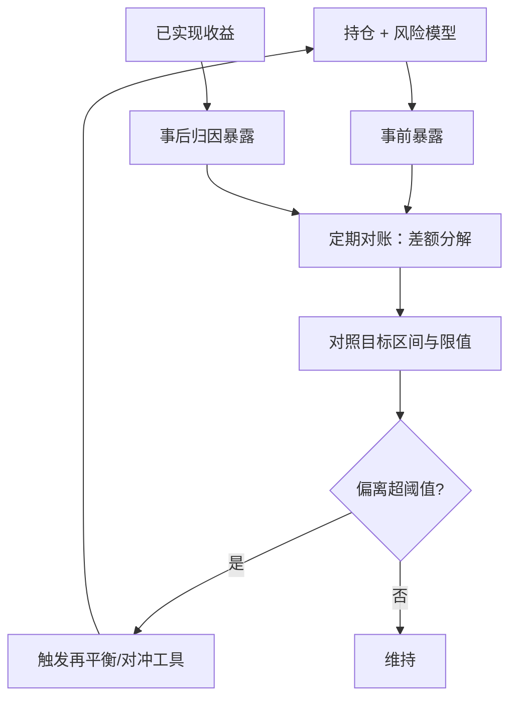

# 因子暴露的管理

暴露不是优化器的一次性输出，而是随价格与持仓漂移的状态量：动量跑赢一个季度，「中性」基金就成了风格赌注——管理暴露就是把漂移变成触发器，而不是月底的惊讶。

<footer>—— 据 Grinold & Kahn, Active Portfolio Management 的传导系数与限值框架整理</footer>

[上一课](/quant/fz-marginal-contribution)回答了「加哪个因子、加多少」；本课回答「加了之后怎么住着」。因子进入账本后，暴露开始漂移：价格漂移（持仓涨跌改变权重）、持仓漂移（再平衡、申赎）、模型漂移（风险模型版本改变坐标）。不管控漂移，风格中性是句空话；管得太死，约束吃掉传导。本课写暴露的测量、目标与限值、再平衡触发，以及约束设计对传导的代价。行业与规模中性的构造细节见[行业中性](/quant/industry-neutral)与[市值中性](/quant/size-neutral)；本课在组合运行的层面深化。

## 问题

暴露管理有三个典型失败。其一，只看事前：优化器输出的暴露是风险模型的估计，实现收益里的暴露还含残余 alpha、事件冲击（停牌、涨跌停）与设定误差；不同事后对账，误差静默累积。其二，限值静态：暴露区间不随拥挤与波动调整，同样的偏离在拥挤期承担的不是同样的风险。其三，约束不算账：每条约束都从传导系数扣掉一块——上一课的 TC——清单没人算总账，alpha 被切碎在十几条软约束里。缺口是把暴露当成漂移的状态量来管理。

### 测量与对账

风险模型升级版本会重画坐标：同一持仓在新版本下价值暴露可能从 $-0.05$ 跳到 $+0.12$——组合没变，地图变了。版本切换必须重放历史持仓、对账新旧暴露序列，并按新坐标重设限值；否则「突破限值」是纸面事件，真实风险没人看过。

测量是两条流水线。事前：持仓乘风险模型的暴露矩阵 $B$，得事前暴露 $B^\top w$，这是限值检查的对象。事后：用归因把已实现收益分解到因子（[因子归因](/quant/factor-attribution)），反推实际起作用的暴露。两条流水线定期对账，差额分解成三部分：模型估计误差、未建模暴露（事件、非线性）、执行偏差。对账差本身是一个监控量：它突然变大，通常是风险模型与真实账本脱钩的最早信号，比任何回撤都来得早。

## 方法

目标与限值的设定分三层。方向层：风格暴露给区间不给点，小的主动偏离可以成为 alpha 来源之一；净毛杠杆与跟踪误差预算（[跟踪误差](/quant/benchmark-tracking-error)）单列。粒度层：行业与国家的中性带比风格宽——截面风险大、估计稳；个股集中度单独设限。状态层：限值随拥挤与波动调整，把拥挤度量课的状态量接进容忍带——拥挤高分位时收窄主动偏离。再平衡用阈值制而不是日历制：交易由「偏了多少」触发，成本花在确实偏了的地方；阈值由交易成本与漂移速度决定。工具分层：β 与市值的暴露用期货互换修正，个股交易留给 alpha——这是[组合约束](/quant/portfolio-constraints)下保传导的标准做法。

## 机制

为什么阈值触发优于日历再平衡？漂移速度不是常数：波动高的月份，风格暴露几天走出平时数倍的距离。日历制在漂移快时反应太慢——期间账本带着超限暴露运行；在漂移慢时交易太勤——成本吃 alpha。阈值制把交易条件定义为偏离量，成本集中在真正偏移的时刻；代价是监控频率要够，并加滞后带防反复穿越。约束对传导的机制同理：每条约束在优化器里是一次投影：约束越多、方向越散，投影掉的越多；Grinold–Kahn 的传导系数就是这个损失的度量。所以约束清单要有总账：每条新约束进清单前，用历史 alpha 测一遍传导损失，说不出代价的约束不值得设。

## 边界

本课不写执行细节——最小冲击修暴露是执行课主题；也不写因子择时——主动偏离方向是另一个决策，本课只管偏离的幅度与账。压力与尾部下暴露的重新定价属风险体系。还有一条统计边界：暴露矩阵的更新会让事前暴露「跳变」，与真实漂移要分开记账，否则触发器会对估计噪声开火。

## 小结

- 暴露是漂移的状态量：价格、持仓、模型三个来源，分别记账。
- 事前与事后两条流水线定期对账，对账差是模型脱钩的最早信号。
- 限值分层：方向给区间、粒度分层、拥挤状态下收窄。
- 阈值触发优于日历制，加滞后带防反复穿越。
- 约束清单要算传导总账，说不出代价的约束不设。
- 出处：Grinold & Kahn, *Active Portfolio Management*；暴露构造另见站内行业/市值中性课。
