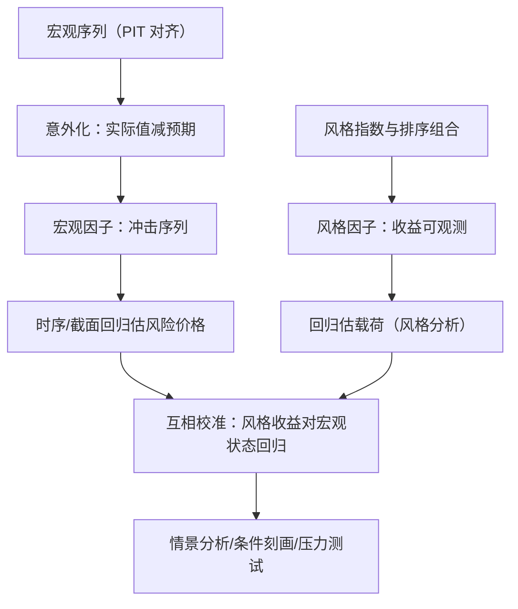
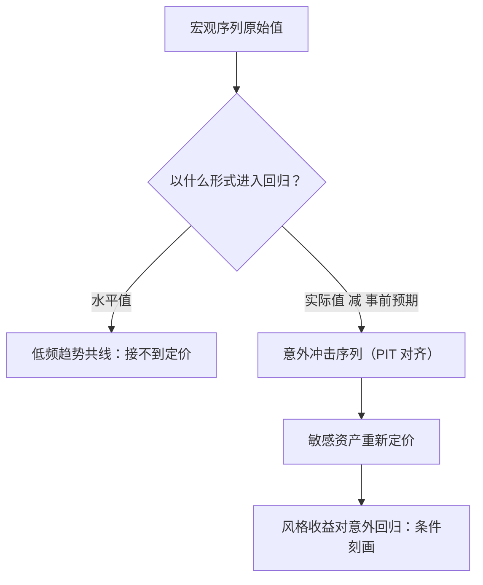

# 宏观因子与风格因子

风格因子与宏观因子的未知数恰好位置相反：前者收益可观测、载荷待估，后者状态可观测、风险价格待估；两类模型互相校准，而不是互相替代。

<footer>—— 据 Sharpe, Journal of Portfolio Management, 1992；Chen, Roll & Ross, Journal of Business, 1986；Connor, Financial Analysts Journal, 1995 整理</footer>

[上一课](/quant/fz-taxonomy)的家族地图基本由风格因子构成：从排序组合里构造出来的多空收益。本课补上地图的另一支：直接用经济状态变量当因子的宏观因子模型，以及把基金收益映射到风格指数的风格分析。它们与统计因子模型（[PCA 统计风险模型](/quant/stat-risk-pca)）构成因子模型的三个类型；本课写它们的构造差异、未知数的位置、以及接合点。

## 问题

风格因子回答「谁跑赢谁」，不回答「为什么、什么时候」：价值溢价存在，但它接不接通胀、接不接信用周期，家族地图是沉默的。宏观因子的承诺是把溢价接到经济状态上——增长、通胀、期限、信用——为情景分析与压力测试提供把手（[宏观因子集](/quant/macro-factor-set)、[宏观状态变量](/quant/macro-state-variables)）。困难在数据这一侧：宏观序列月度低频、发布滞后、且常被修正；直接拿水平值回归，得到的多半是低频趋势的共线。缺口是把「宏观因子」从「拿宏观数据做回归」升级为可检验的构造：用什么序列、以什么形式——水平还是意外——进入模型。

### 两类构造

宏观因子模型的经典集合来自 Chen–Roll–Ross 1986：工业生产增长、预期通胀的变化、未预期通胀、信用价差与期限价差。现代实践把「意外化」做实：用实际值对调查预期的偏离构成冲击序列，再以 point-in-time 纪律对齐发布时点。风格分析则是反向操作：Sharpe 1992 把基金收益对一组风格指数做带约束（系数非负、和为一）的回归，用载荷回答「这只基金像什么」。第三类做法是给对冲基金类策略找模仿组合：Fung–Hsieh 2001 用趋势跟随组合的收益充当对冲基金的基准因子——风格因子反过来给难以透视的策略当地图。

Sharpe (1992) 风格分析的约束（非负、和为一）既是经济解释也是识别手段：风格指数彼此高度相关，无约束系数会在它们之间乱分。R² 高只说明收益能被这组指数张成，不说明经理真按那个比例配置——「像什么」与「是什么」是两句话。

## 方法

方法上先分清未知数位置。

「风险价格 $\lambda$」的术语翻译：载荷 $\beta$ 回答「这只股票对增长冲击有多敏感」，风险价格 $\lambda$ 回答「承担一单位这种敏感，市场每年多付多少预期收益」。两者相乘才进入预期收益——只报暴露不问价格，等于知道自己站在几级台阶上，却不知道台阶通向哪里。风格因子模型（[基本面风险模型](/quant/fundamental-risk-model)是其持仓版）：因子收益 $f_t$ 直接可观测，未知数是载荷 $\beta_i$，用时序回归估。宏观因子模型：状态变量 $g_t$ 可观测，未知数是风险价格 $\lambda$，通常做时序回归 $R_{it}=a_i+\beta_i^\top g_t+e_{it}$ 一并估出载荷与截距，再检验截距——结构与 [Fama–MacBeth](/quant/fama-macbeth) 一致，只是右边换成了宏观序列。统计因子模型则连因子带载荷全从协方差里估，解释性最弱、拟合最强；取舍是解释力与过拟合的交换，Connor 1995 的比较结论至今适用：没有全能型，按用途选。

## 机制

接合点的机制在「意外」。资产定价关心的是冲击，不是水平：利率高不必然压溢价，利率超预期变化才重新定价。

数字实例：调查预期明年通胀 3%，实际公布 3.8%——意外是 $+0.8$ 个百分点，通胀敏感资产立即重新定价；若公布恰好 3.0%，意外为零，哪怕 3% 的绝对水平不低，资产也不为所动。市场交易的是「相对预期的偏差」，不是「数值的高低」。

所以宏观因子必须以意外形式进入回归，而风格因子的收益已经是「意外的后果」——两类回归在意外这一层汇合。实践中的互校：把风格收益对宏观意外回归，得到「价值在复苏意外中占优」这类条件刻画；宏观定价失败的资产，常能被某个风格家族解释。这条双向通道让下一课的条件化有了原料：宏观状态是条件变量 $z_t$ 的天然候选，但要用 PIT 的意外序列，不能用被修正过的最终值。

## 边界

宏观因子模型的推断力受三重限制：样本短（月度数据几十年）、序列经修正（最终值不是决策时点可得的值，[point-in-time](/quant/point-in-time) 纪律必须延伸到宏观库）、风险价格估计的标准误大——单独一个宏观因子的 $\lambda$ 很少显著。

常见误区：从数据库下载今天的通胀「最终值」去回测当年的策略。当年做决策时你只能看到首次发布值，而这个值事后可能被大幅修正——用最终值回测，等于让策略偷看未来。这正是 point-in-time 纪律必须延伸到宏观库的原因：每个时点只用当时可见的数。风格分析的边界是它只回答「像什么」：对一只持有多空与衍生品的基金，约束回归会把它硬投影到多头指数上。宏观与风格不互相替代：风险管理的主力仍是持仓层面的因子暴露，宏观层的价值在情景与压力，不在逐日风控。

## 小结

- 三类因子模型：风格（载荷未知）、宏观（风险价格未知）、统计（全估），按用途选。
- 宏观因子必须意外化并以 PIT 对齐，水平值回归只量到趋势共线。
- 风格分析的约束是识别手段，R² 高不等于「就是」那种配置。
- 两类模型在「意外」层面互相校准，为条件化提供状态变量。
- 出处：Chen, Roll & Ross, *Journal of Business*, 1986；Sharpe, *JPM*, 1992；Fung & Hsieh, *RFS*, 2001；Connor, *FAJ*, 1995。
