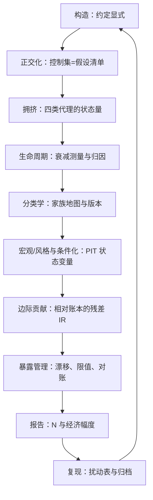

# 因子深化收束

每个环节都把「结论相对什么成立」写死：相对控制集、相对家族地图、相对账本、相对试验次数、相对约定表——因子研究的成熟度，就看这些「相对」有没有被省略。

<footer>—— 本课程十一课方法论的小结口径；文献锚点见各课出处（Fama & French 1993/2015、Carhart 1997、Grinold & Kahn 等）</footer>

[上一课](/quant/fz-replication-exercise)把报告规范走完了全程：约定对照表、主表、扰动表、复现包归档。因子研究深化这门课到此收束。收束课把十一课排成一条可执行的流水线，并标出每一环最常见的死法——因子研究的失败很少死于某一步算错，多死于环节之间的断裂。

## 问题

流水线的价值在链条的传递方式：每一环的出口是下一环的入口，入口坏了，后面全部在噪声上运算。构造的约定不显式，正交化的控制集就含糊，残差 IR 不可比；拥挤没有状态量，衰减的归因就只剩叙事；状态变量不用 PIT，条件化整个设定作废；报告没有 N 与判据，前面的严谨最后一公里漏光。收束就是检查这些接口，而不是复述各课内容。

### 流水线与死法对照

一条贯穿的纪律：每环的结论都声明「相对什么成立」——正交化相对控制集，家族坐标相对地图版本，边际 IR 相对当前账本快照，显著性相对试验次数 N，复现相对约定表。「相对」被省略之处，就是下一轮争论的起点。

十环各有一个最常见的死法。构造：等权加月度调仓，把反转红利记成 alpha。正交化：控制集挑到结论满意为止——那不是检验，是搜索。拥挤：单一代理当开关。生命周期：把体制性回撤当死亡，或把真衰减当噪声扛住。分类学：同家族重复配置，防御风格买了三份。宏观与条件化：状态变量用了修订后的最终值，整个条件设定是未来函数。边际贡献：拿独立 Sharpe 决策，无视与账本的相关。暴露管理：事前与事后从不对账，模型脱钩无人知晓。报告：隐去 N，把挑出的最大 t 当单检验解读。复现：只对主表不做扰动，把约定差异误判为复现失败，或硬凑参数。

## 方法

把课程收成三句话带走。第一句：因子是约定与数据的联合产物，约定要显式，结论要带「相对」。第二句：因子的价值是时变的、状态依赖的、且必须相对账本度量——所以治理（拥挤状态、衰减台账、限值对账）与统计同样重要。第三句：研究的产出是证据链而不是数字，报告与复现是证据链的接口。这三句话与「跑个回测看夏普」的区别：后者在每一环都省略了「相对什么成立」。

## 机制

为什么把流水线闭环——图中最后一道箭头指回构造？因为复现与运行的反馈会改变构造决策：扰动表告诉你哪个约定承载结论，衰减台账告诉你哪条假设死了——这些信息流回下一轮构造，形成学习回路。没有闭环的研究部门反复在同一类约定上发现同一类假阳性；有闭环的部门，每个因子的死亡都在提高下一批因子的存活率。本课程没有引入新的数学：它把主干课的因子知识接上了约定、状态、账本与治理四个维度，让结果从「一组回测数字」变成「可治理、可证伪、可交接的对象」。

## 边界

本课程不进入组合构建的优化器细节——因子确定之后的权重问题（数值稳定性、正则化、再平衡）是下一门课的对象，那里默认你能交付一个约定显式、状态可查、报告完整的因子。机器学习因子是另一条支线，本课程的检验与治理纪律对它原样适用，只是 N 更大、折价更重。方法论不替你判断经济机制：家族标签是先验，风险补偿与行为的划分常不可检验——它收敛于让错误可被发现。

## 小结

- 十环流水线：构造、正交化、拥挤、生命周期、分类、宏观/条件化、边际贡献、暴露、报告、复现；每环出口是下环入口。
- 每环都有一种典型死法，收束于「相对什么成立」被省略之处。
- 三句话带走：约定显式、价值相对且时变、产出是证据链；闭环让每个因子的死亡提高下一批因子的存活率。
- 本课程到此收束；因子确定之后的权重与优化，交给组合构建的课程。
- 出处：本课程各课出处汇总——Fama & French, *JFE*, 1993/2015；Carhart, *JF*, 1997；Grinold & Kahn, *Active Portfolio Management*；Harvey, Liu & Zhu, *RFS*, 2016；McLean & Pontiff, *JF*, 2016。
