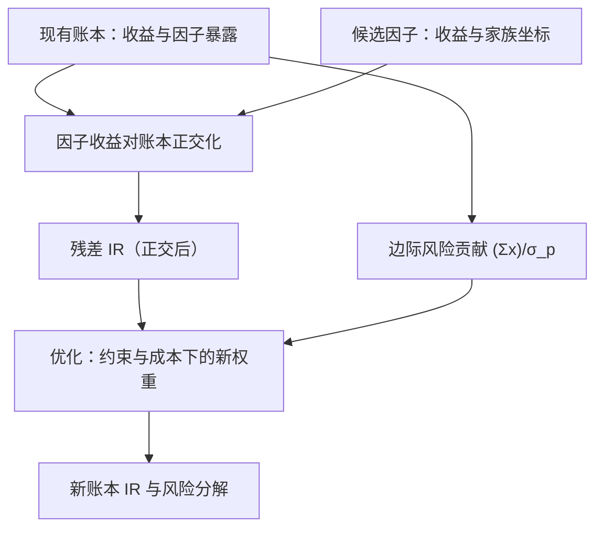
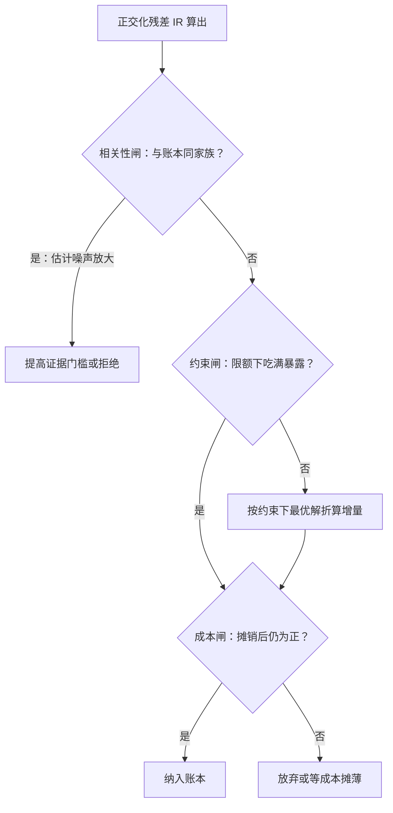

# 因子在组合中的边际贡献

因子报告里的 Sharpe 是独立多空组合的数字；你的账本关心的是另一个量：相对现有持仓正交化之后的 IR。显著是相对数据的，有用是相对账本的。

<footer>—— 据 Grinold & Kahn, Active Portfolio Management；Markowitz, Journal of Finance, 1952 整理</footer>

[上一课](/quant/fz-conditional-deep)解决了「什么时候成立」；本课切换视角，从因子侧转向组合侧：前面各课的产物——正交化残差、拥挤状态、家族地图、条件设定——最终都要回答一个问题：把因子 X 加进这本账，改进多少？[Markowitz](/quant/markowitz) 给了均值方差框架，[IC 与 IR](/quant/ic-ir-timing) 给了主动收益的分解；本课把两者接在因子上，写边际贡献的定义、计算与它依赖的输入。

## 问题

因子研究报告的结论通常是独立构造的多空组合有多高的 Sharpe 与 t。但决策不是「这个因子好不好」，而是「这本账加上它好多少」。两个数可以方向相反：与账本主暴露高度相关的因子，独立 Sharpe 再高也几乎不改进组合；单看平庸的因子，若与账本负相关，反而是分散化珍品。用独立数字做采纳决策，会系统性高估与现有风格相似的候选——因子动物园里最受欢迎的恰是「又一个动量变体」——并低估真正互补的候选。缺口是给出边际贡献的明确定义，并弄清它依赖哪些输入、每个输入的估计误差有多大。

### 定义与公式

候选因子对账本的边际贡献由正交化残差的 IR 决定：把因子收益对账本收益回归取残差，残差的 IR 记 $\mathrm{IR}_{f\perp p}$，则组合最优 $\mathrm{IR}^{new}_p=\sqrt{\mathrm{IR}_p^2+\mathrm{IR}^2_{f\perp p}}$。相关 $\rho$ 越高，残差 IR 越接近零——这就是「又一个动量变体」几乎不改进账本的代数。

风险侧：组合波动 $\sigma_p=\sqrt{x^\top\Sigma x}$，暴露 $i$ 的边际风险贡献 $\mathrm{MCR}_i=(\Sigma x)_i/\sigma_p$，风险预算按贡献分配（[风险预算](/quant/risk-budgeting)）。收益侧：候选因子 $f$ 与账本收益 $r_p$ 的相关 $\rho$ 决定残差 IR 的折损 $\sqrt{1-\rho^2}$。把两侧放进 [Grinold–Kahn](/quant/ic-ir-timing) 的基本律 $\mathrm{IR}=\mathrm{IC}\cdot\sqrt{BR}\cdot TC$：因子质量进 IC，账本可覆盖的独立赌注数进 BR，而现有暴露的重复度正是从有效 BR 与传导系数 TC 里扣的。优化器里的等价形式：因子以 alpha 向量进入（Grinold 口径 $\alpha=\mathrm{IC}\cdot\sigma\cdot z$），边际价值由最优解的影子价格给出。

## 方法

计算顺序固定：先正交化，再谈数字。

成本闸的数字实例：假设调到新权重的一次性成本是 1.5%，而因子给账本带来的年化增量是 0.6%——摊销要整整两年半。若这个因子的半衰期只有一年（拥挤衰减课的 $\tau$ 口径），成本还没摊完，增量已经衰减殆尽。所以「短生命周期因子对成本尤其敏感」不是修辞，是这道除法直接算出来的。把候选因子收益对账本收益（或账本的因子暴露复制组合）回归，残差的均值与 IR 是对这本账的增量——正交化课说「控制集就是假设清单」，在组合语境里控制集就是账本本身。然后过三道闸。相关性闸：残差 IR 的估计误差在 $\rho$ 高时被放大，$\rho$ 的估计要用收缩协方差（[协方差收缩](/quant/cov-shrinkage)），并检查家族坐标——与账本同家族的候选默认高相关。约束闸：账本的限额（风格中性带、杠杆上限）可能让你吃不满因子暴露，可实现的增量要按约束下的最优解算，不是按无约束公式。成本闸：调仓到新权重的一次性成本摊销后与年化增量比较，短生命周期因子尤其敏感。

## 机制

为什么「显著不等于有用」能在代数上看清？假设检验回答 $E[f]\neq 0$；组合问的是 $\mathrm{IR}^{new}_p=\sqrt{\mathrm{IR}_p^2+\mathrm{IR}^2_{f\perp p}}$，唯一进入答案的是正交化残差。独立 Sharpe 与残差 IR 之间隔着整个相关结构：$\rho=0$ 时两者相等，$\rho=0.9$ 时残差 IR 只剩约 $0.44$ 倍。

折损系数 $\sqrt{1-\rho^2}$ 的数字手感：$\rho=0$ 时是 $1.0$（原样保留），$\rho=0.5$ 时约 $0.87$，$\rho=0.9$ 时只剩 $0.44$，$\rho=0.99$ 时仅 $0.14$。也就是说，独立 Sharpe $1.0$ 的因子，一旦与账本相关 $0.9$，对账本的增量 IR 只有 $0.44$——「又一个动量变体」的估值就在最后这两档里。

这也解释了分类学课的地图为什么重要：家族内高相关意味着同家族候选的残差 IR 天然小，地图是边际贡献的先验。反过来，负相关候选的残差 IR 可以高于独立 IR——对冲性质的价值只有账本视角看得见。这就是「边际贡献」必须独立成课的原因：它不是因子性质的函数，是因子与账本联合分布的函数。

## 边界

边际贡献的全部输入都是估计：$\Sigma$ 的误差、$\rho$ 的不稳定、IC 的衰减，都会传导到决策；对高相关候选说「不」通常比对低相关候选说「是」更稳健，因为前者的增量小到估计噪声就能淹没。本课不写执行成本对权重调整的细节（执行侧主题），也不写因子间最优配置权重（下一课的暴露管理是它的运行版）。最后一条边界：边际贡献按「当前账本」计算，账本变了数字作废——把它写成快照而非常数。

常见误区：半年前算过「动量变体对账本增量 IR 0.5」，半年后账本已经新增了三条动量类暴露，还拿着 0.5 做决策。账本一变，正交化的对象就变了，残差 IR 要重算——它是「相对账本快照」的量，像汇率一样有有效期，不是贴在因子身上的永久标签。

## 小结

- 决策量是相对账本的正交化残差 IR：$\mathrm{IR}^{new}_p=\sqrt{\mathrm{IR}_p^2+\mathrm{IR}^2_{f\perp p}}$。
- 相关性折损 $\sqrt{1-\rho^2}$ 是「显著不等于有用」的代数形式；同家族候选默认折损大。
- 边际风险贡献 $(\Sigma x)_i/\sigma_p$ 是风险侧的对偶；预算按贡献不按名义权重。
- 增量要过相关性、约束、成本三道闸，按可实现暴露计算。
- 出处：Grinold & Kahn, *Active Portfolio Management*；Markowitz, *JF*, 1952。
