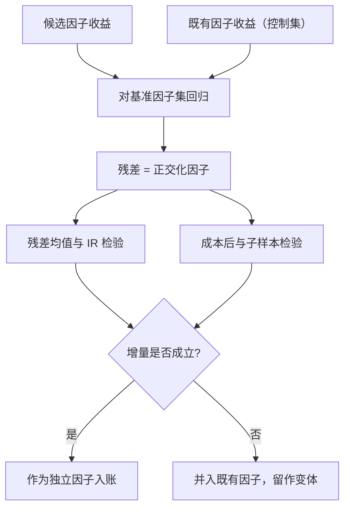
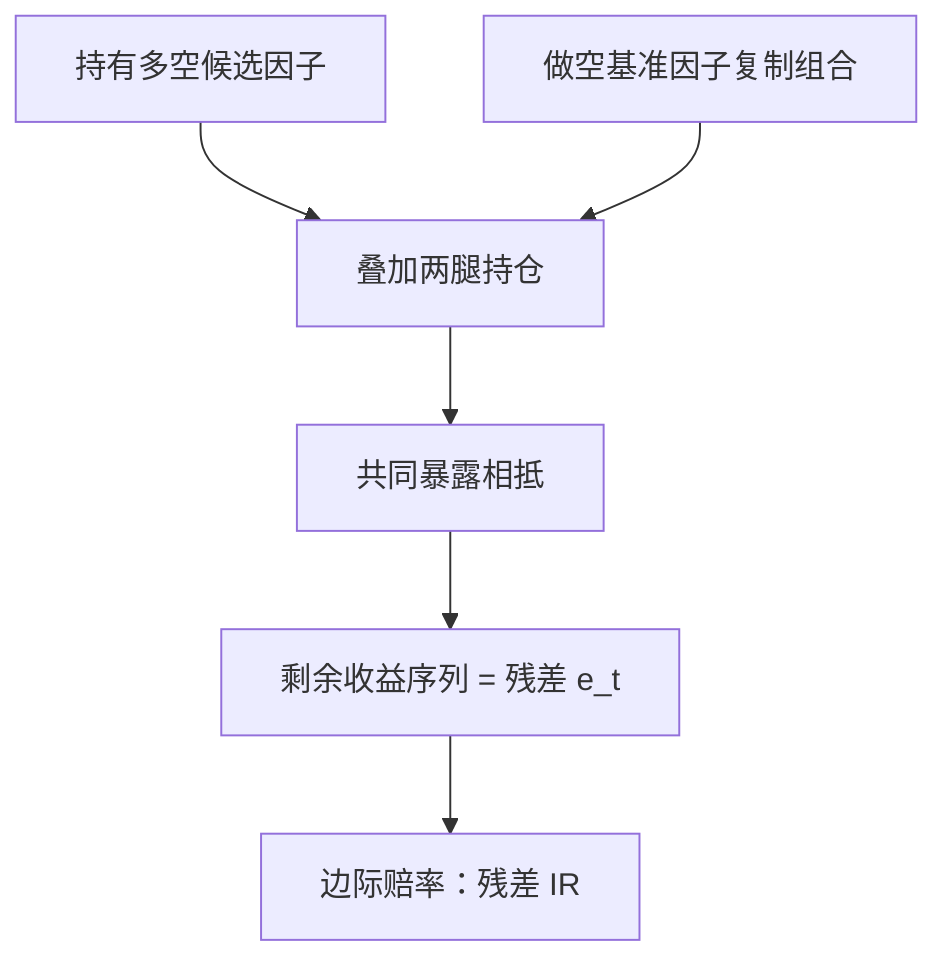

# 因子正交化的艺术

正交化不制造信息，它只是把「新」这个字逼成一句可检验的话：相对哪个控制集的增量？控制集就是你承认的假设清单。

<footer>—— 据 Fama & French, Journal of Financial Economics, 2015；Gibbons, Ross & Shanken, Econometrica, 1989 整理</footer>

[上一课](/quant/fz-construction-method)把构造钉成显式约定，产出了因子收益序列与持仓清单。新因子表交给评审，第一个问题不是「收益多少」，而是「扣掉已知因子还剩多少」：因子清单以数百计（[Harvey–Liu–Zhu](/quant/harvey-liu-zhu) 的口径），绝大多数与既有因子高度相关。本课写正交化的三种操作、它们为什么不对称、控制集怎么选。回归取残差的基础版见[因子正交化](/quant/factor-orthogonal)；本课深化到「把正交化当假设检验」。

## 问题

不问增量就收因子，代价立刻出现：风险模型重复计暴露，归因把同一笔收益算两遍，配置把同一种风格买三份。更隐蔽的是「新包装」：一个新特征可能只是旧特征的噪声版本，多空 Sharpe 不错，全因为间接持有旧因子。缺口因此是把两件事分开：候选因子里多少是已有暴露的重复计量，多少是独立信息。这件事在统计上是投影——把候选因子收益对既有因子收益回归，残差是正交分量；真正的难点在工程：控制集怎么定、结论怎么报。

### 三种操作

操作一，收益层：把候选因子收益 $f^{new}_t$ 对基准因子收益 $F_t$ 做时序回归 $f^{new}_t=a+b^\top F_t+e_t$，取残差 $e_t$ 重新当成因子使用；截距 $a$ 与残差的 IR 是增量。联合版本是 [GRS 检验](/quant/grs-test)式的 spanning test。操作二，特征层：构造前先把候选特征对控制特征（行业、规模）做截面残差化或组内去均值，再排序——[行业中性](/quant/industry-neutral)与[市值中性](/quant/size-neutral)是常用例。操作三，回归层：每月截面把候选特征与既有特征放进同一个 [Fama–MacBeth](/quant/fama-macbeth) 特征回归，看候选斜率还剩多少。三种操作回答同一问题的不同侧面，结论应互相印证。

正交化不对称：res(A|B) 与 res(B|A) 是两个不同的残差。把动量对价值正交化，得到「中性于价值的动量」；把价值对动量正交化，得到「中性于动量的价值」。谁当基准、谁当候选，报告里必须写，不能只说「正交化后显著」。

## 方法

控制集的选择是本课的「艺术」。

「控制集就是假设清单」可以类比审稿：评审问的不是「这篇论文结果漂亮吗」，而是「相对已发表文献的边际贡献是什么」。对三因子正交化，等于把「规模与价值都已发表」设为共识底线；你对多远正交化，就承认了多远是已知的——所以控制集必须写进报告，如同论文必须写相关工作。控得少，增量可能只是旧暴露的新包装；控得多，增量必然缩水，极端情形下对全部已知因子正交化后什么都不剩——这是它在如实报告「没有新信息」。正确姿势是把控制集当成假设清单明示：对市场正交化，回答「有没有 β 之外的收益」；对三因子正交化，回答「相对规模与价值的增量」；对五因子正交化，回答的就是 Fama–French 2015 的问题——HML 在五因子框架里对盈利与投资因子回归后不再显著，[HML 的困境](/quant/hml-devil)正是这一步的著名案例：同一回归，有人读成「价值冗余」，有人读成「五因子误设」；分歧不在计算，在控制集背后的假设。

## 机制

为什么残差可以当成因子继续研究？因为残差 $e_t$ 对应一个可实现的零成本覆盖：持有多空候选，同时用基准因子对冲掉共同暴露。

数字实例：候选因子月均收益 $1.2\%$，其中对动量与市值的回归显示 $1.0\%$ 可由基准解释——残差均值只剩 $0.2\%$。这 $0.2\%$ 才是「在已知世界里再下注的边际赔率」：独立 Sharpe 看上去的体面，大部分是旧因子的功劳记到了新包装头上。

它的收益就是「在已知世界里再下注的边际赔率」。这解释了正交化与组合的接口：后面会证明，新因子对一本已有账本的边际贡献，恰恰由它相对账本收益的正交化残差的 IR 决定——研究侧的正交化与组合侧的边际贡献是同一个投影的两次出现。它也解释了为什么正交化救不了坏研究：投影只重新分配功劳，不创造统计功效；残差的 t 统计量同样要按试验次数打折，[回测过拟合](/quant/backtest-overfitting)的工具（[PBO](/quant/pbo)、[CSCV](/quant/cscv)）对残差因子照常适用。

## 边界

正交化的三个边界要写进习惯。其一，它不做因果：残差显著不说明经济机制，只说明共同暴露之外还有可预测成分。其二，它依赖基准的构造质量：对坏基准正交化会把噪声记成增量。

常见误区：对全部已知因子正交化后残差什么都不剩，第一反应是「方法错了」。实际上这正是投影在如实报告——候选里没有控制集之外的信息。真正该警惕的是反方向：控得太少时残差显著，你以为发现了新因子，实际只是给旧因子换了包装。其三，它不处理时变：今天的残差显著不保证一年后仍显著，采用与拥挤会把增量吃掉——那是后面两课的对象。报告固定为「相对控制集 C，残差 IR 为 X，t 为 Y，试验次数 N」。

## 小结

- 正交化是投影：收益层取残差、特征层残差化、FM 控制回归，三种操作互相印证。
- 正交化不对称，控制集就是假设清单，结论必须以「相对 C」的格式报告。
- HML 在五因子中的命运说明：控制集不同结论相反，计算本身无争议。
- 残差对应可实现的零成本覆盖，其 IR 是边际赔率，也是组合边际贡献的基础。
- 正交化不增加统计功效，PBO/CSCV 折价照常适用。
- 出处：Fama & French, *JFE*, 2015；Gibbons, Ross & Shanken, *Econometrica*, 1989。
