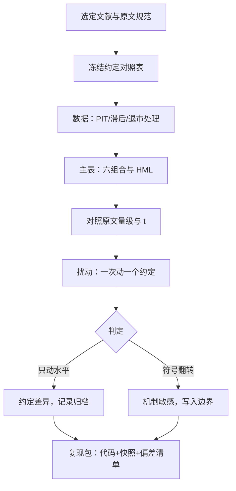

# 复现一篇因子研究

复现的目标不是得到同一个数，而是用原文的规范得到接近的数，并知道每个偏差从哪个参数进来——符号稳住的扰动是约定，符号翻转的扰动是机制。

<footer>—— 据 Fama & French, Journal of Financial Economics, 1993；Hou, Xue & Zhang, Review of Financial Studies, 2020；Jensen, Kelly & Pedersen, Journal of Finance, 2023 整理</footer>

[上一课](/quant/fz-reporting-standard)把报告骨架写死；本课把骨架用一遍：完整复现一篇经典——Fama–French 1993 的 HML——从数据到主表，再做扰动测试。文献里正有一场现实的争论：Hou–Xue–Zhang 2020 重做数百个异象，发现大半在他们的规范下消失；Jensen–Kelly–Pedersen 2023 则争辩相当一部分差异来自规范选择而非数据挖掘。孰是孰非，需要亲手看过数字随约定移动才有判断力——本课的目标就是这个经验，不是又一篇 HML 综述。

## 问题

复现有正确与错误两种失败方式。错误的方式：跑出一个数与原文不同，宣布「复现不了」，或反过来硬调参数凑数。正确的方式：把差异定位到参数——分位点口径、数据 vintage、退市处理、加权方案，逐一归因。HML 是最好的练习对象：它足够简单（六个组合的线性组合），又足够多坑（会计数据滞后、负账面权益、NYSE 分位点、年度重构），这些坑在自研因子上原样出现。缺口是把「复现」从口号变成一套有输出的流程：约定对照表、主表、扰动表、判定。

### 流程

FF 1993 的几条硬约定：每年 6 月末按当月市值分组；B/M 用上一财年账面值且至少滞后六个月；分位点取自 NYSE 股票；负账面权益的股票不参与 B/M 排序但留在规模组。换掉任何一条都会移动 HML 的均值——复现报告的第一张表应是约定对照表。

第一步，冻结规范：从原文抄下每条约定，列成对照表；数据侧确认 [CRSP–Compustat](/quant/crsp-compustat) 式的跨库对齐、会计数据的 [PIT 与滞后](/quant/pit-fundamentals)、退市收益是否计入（[幸存者偏差](/quant/survivorship-bias)）。第二步，主表：六个市值加权组合的月度收益，HML 等于两个价值组合的平均减两个成长组合的平均，年度重构；对照原文的量级与 t。第三步，扰动表：一次只动一个约定——等权替代市值加权、年度重构改月度、分位点改全市场、去掉退市收益——记录每个扰动的方向与幅度。第四步，判定与归档：区分「只动水平的扰动」与「翻转符号的扰动」，按上一课的骨架归档复现包。

## 方法

扰动表怎么读是这个练习的方法论核心。等权替代市值加权，HML 通常上升——再平衡红利与小盘暴露混了进来，这是「构造混入别的溢价」的直接体验。去掉退市收益，价值端（常有退市股）被幸存者偏差抬高，这是数据处理的机制。年度重构改月度，换手与成本大增，成本后溢价明显缩水，这是持有期的机制。多数扰动移动水平但不翻转符号——「价值组合跑赢成长组合」在广泛的约定下稳住。这正是「衰减不等于死亡」的同族判断：稳健性有程度之分，复现把程度量化。翻转符号的扰动要单独写进边界：它标记了结论真正依赖的机制假设。

## 机制

为什么亲手复现不可替代？参数的现实含义只有在数字移动时才被看见：读十遍「NYSE 分位点」，不如看一次换成分位点后 HML 掉了多少。复现还校准对文献的信任：做过一次就知道，原文与复现的差异大多能被约定对照表解释——这是 Jensen–Kelly–Pedersen 论证「争论大半是规范差异」的微观基础；同时你也亲眼看到某些扰动下结论翻转——这是 Hou–Xue–Zhang 警告的内容。两种文献立场是同一张扰动表上的不同区域。复现训练的最后一块是归档：对照表、扰动表与偏差清单进包，接手的人从你的边界继续。

## 边界

本课复现的是构造与描述统计，不重做定价检验——GRS 与截面风险价格的推断见 [GRS 检验](/quant/grs-test)与 [Fama–MacBeth](/quant/fama-macbeth)。跨供应商与跨市场的复现（会计口径、制度差异）会引入原文不存在的偏差，属于另立规范的情形。样本期与原文不同，量级必然有差——复现比较的是「同一约定下的量级区间」，不是逐月吻合。复现一篇是为了建立能力；流程的价值在复现自研因子时兑现。

## 小结

- 复现的输出是四件套：约定对照表、主表、扰动表、判定与归档。
- 一次只动一个约定，区分「只动水平」与「翻转符号」两类扰动。
- 等权、退市、重构频率各自混入已知的机制：红利、幸存者、换手成本。
- 原文与复现的差异大多能被约定解释——扰动表是「规范差异与数据挖掘」之争的微观基础。
- 出处：Fama & French, *JFE*, 1993；Hou, Xue & Zhang, *RFS*, 2020；Jensen, Kelly & Pedersen, *JF*, 2023。
