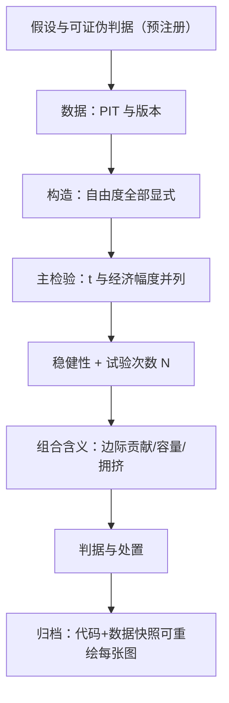
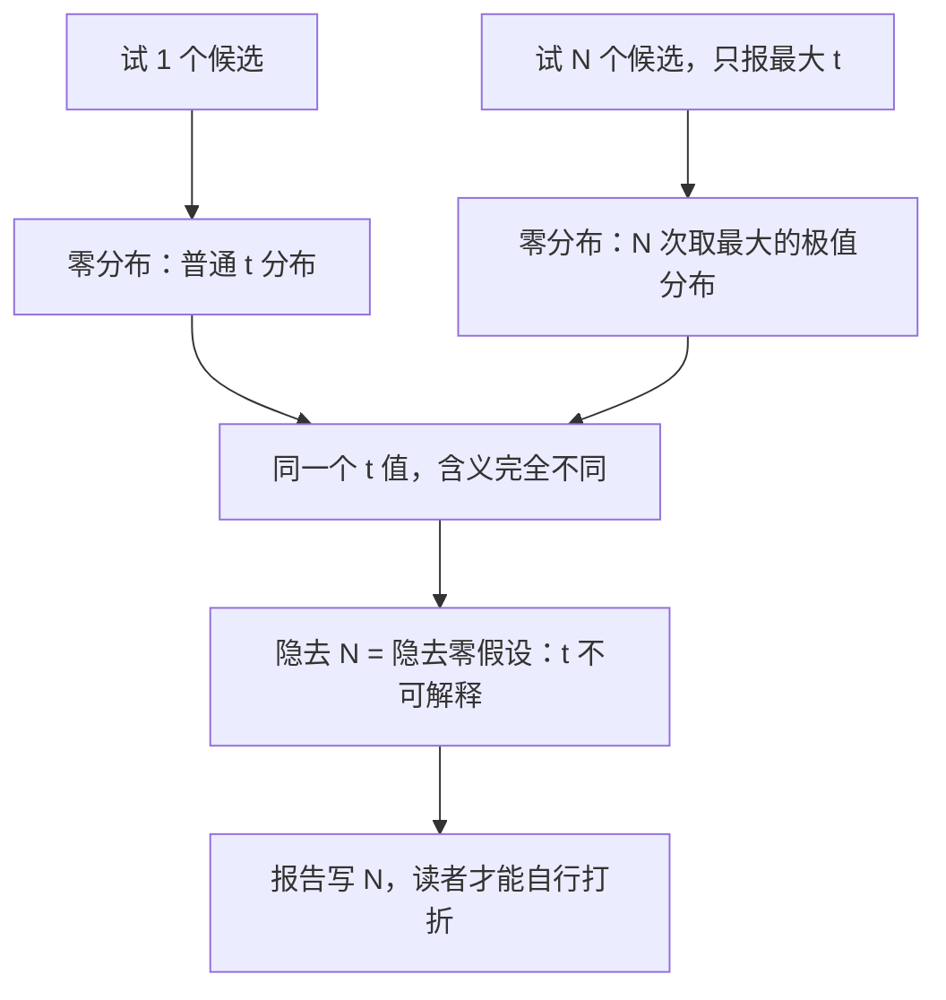

# 因子研究报告的规范

因子研究到写进报告才算完成：报告是研究的接口，接口规范决定它能不能被复核、复用与推翻——省略的每一个参数，都是转嫁给下一个读者的成本。

<footer>—— 据 Harvey, Liu & Zhu, Review of Financial Studies, 2016；站内研究纪律课（预注册、台账、复盘）整理</footer>

[上一课](/quant/fz-exposure-management)管住了账本里的暴露；本课管住纸面。前九课的每一环都产出文件：构造约定、控制集、拥挤分项、衰减估计、家族坐标、条件设定、边际贡献快照——最终要装进一份可复核的研究报告。[假设预注册](/quant/hypothesis-preregistration)、[研究台账](/quant/research-log-discipline)与[复盘](/quant/research-postmortem)给了过程纪律；本课把因子研究报告的骨架与写作规则一次写死，作为全课程的汇总接口。

## 问题

没有规范的报告有四种共同死法。构造参数不全：换一个人或三个月后的作者，无法重出同一序列——构造课的自由度有一处没写，复现就断。只报好口径：全样本显著、子样本消失的因子只给你看全样本。不报试验次数：没有 N，「t=2.5」在试过五十个变体的背景下毫无意义——多重检验折价（[Harvey–Liu–Zhu](/quant/harvey-liu-zhu)、[多重检验下的因子](/quant/multiple-testing-factors)）需要 N 作为输入；报告不给 N，读者无法打折。把 t 当结论：统计显著但年化价差低于交易成本，t 再大也不构成可执行命题。四种死法指向同一件事：报告不是结论的容器，是证据链的接口。

### 骨架七节

Harvey, Liu & Zhu (2016, RFS) 在统计了发表因子群后建议：新因子的 t 统计量应过 3.0 而非 1.96——这不是抬高门槛的洁癖，是对「数百个候选里挑最大 t」这一选择效应的定价。报告写出 N，读者才能自己决定用哪个门槛打折。

一节，假设与理由：溢价从哪来（风险补偿还是行为），可证伪的判据是什么——判据在看过数据之前写下（预注册）。二节，数据：域、PIT 来源与版本、公司行动与退市处理。三节，构造：构造课的三层自由度全部显式，参数化到代码可直读。四节，主检验：全样本与分段子样本的 IC、分位数价差、多空收益（成本前后），t 与经济幅度并列。五节，稳健性：构造变体、子集、正交化到既有因子（控制集明示），试验次数 N 与折价口径。六节，组合含义：边际贡献快照、容量与拥挤状态、暴露含义。七节，判据与处置：进或不进账本的条件，以及失败的复盘链接。

## 方法

写作规则高于模板。

「数字带区间」的数字实例：半衰期写「$\tau$ 在 2 到 5 年之间」而非「$\tau=3.2$ 年」。前者告诉你：按最坏情形（2 年）安排退出也来得及；后者只是给幻灯片用的一个好看小数。决策要的是「最坏情形下结论还站不站得住」，所以区间是给决策的，点估计是给演讲的。其一，负结果同模板：不显著的因子按同一骨架归档，失败清单可检索才不重复付学费。其二，数字带区间：半衰期、残差 IR、容量都给区间不给点估计；点估计是给幻灯片的，区间是给决策的。其三，每个数字可重绘：报告附代码与数据快照，任何一张图能重出——这是「可复核」的操作性定义。其四，pitch 与报告分离：对外材料可以说故事，内部报告只认证据链；两者混写的研究部门，迟早用自己的故事定价。其五，报告有版本：状态变化以修订而非覆写记录，历史判断不回改。

## 机制

为什么规范是统计要求而不只是文风？多重检验折价的机制链条是：试了 N 个候选，挑最大的 t，其零分布是「N 次取最大」的极值分布——家族错误率由 N 决定。

数字实例：只试 1 个候选时，$t=1.96$ 对应 5% 假阳性；但若试了 100 个纯噪声变体、专挑最大的 t 报告，「最大 t 不超过 1.96」的概率只剩约 $0.975^{100}\approx 8\%$——也就是说九成以上的概率你会看到一个大得吓人的假 t。门槛必须随 N 抬，这正是「报告写 N」在统计上的含义。

报告隐去 N，等于隐去了自己结论的零假设；这不是不严谨，是统计上不可解释。复现机制同理：构造参数不全是把经验命题变成不可证伪的口号——「因子有效」若无法被别人重出，就退化为信任问题。规范的每一条都对应一个已知的失败机制：模板不是仪式，是失败模式的清单化。

## 边界

规范不保证正确：七节写满也可能结论错误，规范保证的是错误可被发现。

为什么重要：规范像建筑验收标准——验收合格不保证楼永远不塌，但保证裂缝有记录、管线可查、谁改过图纸有签名。没有规范的研究结论错了，你连「错在哪一步」都无从查起；有规范的结论错了，扰动表与判据会直接指到出问题的那节。可发现性，是证据链对错误的全部主张。报告不含仓位建议之外的投资故事，也不承担合规审查——对外发布的合规是另一道流程。会议纪要与委员会决议不属于研究报告，不要混进证据链。规范的粒度按团队规模定：一个人的团队可以把七节压成一页加一个 notebook，但 N、控制集、判据不能省——那是统计上不可协商的部分。

## 小结

- 报告是证据链接口：构造、N、控制集、判据缺一不可，其余可按团队压缩。
- 多重检验折价的计算需要 N；隐去 N 等于隐去零假设。
- t 与经济幅度并列，成本后的可执行性是入场券不是附录。
- 负结果同模板归档，报告带版本，每个数字可从快照重绘。
- pitch 与内部报告分离，故事不进证据链。
- 出处：Harvey, Liu & Zhu, *RFS*, 2016；过程纪律见站内预注册、台账与复盘课。
