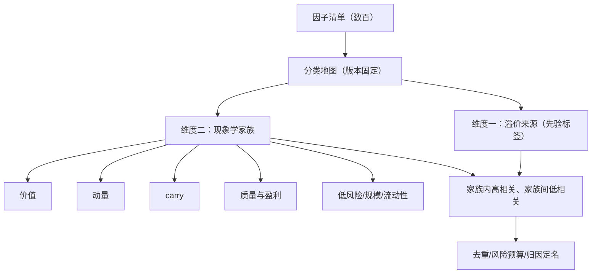
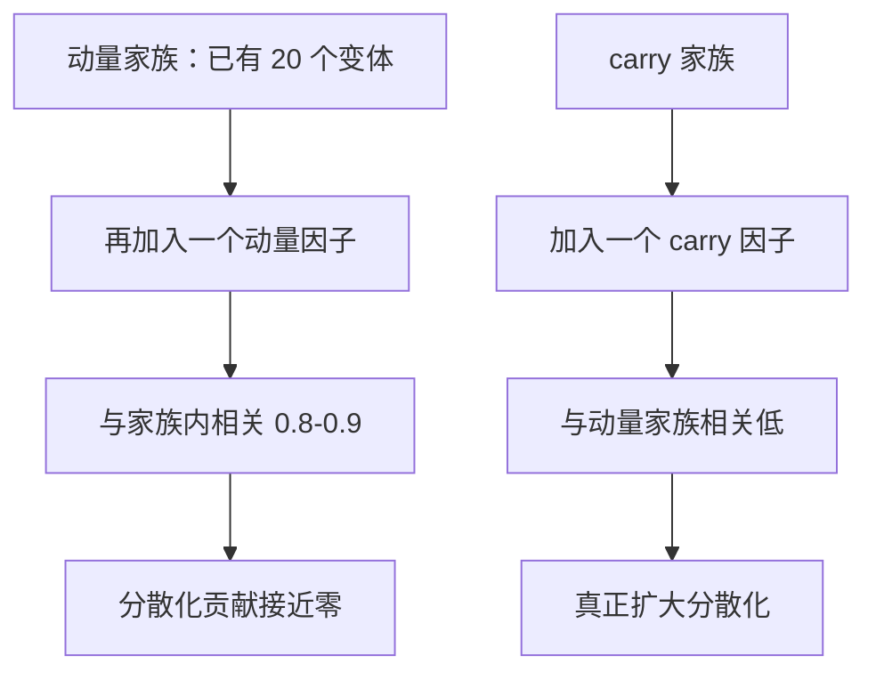

# 因子分类学

数百个「已发表因子」要先落进少数几个家族，才有除重、配置与归因可言；地图不等于疆域，但没有地图，你会在同一块疆域上买三次。

<footer>—— 据 Fama & French, Journal of Financial Economics, 2015；Carhart, Journal of Finance, 1997；Asness, Moskowitz & Pedersen, Journal of Finance, 2013 整理</footer>

[上一课](/quant/fz-decay-lifecycle)把单个因子的生命周期写进治理。本课抬起视角：前四课的处理对象始终是「一个因子」，可实务里要管的是一张清单——文献里 t 统计量过 3.0 的候选以百计（[Harvey–Liu–Zhu](/quant/harvey-liu-zhu)），机构内部的自研因子还要再加一层。没有分类，风险模型重复计暴露、归因把一笔收益算进三个因子、配置在同一个风格上买三份。本课写分类的两个维度、两张常用的正式地图、以及地图的使用规则。

## 问题

分类的难点不是列家族，而是承认分类服务于决策：风险模型要用它去重，配置要用它分预算，归因要用它定名。三个用途对粒度的要求不同——风险模型要细到暴露不重复，配置要粗到家族间低相关。用一张图同时服务三个用途，就会要么太粗（重复配置）要么太细（预算碎片化）。更深一层：家族标签不是定价理论，「价值」是一个相关度高的组合集合，不回答溢价为什么存在；把地图当理论，是因子投资里最常见的滑坡。

### 两个维度

FF5 用盈利（RMW）与投资（CMA）扩充三因子后，HML 对其余因子回归的 α 不再显著；Carhart (1997) 的四因子则把动量列为与价值并列的独立轴。同一家公司在两张地图上的坐标不同——报告因子结果时先声明用哪张地图，坐标才有意义。

第一维度按溢价来源：风险补偿（承担别人不愿承担的，如低波动、部分价值）与行为错定价（错误定价被修正的过程，如动量、盈余公告后漂移）。这是先验标签不是判决：一个家族可以两者兼有。第二维度按现象学家族：价值（[价值因子](/quant/value-factors)）、动量（截面[动量](/quant/momentum-wml)与时序 [tsmom](/quant/tsmom)）、carry（[carry-everywhere](/quant/carry-everywhere)）、质量与盈利（[qmj](/quant/qmj)、[盈利质量](/quant/gross-profitability)）、投资（[投资因子](/quant/investment-factor)）、低风险（[低波与 BAB](/quant/low-vol-bab)）、规模、流动性（[流动性因子](/quant/liquidity-factor)）。正式地图是模型：Fama–French 2015 的五因子（市场、规模、价值、盈利、投资）与 Carhart 1997 的四因子（加动量）是最常用的两张；Asness–Moskowitz–Pedersen 2013 则证明价值与动量在股票、债券、商品、外汇普遍存在，支持「家族」跨资产成立。

## 方法

地图的使用规则有三条。

数字实例：风险预算按家族分块，意味着 20 个动量变体共享「动量」这一份预算，而不是各得二十分之一份再加总成一大份。常见误区恰好相反：按论文数配置，动量家族悄悄占掉预算表的六成——账面上分散在几十个策略，风险上其实是一笔仓位。第一，新因子入账必须报坐标：相对哪张地图、落在哪个家族、家族内的正交化残差还剩多少——上一课的操作按家族做。第二，配置按家族不按论文：把相关矩阵按家族分块，家族内平均相关高、家族间低，风险预算按块分配。这是多策略平台把预算分给价值、动量、carry 各一份而不是给几十篇论文各一份的数学依据，也是[风险平价](/quant/risk-parity)思路在因子层的用法。第三，警惕跨家族的伪装相关：质量与低波动在防御期同涨同跌，按家族是两份预算，按风险实际是一份——预算表要定期用已实现相关回查。

## 机制

为什么家族划分有效？因为分类的底层是收益的共同驱动：同一家族的因子持有相似的股票、对相似的冲击敏感，所以家族内相关结构性偏高；不同家族的驱动不同——价值的均值回归、趋势的持续性、carry 的时限结构——家族间相关低。

直觉类比：分散化像水果篮——第 21 个苹果几乎不增加多样性，加一根香蕉才有意义。家族就是水果的种类：家族内再添成员（苹果换成不同产地），营养结构不变；家族间替换（苹果换香蕉）才改变整体的波动来源。分散化的收益按「块」计算，不按个数计算。

分散化的收益来自低相关的块，而不是来自因子个数：往一个已有二十个动量变体的组合里再加第十一个动量因子，分散化贡献接近零。这正是「地图决定边际价值」的先声，本课程后面会用正交化 IR 把它写成公式。

## 边界

分类学不回答存在性问题：家族标签不解释溢价来源，风险补偿与行为的划分常不可检验，只能作为先验声明写进报告。地图有版本问题：五因子与四因子的坐标不同，跨地图比较因子排名没有共同零假设；机构要固定自己的地图并记录版本。

常见误区：把家族标签当定价理论，以为说「这是价值因子」就解释了它为什么赚钱。「价值」只是一组相关度高的组合的集合名，像「鸟类」这个名字并不解释鸟为什么会飞。溢价来源（风险补偿还是行为）是另一个层面的声明，而且常常不可检验——地图的用途是去重与预算，不是因果解释。本课给的是静态地图；家族收益随宏观状态移动——价值在复苏期、动量在衰退尾部——是条件化问题，留给下一课。

## 小结

- 分类服务三个决策：风险去重、风险预算、归因定名；粒度按用途选。
- 两个维度：溢价来源（先验标签）与现象学家族（可操作分组）。
- 正式地图固定为模型（FF5、Carhart 四因子），报告先报地图版本。
- 家族的统计基础是分块相关：家族内高、家族间低，分散化按块计算。
- 出处：Fama & French, *JFE*, 2015；Carhart, *JF*, 1997；Asness, Moskowitz & Pedersen, *JF*, 2013。
