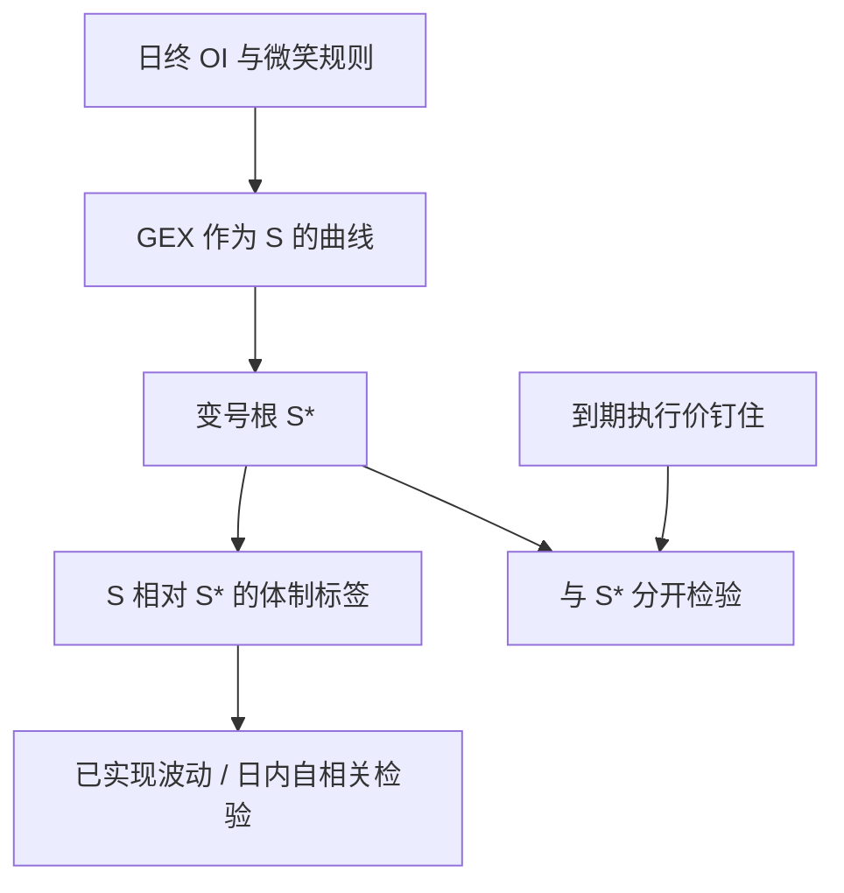

# Gamma Flip 零 gamma 位

净经销商 Gamma 作为现货的函数会穿过零；零点只是反馈符号的边界，不是由力学保证的吸铁石价位。

<footer>—— 对冲反馈随净 Gamma 变号是 Black–Scholes 希腊字母的直接推论；公开链上零点是 GEX 口径下的数值根，识别条件同 Mixon / Gârleanu–Pedersen–Poteshman</footer>

把 [GEX](/quant/gex-calculation) 写成现货 $S$ 的函数：每个执行价的 $\Gamma(S;K,T,\sigma)$ 随标的移动而变，带符号的加总 $\mathrm{GEX}(S)$ 连续时会有根。从业者称这个根为 **Gamma Flip**（零 gamma 位）：$S$ 在根之上与之下，经销商对冲的反馈符号相反。它在图上好看，也容易被讲成「价格会在 flip 处反弹」。公开文献只支持弱得多的命题：若净 Gamma 估计不太错，则跨越根时对冲需求的符号改变；**根本身没有额外的吸引力**，吸引力来自执行价附近的 Gamma 峰与 [pin risk](/quant/pin-risk)，见 [Strike Magnetism](/quant/strike-magnetism-max-pain)。本篇写如何解这个根、它随到期与 IV 怎么移，以及为什么不能把它当成支撑阻力。

## 问题

固定日终未平仓与微笑，$\mathrm{GEX}(S)$ 是一条可通过网格重估的曲线。在平值附近 Gamma 集中，曲线往往陡；在远离所有 $K$ 处 Gamma 近零，曲线平坦。根可能有一个、多个或没有（整天同号）。问题是数值上的：用哪一个 $S$ 网格、是否让每个 $K$ 的 $\sigma$ 随 $S$ 按 sticky strike 还是 sticky delta 移动。不同微笑动态给出不同的 $\mathrm{GEX}(S)$，因而给出不同的 flip。这与 [Delta 对冲](/quant/greeks-hedge) 里「用哪一个 Delta」是同一类模型选择，不是数据对错。

第二个问题是经济上的：即使根算对了，跨越它只改变**边际**对冲符号。若无符号 Gamma 存量很小，变号几乎没有流量含义。若存量很大但经销商并非残余持有人（符号约定错了），根在错误的曲线上。Mixon 的识别警告在零点上同样适用：公开 flip 是假设下的函数根。

### 多根、平台与 0DTE 尖峰

0DTE 把 Gamma 收成现货附近一根针，[GEX](/quant/gex-calculation) 作为 $S$ 的函数会在针的两侧迅速变号，根几乎贴着现货走——「flip 跟着价格」会让人误以为指标有预测力，其实是 $\Gamma(S)$ 的局部性。远月合约使曲线平滑、根稳定，但对当日对冲流贡献小。应报告 **0DTE 根** 与 **剔除 0DTE 的根** 两条，避免把针的几何当成体制。多根出现在多到期、多峰 OI 时：应列出全部根，或定义「距现货最近的根」，并承认选择规则是约定。

把 flip 画成水平线叠在 K 线图上，会暗示它是价格的函数之外的「位」。它其实是 $S$ 的函数的根，现货一动、IV 一动、OI 一更新，根就移。静态水平线只是某次快照。

## 方法

**网格重估。** 在现货上下若干百分比取网格 $\{S_j\}$，每个 $S_j$ 上重算全部合约的 $\Gamma_{\$}$（微笑规则预指定），用同一符号约定加总，得到 $\mathrm{GEX}(S_j)$。在变号区间线性插值得根 $S^\star$。精度到指数一点通常足够：对冲文献不支持把 flip 用到小数后两位去对交易。

**微笑规则。** Sticky strike：每个 $K$ 的 $\sigma$ 不变，$S$ 移动只改变 $K/S$。Sticky delta：保持 Delta 的 $\sigma$ 不变，执行价的隐含波动随 $S$ 平移。二者对虚值 Gamma 影响大于对平值，但仍会移动根。研究应预指定一种，并把另一种当稳健性，而不是挑使历史故事更好看的那种。

**时间。** Charm 与日历流逝会在 OI 不变时改变 $\Gamma$，因而移动 $S^\star$，见 [Charm](/quant/higher-greeks) 与 [Vanna / Charm 流](/quant/dealer-vanna-charm-flows)。盘中只用日终 OI 重估 $S^\star(S_t)$，是「仓位冻结、现货变动」的反事实，须在图注里写明。

### 与最大痛点、最大 OI 执行价的区别

最大未平仓执行价、[最大痛点](/quant/strike-magnetism-max-pain)、Gamma Flip 是三个不同的统计量。最大 OI 是仓位最厚的 $K$；最大痛点是使期权内在价值之和最小的交割价；flip 是净 Gamma 的零。它们可以碰巧接近（OI 厚的 $K$ 附近 Gamma 也大），但没有恒等式。检验钉住应预指定看哪一个，Ni、Pearson 与 Poteshman（2005）用的是期权到期日的执行价聚类，不是 GEX 根。

根对符号约定一阶敏感：把看涨看跌的经销商符号对调，曲线翻号，根一般还在，但「之上为正还是为负」对调。体制叙事必须与 [GEX](/quant/gex-calculation) 的同一约定绑定。

## 机制

在连续对冲的理想化里，经销商 Delta 对 $S$ 的导数就是净 Gamma。$S$ 穿过 $S^\star$ 时该导数变号，反馈从「逆趋势」换成「顺趋势」，或反过来。这是局部线性化的陈述，要求：对冲足够频繁、跳跃不大、存货符号正确。真实市场有离散对冲带、[对冲频率](/quant/delta-hedge-freq) 与跳空，穿过 flip 的几分钟不必出现可识别的流量脉冲。公开研究能做的检验是：在日频或低频上，现货在 $S^\star$ 之上与之下，已实现波动或日内自相关是否不同——这是 [体制](/quant/dealer-gamma-regime) 检验，不是「在 $S^\star$ 挂单」。

Flip 跟着 0DTE 现货走，说明当日凸性由当日合约主导；这时「位置相对 flip」几乎等于「位置相对平值」，信息增量有限。剔除短到期后的根，才更像存量体制的边界。

### 为什么不是磁铁

磁铁需要恢复力：价格离开某点后被拉回。正 Gamma 体制提供的是**阻尼**（减波动），不是恢复到 $S^\star$。负 Gamma 提供的是**放大**，更不是恢复。$S^\star$ 只是阻尼与放大的分界。把分界画成磁铁，是把体制边界误写成价格目标。执行价 $K$ 上的钉住来自到期 Gamma 爆炸与行权阈值，对象是 $K$ 不是 $S^\star$。二者在图上接近时，叙事容易混，检验必须分开。

## 边界与工程取舍

不要把 flip 当盘中支撑去交易：那超出公开识别，也把快照根当成固定位。不要在个股薄链上解根：OI 稀疏、IV 噪声会使 $\mathrm{GEX}(S)$ 乱跳。不要混用 SPX 与 SPY 的 $S$ 而不换算。A 股没有同构的经销商 Gamma 披露，画「A 股 gamma flip」需要另一套持仓假设。

Flip 的正当用途是：**与 GEX 同一口径的状态变量**，用于样本外体制分层，并报告对微笑规则、符号约定、是否含 0DTE 的稳健性。它不提供执行算法。

新闻日微笑跳开，根可以瞬时移动数十点。事件日应把 flip 当不可靠，而不是当更精确的磁铁。

## 小结

- Gamma Flip 是带符号 GEX 作为现货函数的零点，依赖 OI、微笑动态与经销商符号约定。
- 0DTE 会使根贴着现货，增量信息少；应同时报告剔除短到期的根。
- 零点是对冲反馈的符号边界，不是价格磁铁；钉住属于执行价与 pin risk。
- 正当用法是体制分层与波动检验，不是把快照水平线当支撑阻力。
- 出处：希腊字母与对冲反馈为标准推论；识别同 Gârleanu, Pedersen and Poteshman, *RFS*, 2009 与 Mixon 对公开定位的讨论；到期钉住见 Ni, Pearson and Poteshman, *JFE*, 2005。
