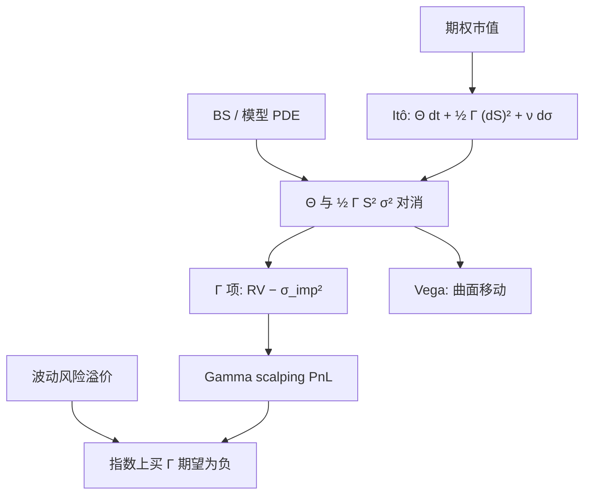

# Gamma scalping PnL

    
Delta 对冲之后，期权组合的瞬时盈亏由 Gamma 乘上已实现方差相对隐含方差的差额主导；多头 Gamma 在实现波动高于隐含时赚钱，这不是「高频交易的手感」，而是一条 Itô 恒等式。

    <footer>—— Bakshi and Kapadia, Delta-Hedged Gains and the Negative Market Volatility Risk Premium, Review of Financial Studies, 2003；离散项见 Boyle–Emanuel</footer>

[离散对冲误差](/quant/discrete-hedge-error) 把两次再平衡之间的残差写成渐近对象；[对冲频率](/quant/delta-hedge-freq) 决定何时付价差去消灭残差。本篇把同一项收成**可交易的 PnL 恒等式**：Gurdip Bakshi 与 Nikunj Kapadia 证明，指数期权在 Delta 对冲后的平均收益为负——卖出隐含、买入已实现的那一侧在收取波动率风险溢价。Gamma scalping 是多头 Gamma 的操作名称：现货来回动时再平衡「刮」已实现方差。不讨论最优带宽，不把高阶 Charm / Color 再推一遍。

## 问题

Black–Scholes 方程在无利率、无分红的局部写法下给出 $\Theta+\frac12\Gamma S^2\sigma^2=0$（或加上融资项）。Delta 中性组合在 $\mathrm{d}t$ 内的价值变化，用 Itô 展开到二阶，期权侧贡献 $\Theta\mathrm{d}t+\frac12\Gamma(\mathrm{d}S)^2$，对冲侧贡献 $-\Delta\mathrm{d}S$。代入 PDE，剩余是

$$
\mathrm{d}\Pi=\frac12\Gamma S^2\Bigl(\bigl(\mathrm{d}S/S\bigr)^2-\sigma^2\mathrm{d}t\Bigr)+\nu\mathrm{d}\sigma+\cdots.
$$

第一项是 scalping 的核心：已实现二次变差对上定价用的隐含方差。$\sigma$ 是插入 Black 公式的那一个数，微笑下应对每个执行价用自己的 $\sigma_{\mathrm{imp}}(K,T)$，或改用模型方差。问题是：把路径积分后，这笔 PnL 期望是否为零；若不为零，它是风险溢价还是对冲误差；以及 Gamma 随 $S,t$ 变化时，香草 scalping 与方差互换差在哪里。

Bakshi–Kapadia 的零假设是：若波动风险不被定价，Delta 对冲的期权收益在补偿融资后均值应为零。数据拒绝：指数看涨、看跌在 Delta 对冲后平均亏损，亏损随 Vega 与期限增大，与 [波动率风险溢价](/quant/variance-risk-premium) 同号。Scalping 作为策略，是站在「买 Gamma、付 Theta」一侧去收已实现；作为做市，是站在另一侧去收溢价。同一恒等式，符号相反。

### 隐含方差必须与 Gamma 的测度一致

用 ATM $\sigma$ 去对冲一张 25-delta 看跌，恒等式右边的 $\sigma^2$ 与左边的 $\Gamma$ 不在同一张切片上。正确的对照是：定价该合约所用的波动（Black 的 $\sigma_{\mathrm{imp}}$ 或 Heston 的瞬时 $v$ 路径）对上路径二次变差。微笑下还有 Vanna：现货一动，$\sigma_{\mathrm{imp}}$ 若按 sticky 规则跟着动，$\nu\mathrm{d}\sigma$ 项不再是零，scalping PnL 里会混进偏斜。应先声明 Delta 是 sticky strike 还是模型 Delta，见 [sticky delta / strike](/quant/sticky-delta-strike)。

「刮 Gamma」不是把对冲频率加密到每秒。频率只改变离散误差的方差与价差成本；期望 PnL 的领头项仍是 $\int\frac12\Gamma S^2(\mathrm{d}\langle\log S\rangle-\sigma^2\mathrm{d}t)$。加密不能把负的波动风险溢价变成正的。

## 方法

**记账。** 每个再平衡点记录：期权市值、对冲头寸、融资。区间 PnL 拆成：Delta（应为近零）、Gamma（二次变差项）、Theta（时间）、Vega（曲面移动）、残差（跳、价差、离散）。Bakshi–Kapadia 在研究里用 Black Delta、按日再平衡，把平均 Delta 对冲收益对 Vega、期限、执行价回归，以识别波动风险价格。交易台要把同一分解做成日报，否则「scalping 赚了」可能只是 Delta 没对上或曲面涨了。

**对象选择。** 平值短到期 Gamma 大、Theta 贵，已实现必须明显高于隐含才覆盖成本；虚值 Gamma 小，scalping 弱，更多是尾部保险。方差互换把权重换成 $1/K^2$，Gamma 剖面更平，是「干净」的已实现对隐含；香草是 $\Gamma(S,t;K)$ 加权的已实现，现货若远离 $K$，刮不到。这是为何专业方差账用互换，而做市商的日内 PnL 仍像香草 Gamma。

**溢价与 alpha。** 指数上买 Gamma 的无条件期望为负（BK）。要把它做成正的策略，需要择时已实现相对隐含的条件预测，或只在溢价过厚时卖出，而不是无条件买。个股上 Bakshi–Kapadia–Madan 显示单名期权相对指数更便宜（相关溢价在指数侧），单名买 Gamma 的溢价结构不同，见 [dispersion 相关溢价](/quant/dispersion-corr-prem)。

### 跳跃：恒等式的一次性项

路径有跳 $\Delta S$ 时，$(\Delta S)^2$ 进入二次变差，但期权价格跳的是 $V(S+\Delta S)-V(S)$，不是 $\frac12\Gamma(\Delta S)^2$。Taylor 余项在大跳时为正（看涨看跌的凸性），空头 Gamma 在崩盘日的亏损大于扩散公式所报。Scalping 报表若只用 $\frac12\Gamma(\Delta S)^2$ 去解释跳日，会低估空头损失。应单列跳贡献，或用完整重定价减切线。

## 机制

连续极限里，若实现过程的瞬时方差等于定价 $\sigma^2$，且无波动风险溢价，scalping 的期望为零，只剩离散噪声。市场拒绝「无溢价」：风险中性下的 $\mathbb{E}^{\mathbb{Q}}[\mathrm{QV}]$ 高于物理期望，条带贵于随后实现。Delta 对冲的多头期权是这条溢价的香草实现，权重是该期权的 $\Gamma$ 而不是 $1/K^2$。Bakshi–Kapadia 的贡献是把「期权贵」写成可检验的 Delta 对冲收益，而不是只比较 ATM IV 与历史波动。

随机波动下，即使 $\mathbb{E}[\mathrm{d}\langle\log S\rangle]=v_t\mathrm{d}t$，若 $v_t$ 与定价所用的 Black $\sigma$ 不同，且 $\mathrm{d}v$ 与 $\mathrm{d}S$ 相关，Vega / Vanna 项有均值。Heston 里 $\rho\lt 0$ 使下跌伴随 $v$ 上升，空头看跌的 Delta 对冲收益更负。用 Black Delta 对冲随机波动世界，本身就是模型错误；BK 的检验用的是市场惯例 Delta，测到的是这一惯例下的溢价，包含模型误设。生产上应用记账模型的 Delta，再把模型外的 Vega 分桶。

### 与方差互换 PnL 的换算

若 $\Gamma S^2$ 近似常数，累积 Gamma PnL 正比于已实现方差减隐含方差，名义可换成方差互换。真实 $\Gamma$ 是峰状的：现货离开执行价，scalping 自动减仓。这是路径依赖，不是 bug。要把香草账对成方差账，需一篮子执行价使 $\sum\Gamma_i S^2$ 接近常数，即再逼近 $1/K^2$ 条带。单一跨式的 scalping 永远带方向性的 Gamma 衰减。

Theta 不是「独立的第三笔钱」。在扩散模型里它是为持有 Gamma 预收的 $\frac12\Gamma S^2\sigma^2$。把 Theta 当稳定票息、把 Gamma 当意外，会在实现波动低的月份误报利润来源。

## 边界与工程取舍

价差与冲击进入每一笔再平衡，多头 Gamma 的已实现必须覆盖 Theta **加** 成本。微观结构噪声会让过密对冲把买卖弹跳当成已实现方差，虚假 scalping、真实亏损。隔夜跳空无法刮，只能当跳项。微笑移动时，未对冲 Vega 可以盖过 Gamma 项：日报必须拆开，否则策略归因失败。

不要用 Heston 特征函数的 Vega 去解释 Black Delta 对冲的历史 PnL，两个希腊字母不在同一测度、同一参数化。不要把 BK（2003）写成「证明了该卖所有期权」：他们证明的是指数上波动风险被负向定价；个股、商品、外汇的符号与幅度不同。粗糙波动下短尺度二次变差更凶，同样的再平衡频率留下更大残差，见 [rBergomi](/quant/rough-bergomi)。

Gamma scalping 与做市报价不是同一件事。做市同时赚价差、管理库存，PnL 里有逆选择。把做市利润全部记成「刮到了已实现」，会高估波动策略、低估毒性成本。

利率与分红使 PDE 多出 $r(V-\Delta S)$ 一类融资项。忽略隔夜资金，等于把融资 PnL 算进 scalping。多币种与期货期权要用对应的保证金惯例。

## 小结

- Delta 对冲后的领头 PnL 是 $\frac12\Gamma S^2(\mathrm{RV}-\sigma_{\mathrm{imp}}^2)$，这就是 Gamma scalping 的对象。
- 指数上该期望为负（Bakshi–Kapadia）：买 Gamma 在付波动率风险溢价，加密对冲消不掉。
- 香草权重是 $\Gamma(K)$，方差互换权重是 $1/K^2$；单一跨式不是干净的方差。
- 记账须拆开 Delta、Gamma、Theta、Vega、跳与价差；Theta 是预收的 Gamma 租金。
- Delta 惯例（sticky / 模型）改变 Vanna 泄漏，须与曲面动态一起声明。
- 出处：Bakshi and Kapadia, *Review of Financial Studies*, 2003；Itô / BS 恒等式；离散见 Boyle and Emanuel；溢价对照 Carr–Madan 条带。
