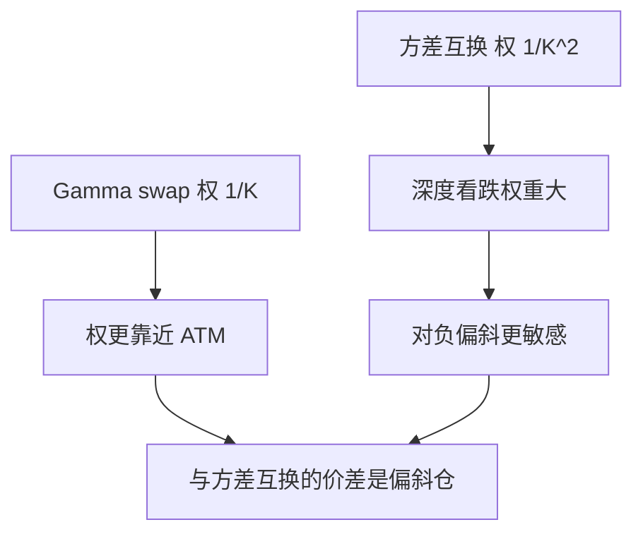

# Gamma swap

方差互换按 $1/K^2$ 加权香草条带；Gamma 互换按 $1/K$ 加权，使已实现方差的权重跟现价走，对冲的是价格加权的二次变差。

<footer>—— 方差互换复制见 Carr–Madan 与 Demeterfi–Derman–Kamal–Zou；Gamma swap 的条带权见波动率衍生文献对 price-weighted variance 的定义</footer>

[上一课](/quant/autocallable)把路径依赖收在零售障碍结构。本课回到波动率产品线：主干 [方差互换与 VIX](/quant/variance-swap-vix) 已经把对数合约与 $1/K^2$ 条带写清。缺口是 **Gamma swap**：已实现部分按收益贡献与 $S$ 成正比加权，复制权从 $1/K^2$ 变成 $1/K$。后课相关互换再把对象从单资产二次变差换成 $\rho$。

## 问题

方差互换支付 $\frac{1}{T}\sum r_i^2-K_{\mathrm{var}}$，每笔对数收益等权。标的大涨之后，同样 1% 的收益对卖方的 Gamma 与未对冲方差一样大，但名本未随价格放大。Gamma swap 把权重改成与现价成正比（实现上常用 $\frac{S_{i-1}}{S_0}r_i^2$ 一类约定），使对冲账户里的 Gamma 更接近「持有随 $S$ 放大的期权条带」。问题是：公平执行价不再等于对数合约，而等于**价格加权**的欧式条带，对偏斜的暴露从方差互换的下侧 $1/K^2$ 转向更靠近 ATM 与上侧。

把 Gamma swap 当「方差互换换个名字」，会在微笑陡的指数上把执行价定错，也会把对冲用的期权权重用错。

### 条带权决定吃哪一段微笑

Carr–Madan 静态复制：收益 $f(S_T)$ 由 $f''$ 对香草积分。方差互换对应 $f=\ln$，权 $\propto 1/K^2$，深度价外看跌权重大。Gamma swap 对应更接近 $S\ln S$ 一类，权 $\propto 1/K$，看跌权重相对减轻。因此 Gamma swap 的公平波动通常高于或低于方差互换，取决于偏斜形态——差本身是一个偏斜仓位，不是噪声。

名称来自对冲：方差互换的瞬时 Gamma 随 $1/S^2$ 变，Delta 对冲后对 $S$ 的依赖与交易员「Gamma」直觉不完全一致；价格加权后更接近名义随现价走的 Gamma 账户。

## 方法

在离散执行价网格上，用 $1/K$ 权对 OTM 香草求和，加远期与现金项，得到公平 Gamma 方差，再开方报成波动（若市场习惯如此）。离散采样、跳、分红修正的精神与方差互换相同，系数不同，不要复用 $1/K^2$ 的实现代码只改名字。有限执行价截断对 $1/K$ 与 $1/K^2$ 的敏感不同：下侧缺执行价时，方差互换缺得更多。

对冲：持有 $1/K$ 条带并动态对冲 Delta。与方差互换簿之间的价差，主要是偏斜与跳。不要用 VIX 期货去对冲 Gamma swap 当「同一个 vol」。

## 机制

二次变差的权若随 $S$ 放大，大涨路径贡献更多已实现，大跌路径贡献相对方差互换更少（因为权随 $S$ 降）。陡峭的负偏斜下，方差互换更吃下侧看跌；Gamma swap 相对「更 ATM」。两者的价差于是是交易偏斜的一种方式，而不必直接做风险反转。

## 边界

合同必须写清：用何种对数收益、是否用收盘、是否除权、名义是方差点还是波动点、权是 $S_{i-1}/S_0$ 还是连续 $S_t$。商品与外汇的「现价」还涉及远期滚动。流动性：Gamma swap 远薄于方差互换与 VIX，复制要用更宽的条带，买卖价差会吃掉理论价差。

本课不把 Gamma swap 写成「更好的方差互换」。它是不同的 $f''$，服务不同的对冲账户。

## 小结

- Gamma swap 复制权是 $1/K$，方差互换是 $1/K^2$；公平执行价对偏斜的暴露不同。
- 与方差互换的价差本身是偏斜仓位。
- 实现不要复用方差互换代码只改标签；截断与跳的修正系数都不同。
- 出处：方差复制见 Carr and Madan, 1998 与 Demeterfi et al., 1999；价格加权方差的条带权见波动率衍生标准处理。
