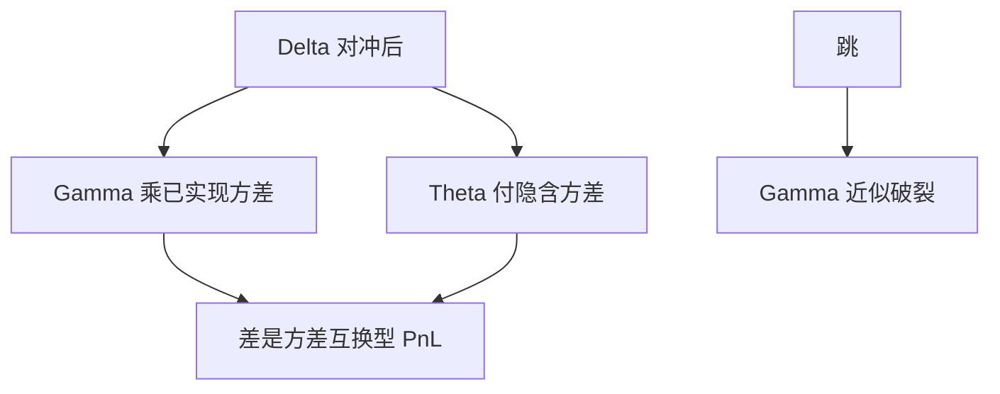

# gamma-theta 权衡

持有期权的 Theta 是你为 Gamma 付的租金；已实现波动若高于隐含，租金才赚得回来。

<footer>—— 对照 Taleb 对期权动态对冲的叙述；BSM 方程里 $\Theta+\tfrac12\sigma^2 S^2\Gamma$ 与利率项的平衡</footer>

[上一课](/quant/iv-surface-dynamics)把曲面因子写进情景。本课回到单日 PnL 的会计：**Gamma 赚已实现、Theta 付隐含。** 主干 [离散对冲误差](/quant/discrete-hedge-error) 与 [Greeks 对冲](/quant/greeks-hedge) 已写复制误差。缺口是把 BSM 的瞬时恒等式当成交易员的日 PnL 分解，并写清微笑与跳如何让恒等式破损。后课模型风险把「隐含 vs 已实现」升成模型选择。

## 问题

Delta 对冲后，BSM 世界里瞬时

$$
\mathrm{d}V-\Delta\mathrm{d}S \approx \Theta\mathrm{d}t+\tfrac12\Gamma(\mathrm{d}S)^2+\cdots
$$

而定价时 $\Theta+\tfrac12\sigma_{\mathrm{imp}}^2 S^2\Gamma\approx r(V-\Delta S)$（略去股息）。于是超额 PnL 大约是 $\tfrac12 S^2\Gamma\bigl((\mathrm{d}S/S)^2-\sigma_{\mathrm{imp}}^2\mathrm{d}t\bigr)$。多 Gamma 的人在已实现方差高于隐含方差时赚钱。问题是：这是**对冲后的方差互换型暴露**，不是「方向对了」；微笑下每个 $K$ 的 $\sigma_{\mathrm{imp}}$ 不同，总 Gamma 加权平均的隐含方差才是你付的租金。把 ATM 隐波当所有腿的租金，会在偏斜产品上把账做平。

Theta 还含利率与时间衰减的会计项。周末、节假日的日历 Theta 与交易日已实现不对齐，见 [日历与隔夜](/quant/calendar-overnight)。

### 跳让 Gamma 租金变成数字风险

连续路径下 $(\mathrm{d}S)^2$ 与 $\sigma^2\mathrm{d}t$ 比。跳来时 $(\Delta S)^2$ 很大，Gamma 近似失效，PnL 由跳跃大小与期权凸性的离散差决定。卖方若靠收 Theta 过日子，是在卖跳。这与 [方差互换](/quant/variance-swap-vix) 的跳修正是同一件事，只是名义换成了你簿上的 $\Gamma(K)$ 分布。

Gamma 的符号在障碍附近可以与香草相反。敲出前多 Gamma、敲出后归零，Theta 仍在收，权衡在壁附近不是平稳的日租金。

## 方法

日终分解：Delta PnL、Gamma/已实现、Theta/隐含、Vega/曲面变化、残余（高阶、跳、费用）。已实现用与对冲频率一致的采样，不要用日度平方去解释五分钟对冲的簿。对冲频率提高，已实现更接近二次变差，也更吃微观结构噪声，见 [已实现波动与噪声](/quant/rv-noise)。

限额：用 $\tfrac12 S^2\Gamma$ 当方差名义，对比隐含方差与预测 RV。这是把期权簿翻译成方差互换语言，便于和 [HAR](/quant/har-rv) 一类预测对表。

## 机制

你买凸性，就得付时间。市场通过隐波收这份租金。若你的对冲把方向拿走，剩下的赌注是二次变差对隐含方差。曲面因子动时，Vega PnL 会盖过 Gamma-Theta；那不是权衡失效，是你还暴露在 Cont–da Fonseca 的水平上。先把 Vega 对冲到桶限额内，Gamma-Theta 才读得出来。

## 边界

离散对冲、买卖价差、隔夜缺口使恒等式只是分解框架，不是保证。美式提前行权、融资与股票借券进入 carry，不在纯 $\Gamma$–$\Theta$ 里。结构产品的「Theta」往往含障碍时间流逝，符号与香草相反，不要用同一句「卖方收租」概括 autocallable。

## 小结

- Delta 对冲后，多 Gamma 赚已实现减隐含；租金应按簿上 $\Gamma(K)$ 加权的隐波来算。
- 跳与障碍让瞬时恒等式破裂。
- 先把 Vega 桶对冲掉，再读 Gamma-Theta，否则被曲面因子淹没。
- 出处：BSM 方程的 $\Theta$–$\Gamma$ 平衡；Taleb, *Dynamic Hedging*；跳与方差复制见 Carr–Madan。
