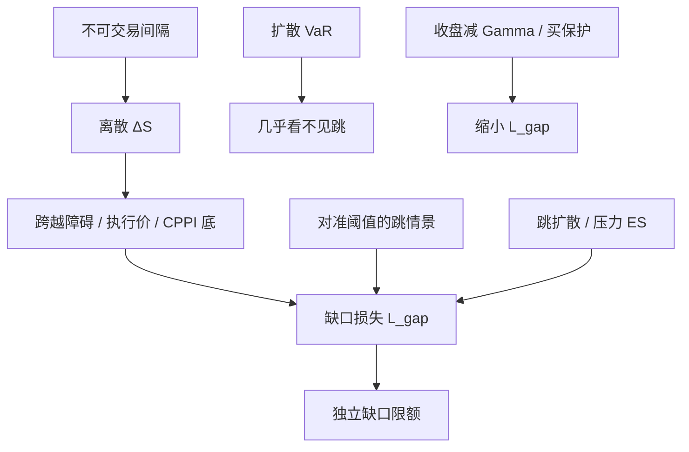

# 缺口风险

连续对冲假定你能在路径的每一点再平衡；价格若在不可交易的间隔里跳过执行价、障碍或 CPPI 的债券底，损益在开盘时一次性实现，加密日内 Delta 消灭不了这一跳。

<footer>—— 离散复制误差见 Boyle and Emanuel, 1980；跳扩散见 Merton, 1976；障碍监控与缺口是结构化产品风险的标准对象</footer>

[上一课](/quant/span-simm)表明 SPAN 用价格–波动网格的最大损失服务清算 IM，SIMM 用公开参数的敏感性加总服务非清算 IM；网格外缺口与希腊字母抓不住的奇异风险，两套都会漏。缺口是不可交易间隔里的离散跳。连续对冲与扩散 VaR 把障碍、CPPI 底、自动赎回写成平滑路径上的分位数，中间没有报价的 $\Delta S$ 可以跨过非线性阈值。本课把 gap risk 写成必须单独建模的一项。不重讲扫描档位。后课拥挤螺旋默认已经读完：集中在同一障碍附近的名义应合并计量。

## 问题

连续模型里，局部风险由 Delta、Gamma、Vega 描述，小移动用泰勒展开。缺口 $\Delta S$ 可以是数个标准差且中间没有报价，泰勒在障碍点不成立：$g(S)$ 在障碍 $B$ 处不连续或导数爆炸。典型结构：

- **障碍期权：** 向下敲入若跳过 $B$，从零变成深度价内，空头瞬间出现 Delta 与负值。离散监控与连续监控的差别见障碍监控类工作；缺口使「收盘未破、盘中已破」或「隔夜已破」成为定价与对冲的核心。
- **CPPI / 组合保险：** 乘数把仓位钉在 $m\times$ 垫头上。缺口若一次打穿债券底，理论应已降到零风险资产，实际来不及卖，剩余是股票缺口损失。这是缺口风险的经典银行定义之一。
- **自动赎回 / 反向可转：** 观察日开盘相对敲入价的跳，决定是否变成股票交割。

问题是：扩散 VaR 把这些事件的概率估成几乎为零（正态一日 5% 跳的尾极薄），而真实缺口来自隔夜信息、停牌后复牌、宏观发布。必须用跳过程、压力情景或隔夜经验分布，而不是加密 GARCH 的 $\Delta t$。

### 缺口不是「很大的日内波动」

把隔夜收益塞进五分钟已实现波动的第一格，等于假设跳来自同一扩散。French 等对隔夜与周末的研究说明非交易间隔的方差率与交易时段不同。停牌再开是制度性缺口，见 [停牌](/quant/trading-halts)。涨跌停把连续路径截断，打开时一次补完，对障碍是另一种监控。风控若只用交易时段的 $\sigma$ 乘日历小时数，会系统低估缺口。

缺口风险的资本若用「99% 日 VaR 乘一个倍数」，倍数永远说不清。应单独定义缺口损失 $L_{\mathrm{gap}}=g(S_{t+}\Delta)-g(S_t)$，其中 $S_{t+}$ 来自跳情景，再对 $L_{\mathrm{gap}}$ 取压力或跳测度下的分位数 / ES。

## 方法

**跳情景表。** 对每个非线性阈值（执行价、障碍、CPPI 底、自动赎回触发），列出：隔夜历史分位数跳、周末跳、该标的停牌复牌跳、指数期货可交易而现货不可交易的基差跳。每个情景全定价，得到 $L_{\mathrm{gap}}$。限额写成：给定情景集合上 $\max L_{\mathrm{gap}}$ 或概率加权 ES 不得超过预算。这与 SPAN 网格同类，但情景必须对准**你的阈值**，而不是交易所通用的价格档。

**跳扩散 / 方差伽马。** Merton 跳扩散给 $\Delta S$ 一个强度为 $\lambda$ 的复合泊松。VaR/ES 在含跳的预测分布上计算，缺口产品的 $g$ 用全定价。校准应区分交易时段跳与隔夜跳；用日内高频估 $\lambda$ 再用于隔夜，强度会错。 Bates 一类随机波动加跳，对同时「波动跳起 + 现货跳下」的缺口更诚实。模型风险大，应与情景表并行，而不是替代。

**监控约定。** 连续监控、收盘监控、盘中障碍，三种 $g$ 不同。合同写收盘监控，隔夜跳只在次日收盘才决定敲入，缺口时点延后，但开盘到收盘仍可能无法对冲已裸露的 Delta。合同写美式障碍，隔夜已经敲定。风险系统必须读合同，不能用定价库默认监控。离散监控的缺口与连续极限不是同一价格，对冲比也不能共用。

### 与 VaR、保证金的接口

日常 FHS 若残差来自含隔夜的日收益，会把一部分历史缺口带进经验测度，但样本里没有的跳幅仍不会出现。压力期 [FRTB](/quant/stressed-var-frtb) 可能含 2008 年的隔夜跳，对当前障碍位置不必是最坏：最坏是「从当前 $S$ 刚好跳过 $B$」的那一档。因此缺口限额不能并入压力 ES 了事，要对准距离阈值的几何。SPAN/SIMM 对奇异障碍覆盖不足，发行台应有独立缺口资本，而不是指望初始保证金。

对冲政策：收盘前把净 Gamma、净障碍暴露压到跳情景可接受；用虚值保护转移缺口，而不是更勤的日内 Delta。CPPI 应设缺口缓冲（乘数上限、垫头下限），使历史最大隔夜跳仍留在债券底之上。缓冲吃收益，那是保费。

## 机制

缺口的机制是状态变量在不可交易集合上的不连续更新。复制论要求的可交易区间被挖掉一块，伊藤公式的 $dt$ 项与 $\mathrm{d}S$ 项中间插入 $\Delta S$。Gamma 损失 $\tfrac12\Gamma(\Delta S)^2$ 是光滑 $g$ 的二次近似；$g$ 有跳跃时，损失是 $g(S+\Delta S)-g(S)-\Delta\cdot\Delta S$，可以接近整个期权名义。尾依赖使多标的篮子同时跳，篮子障碍比单名更脆。这是 [Copula](/quant/copula-var) 的缺口版本：边缘跳加上同跳。

内生缺口：你的对冲在开盘拍卖上成为冲击，触发更多障碍，见流动性螺旋。风险模型若把 $\Delta S$ 当外生，会低估发行规模大的结构化产品在敲入潮中的损失。限额因此要含集中度：同一障碍附近的名义之和，而不是各账户单独的缺口 ES 相加——相加会假分散。

A 股 T+1、涨跌停、指数与个股不同步开盘，使「用期货补隔夜 Delta」留下基差缺口。缺口清单必须按交易制度分市场，不能从美股复制粘贴。

### 估计：样本不够时用几何而不是频率

个股 5% 隔夜跳可能十年一遇，障碍产品的样本 ES 几乎不可估。此时用几何：当前距离障碍的百分比，对照该标的与同类标的的历史最大缺口、指数缺口、停牌缺口。频率模型（$\lambda$）用指数或行业估计，幅度用压力表。EVT 对日损失的 GPD 含一部分缺口日，但混合了连续尾与跳；若关心合同阈值，应把跳日单独建样本。回测缺口模型不要用 Kupiec 对日 VaR：缺口事件太稀，应做情景覆盖（是否含历史最大跳）与对新发产品的事前缓冲检查。

## 边界与工程取舍

缺口风险不是把置信水平从 99% 调到 99.9%。更高 $\alpha$ 仍在同一扩散测度里外推，除非测度含跳。也不要与 pin 混用：pin 是到期日在 $K$ 附近的二元，缺口是任意时刻的离散跳。两者在到期周重叠，政策可以合并，定义不要合并。模型方面，纯扩散 + 短 $\Delta t$ 的 MC 会漏掉隔夜；必须显式插入非交易间隔。

发行与做市的利益冲突：发行台卖出缺口（客户买保护或买收益率），簿上留下跳的空头。VaR 限额按扩散可能显示安全。治理上缺口 ES 应有独立预算，突破则停发，而不是用更高的票息去「补偿」未对冲的跳。保证金（SPAN 网格）可能覆盖一部分，但网格档位不是你的障碍。

把缺口称为「操作风险（系统在隔夜没对冲）」会分错类。对冲本来就无法在间隔内发生。它是市场风险在不可交易时段的实现，资本应在市场风险里单列。

## 小结

- 缺口风险是不可交易间隔里的离散跳跨过非线性阈值，连续对冲与扩散 VaR 都覆盖不到。
- 应对准障碍、CPPI 底、自动赎回等几何位置建跳情景，并与历史隔夜、停牌复牌对照。
- Merton 类跳过程可补概率，但不能替代对准当前阈值的压力表。
- 集中在同一障碍附近的名义应合并计量；分账户加总会假分散。
- 出处：Merton, *Journal of Financial Economics*, 1976；Boyle and Emanuel, 1980；French 对非交易间隔；障碍与 CPPI 缺口为结构化产品风险管理的公开标准讨论；制度侧对照停牌与隔夜对冲实务。
