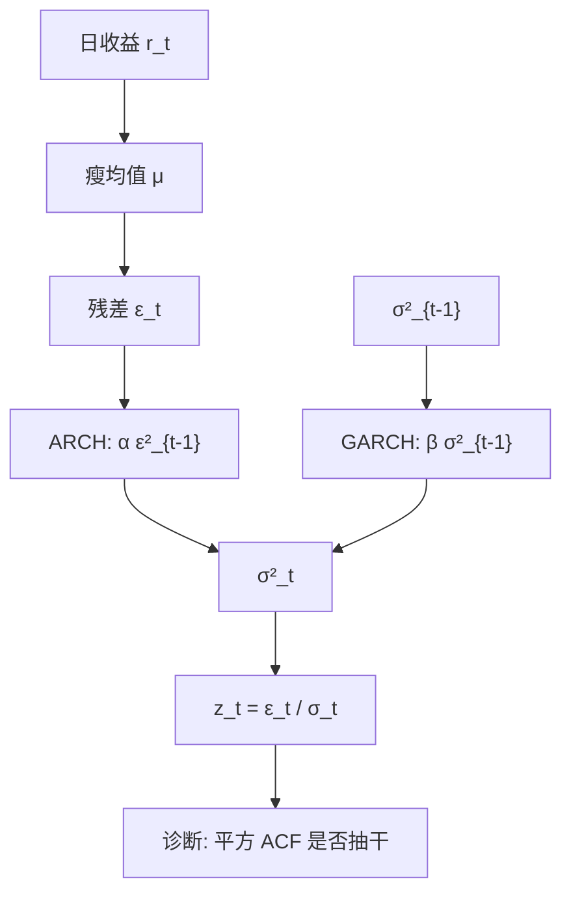

# GARCH

用过去残差平方的分布滞后生成条件方差，就能在均值方程仍然很瘦的同时，产生波动聚集与肥尾；把滞后写成一个自回归项，阶数不必开到无穷。

<footer>—— Engle, Autoregressive Conditional Heteroscedasticity, Econometrica 1982；Bollerslev, Generalized Autoregressive Conditional Heteroskedasticity, Journal of Econometrics 1986</footer>

日收益的线性自相关弱，平方的自相关强：大波动后面还是大波动。Engle（1982）的 ARCH 让条件方差成为过去平方冲击的函数；Bollerslev（1986）的 GARCH 把条件方差自身也放进方程，用很少的参数吸收长的平方记忆。GARCH 是日频波动建模的默认均值–方差装置，对象是**条件方差过程**，不是积分波动的高频估计。有 RV 时，HAR 与已实现 GARCH 会改写信息集；没有 RV 时，GARCH 仍是能从一条收益序列抽出 $\sigma_t$ 的方法。

## 问题

记 $r_t=\mu_t+\varepsilon_t$，$\varepsilon_t=\sigma_t z_t$，$z_t$ 为 i.i.d.、均值 0 方差 1。Engle 的 ARCH$(q)$ 为 $\sigma_t^2=\omega+\sum_{i=1}^q\alpha_i\varepsilon_{t-i}^2$。要拟合缓慢衰减的平方 ACF，$q$ 必须很大。Bollerslev 写成 GARCH$(p,q)$，标准 GARCH(1,1) 是

$$
\sigma_t^2=\omega+\alpha\varepsilon_{t-1}^2+\beta\sigma_{t-1}^2.
$$

$\alpha+\beta$ 接近 1 时冲击持续很久，但仍是短记忆（指数衰减）。问题是：在正性、平稳性约束下估计 $(\omega,\alpha,\beta)$，使标准化残差 $z_t$ 接近白噪声，并给出一步条件方差。均值 $\mu_t$ 通常极瘦（常数或略加 AR(1)）；把可预测性塞进均值，会与方差抢同一块平方结构。

### 无条件方差与持续性必须分开看

平稳时 $E[\sigma_t^2]=\omega/(1-\alpha-\beta)$。$\alpha+\beta$ 靠近 1，无条件方差对 $\omega$ 敏感，有限样本里 $\omega$ 估不稳，长期预测会漂。RiskMetrics 的 IGARCH 令 $\alpha+\beta=1$、无 $\omega$，条件方差是平方收益的指数加权，没有无条件均值，长期预测不收敛——这是工程简化，不是 Engle–Bollerslev 的平稳 GARCH。报告应写清：你要的是有均值回复的 $\sigma_t$，还是永不回复的 EWMA。

GARCH 滤出的是关于 $t-1$ 可测的条件方差。某一天已经实现的「今日波动」不是 $\sigma_t$，而是 $|\varepsilon_t|$ 或 RV。用 $\sigma_t$ 去和当日 RV 比，GARCH 少了当日日内信息；这正是已实现 GARCH 要补的测量方程。

## 方法

**估计。** 条件高斯极大似然（实际上是准似然）：即使 $z_t$ 不是高斯，在正则条件下 QMLE 仍一致，标准误用 Bollerslev–Wooldridge 三明治。收益肥尾时，直接设 $z_t$ 为 t 分布往往更稳，但自由度会与 $\alpha,\beta$ 纠缠。约束 $\omega>0$，$\alpha,\beta\ge 0$，$\alpha+\beta<1$（协方差平稳）。估计前应把收益按交易日对齐，分红与拆股已调整；均值用常数即可，除非有明确的日历均值。

**诊断。** 标准化残差的 ACF 应接近零，其平方的 ACF 也应被抽干。若平方仍相关，升阶或检查是否缺非对称（交给 [EGARCH / GJR](/quant/egarch-gjr)）。若标准化残差仍极肥尾，GARCH 只解释了部分峰度——条件高斯 GARCH 能产生无条件肥尾，但往往不够，需要 t 创新或跳出 GARCH。

**预测。** 一步 $\sigma_{t+1}^2$ 由滤波给出；多步向无条件方差均值回复，速率由 $\alpha+\beta$ 决定。VaR 还要创新分布的分位，不能只把 $\sigma$ 乘 1.65。期权与多期密度需要模拟或解析矩，GARCH(1,1) 对长地平线会显得记忆不够，那不是调 $\beta$ 能完全补的，而是模型类的边界。

### 信息集是日收益平方，不是 RV

ARCH 项 $\varepsilon_{t-1}^2$ 是对昨日积分波动的噪声极大的代理。一日只有一个平方，噪声–信号比差，所以 $\alpha$ 通常远小于 HAR 的日系数。这解释了为何有高频 RV 时，用 RV 替换 $\varepsilon^2$ 会立刻改善——但那就不再是经典 GARCH，而是已实现测量模型。没有高频时，GARCH 仍合理：对象变成「从日收益能提取的条件方差」，不要假装它等于 IV。

## 机制

机制是方差的反馈。大冲击抬高 $\sigma_t$，使下一期更容易再出现大冲击，从而平方相关、波动聚集。无条件分布是混合：随机的 $\sigma_t$ 混合出肥尾，即使 $z_t$ 是高斯。持续性 $\alpha+\beta$ 高，是因为波动冲击衰减慢，不是因为收益均值有单位根。把 GARCH 残差再去做 [单位根](/quant/unit-root) 检验没有对象——$r_t$ 已是 I(0) 附近，$\sigma_t^2$ 是正的条件二阶矩过程。

与 [ARMA](/quant/arma) 的对应：对 $\varepsilon_t^2$ 而言，GARCH(1,1) 像 IARCH 的 ARMA(1,1) 表示（Engle 的 ARCH 是分布滞后，$\sigma^2$ 的 AR 项压缩滞后）。识别上仍应简约：GARCH(1,1) 对多数日收益够用；GARCH(2,2) 常常是在拟合一两次危机，样本外并不更好。

$\alpha$ 是「昨日惊吓有多快进入方差」，$\beta$ 是「旧方差有多黏」。$\alpha$ 过小、$\beta$ 过大，滤波几乎是慢 EWMA，对跳反应迟钝；$\alpha$ 过大则 $\sigma_t$ 跟着每日平方乱跳，失去「条件」的平滑。两者的权衡是对象，不是越大越好。

### 与随机波动的差别先写在信息集上

GARCH 的 $\sigma_t$ 关于过去收益可测，一步预测没有额外冲击。随机波动让方差有自己的新息，滤波是潜变量推断。对日收益拟合，两者都能做聚集与肥尾；对期权，Heston 一类 SV 更常给出闭式或半闭式。先把 GARCH 当作可观测条件方差的工作马，SV 当作多一层冲击的潜波动，已实现测量当作对 IV 的直接观测。

## 边界与工程取舍

GARCH(1,1) 对称，不能产生「跌时波动升得更快」的杠杆效应，这是下一篇 EGARCH/GJR 的入口。结构突变会使全样本 $\alpha+\beta$ 被高估（Lamoureux–Lastrapes）：危机像永久提高了方差水平，持续性被污染。滚动或允许水平切换会降低 $\alpha+\beta$。日内季节性、隔夜跳不应塞进单方程日 GARCH；隔夜可单独一项。

工程上：组合风险不要对每只股票估一套不稳定的 GARCH 再加总相关，宁可对因子组合或指数估，个股用 beta 映射。数值上，对 $\omega,\alpha,\beta$ 做对数再参数化以免踩边界；初值用无条件方差与 $\alpha+\beta=0.95$ 一类默认。不要用日 GARCH 去描述 tick 波动——对象错了，应回到 RV 与核。不要把 GARCH $\sigma_t$ 年化后直接当隐含波动卖出信号，中间隔着风险溢价与模型误设。

准似然在厚尾下仍可一致，但小样本里一次暴跌能把 $\beta$ 推到边界。估计应报告是否顶在 $\alpha+\beta=1$，顶住时长期预测已经坏了，应改 IGARCH、t 创新，或把该日当跳跃单独处理。

## 小结

- Engle 的 ARCH 用过去平方冲击驱动条件方差；Bollerslev 的 GARCH 加入方差自回归，GARCH(1,1) 是日频默认。
- 平稳性要求 $\alpha+\beta<1$；该和接近 1 时长期预测对 $\omega$ 敏感，有限样本易漂。
- 信息集是日收益平方，噪声大；有 RV 时应换测量，而不是把 GARCH 阶数开大。
- 条件高斯即可产生无条件肥尾，但往往不够，需 t 创新或非对称扩展。
- 结构突变会抬高表面持续性；对称 GARCH 不解释杠杆效应。
- 出处：Engle, *Autoregressive Conditional Heteroscedasticity…*, Econometrica, 1982；Bollerslev, *Generalized Autoregressive Conditional Heteroskedasticity*, Journal of Econometrics, 1986。
