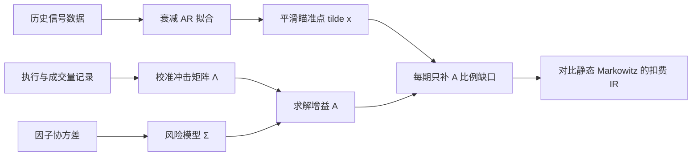
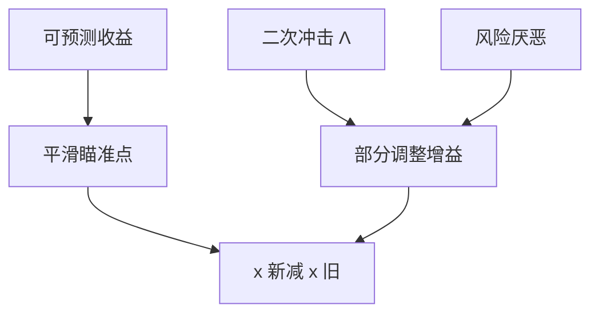

# Gârleanu–Pedersen 动态交易

目标仓位在动、冲击是当前交易量的二次型时，最优是向一个瞄准点做部分调整，而不是一步买到信号目标。

<footer>—— Gârleanu and Pedersen, Dynamic Trading with Predictable Returns and Transaction Costs, Journal of Finance, 2013</footer>

[上一课](/quant/dynamic-programming-rebalance)给出带费用的 DP 结构。Gârleanu–Pedersen（GP）的缺口是给出**可算的线性政策**：超额收益可预测、价格冲击为 $\frac12\Lambda \Delta x$ 二次，目标函数是均值方差减冲击。主干 [Almgren–Chriss](/quant/almgren-chriss) 处理一次性执行；GP 处理持续的 alpha 流。本课不重写冲击核。

## 问题

信号给出理想仓 $aim_t\propto \mathrm{forecast}_t$。若一步到位，冲击把 alpha 吃光，且明天信号又变，等于反复付冲击。GP 的解：交易朝着一个**更平滑的瞄准组合**，速度由 $\Lambda$ 与风险厌恶、以及信号的半衰期决定。问题是把「部分仓位」从经验规则（每次调 20%）升级为最优控制的增益矩阵，并能用同一套 $\Lambda$ 去解释容量。

与无交易带的差别：线性冲击 + 二次风险下，最优是连续的部分调整，不是「不动直到边界」。两种费用函数，两种政策形态。不要用 GP 去解释固定佣金下的阈值规则，也不要用 Constantinides 带去解释二次冲击的高频调仓。

### 瞄准点不是信号目标

GP 的瞄准点是当前信号与未来预期信号的加权（因为未来还要交易）。快衰减信号的瞄准更靠近当前；慢信号可以更早布局。把瞄准点设成「今天的截面排序目标」，等于假设信号是白噪声未来，会交易过度。

$\Lambda$ 应来自冲击模型校准，见 [平方根冲击](/quant/sqrt-impact) 与 Almgren。用换手惩罚乱凑一个 $\Lambda$，政策增益没有经济单位。

## 方法

状态：当前仓 $x_t$、信号向量。政策：$x_{t+1}-x_t=A(\tilde x_t-x_t)$，其中 $\tilde x$ 是瞄准，$A$ 是增益（可以按特征因子化）。估计：信号用衰减 AR；$\Lambda$ 用执行数据；风险用因子 $\Sigma$。实现：在因子空间做 GP，再映射到股票，避免 $N\times N$ 冲击矩阵。对照：静态 Markowitz 每期重做 vs GP 路径，比较扣冲击后的 IR。

```mermaid
flowchart LR
  SigData["历史信号数据"] --> AR["衰减 AR 拟合"]
  Exec["执行与成交量记录"] --> Lam["校准冲击矩阵 Λ"]
  Fac["因子协方差"] --> Risk["风险模型 Σ"]
  AR --> Aim["平滑瞄准点 tilde x"]
  Lam --> Gain["求解增益 A"]
  Risk --> Gain
  Aim --> Policy["每期只补 A 比例缺口"]
  Gain --> Policy
  Policy --> Eval["对比静态 Markowitz 的扣费 IR"]
```

「增益 $A$」翻译成大白话就是：每期只把当前仓位与目标之间的缺口补上一部分，而不是一口吃成。数字实例：若 $A=0.2$，缺口按每期 $0.8$ 倍缩小，五期后大约只剩 $0.8^5\approx 33\%$；$A$ 越小走得越慢，付的冲击费越少，但 alpha 也衰减得越多。

## 机制

二次成本使交易像在粘性介质里移动仓位；最优是指数逼近，时间常数 $\sqrt{\lambda_{\mathrm{risk}}/\lambda_{\mathrm{cost}}}$ 一类。可预测收益提供漂移项，把稳态从 0 拉到正的风险暴露。容量：$\Lambda$ 随 AUM 涨，增益下降，稳态暴露下降——与 [策略容量](/quant/strategy-capacity) 同向。

「粘性介质」可以想象成把铁球泡在糖浆里拖动：拖得越猛，阻力费越大，所以最优策略不是一步拖到位，而是匀速渐进。可预测收益像一个恒定的小水流，把球从中心慢慢推向某个偏移位置——这个偏移就是稳态上的 alpha 暴露。

```mermaid
flowchart TD
  Sig["可预测收益"] --> Aim["平滑瞄准点"]
  Lam["二次冲击 Λ"] --> Gain["部分调整增益"]
  Risk["风险厌恶"] --> Gain
  Aim --> Trade["x 新减 x 旧"]
  Gain --> Trade
```

## 边界

冲击若是平方根而非二次，政策不再线性，GP 是近似。非线性约束（多空、行业）要投影，投影后失去最优性。信号若不可预测，GP 退化成缓慢向战略配置回归，等于带费用的再平衡，不是 alpha 引擎。

初学者容易把 GP 的线性公式当成万能调仓器。实际上整条结论都建立在「冲击成本是交易量的二次型」这一假设上；一旦真实冲击更像平方根（大单的边际成本递减），最优路径就不再是成比例的部分调整，公式只能当近似用。这一步假设错了，后面的增益估计就会系统性偏快。

## 小结

- GP 在二次冲击下给出向平滑瞄准点的部分调整，不是一步到信号目标。
- 瞄准点含未来信号预期；半衰期错了就会过交易。
- $\Lambda$ 必须来自执行模型，增益才有单位。
- 出处：Gârleanu and Pedersen, *Journal of Finance*, 2013。
