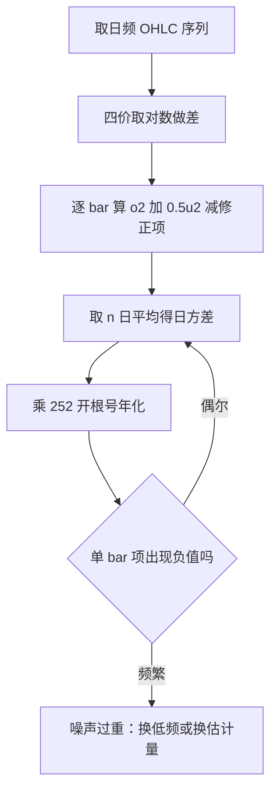
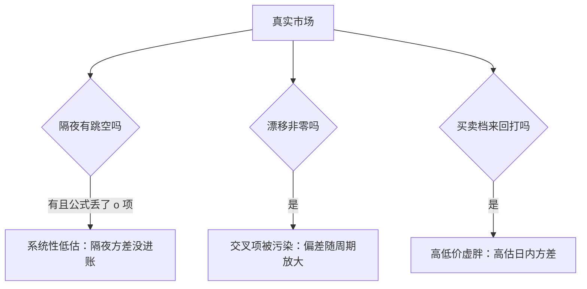

# Garman–Klass 估计量

同一根 K 线里的高与低，携带的信息约为收盘到收盘的七倍——前提是价格连续、无漂移、开盘无跳空；破一条，效率就换方向。

<footer>—— 据 Garman and Klass, Journal of Business, 1980</footer>

[上一课](/quant/ornstein-uhlenbeck)把价差动力学写成 OU，方程里的 $\sigma$ 通常拿收盘对收盘去估——一天只攒一个样本点。K 线的开、高、低、收四价每天都在那里闲着。Garman–Klass 把四价拧成一个估计量，理想条件下效率约为 close-to-close 的 7.4 倍；前提破一条，偏差就从另一头进来。本课写公式、写效率从哪来、写每条假设被违背时偏差往哪边走，不重讲极值分布的推导。

## 问题

已实现波动的原料是样本量：close-to-close 每个交易日贡献一个 $r_t^2$，一百天才有一百个自由度，年化估计的噪声大得难堪。盘中高低价把日内整条路径压缩成两个极值，信息密度高得多。但 1980 年的推导假定：几何布朗运动、漂移为零、路径连续、开盘无跳空。真实股票隔夜必然跳、漂移常年非零、微观噪声让高低价虚胖。本课写 GK 本体与失效方向；pre-averaging 与核估计族不展开，隐含那一侧归 [波动率曲面](/quant/vol-surface)。

术语翻译：估计量的「效率」是方差比的倒数——同一真值下估计量方差越小效率越高；效率 7.4 的意思是达到同样精度，close-to-close 要用约 7.4 倍的样本天数。OHLC 四价即开盘、最高、最低、收盘，一根 K 线的全部廉价信息。

## 方法

记 $o_i=\ln(O_i/C_{i-1})$、$u_i=\ln(H_i/L_i)$、$c_i=\ln(C_i/O_i)$，估计量为

$$\hat\sigma_{\mathrm{GK}}^2=\frac{1}{n}\sum_{i=1}^n\left[\,o_i^2+0.5\,u_i^2-(2\ln 2-1)\,c_i^2\,\right]$$

很多实现把 $o_i^2$ 一项静默丢掉——那等于宣布隔夜方差不存在。数字实例：一根日内高低比 2% 的 bar，$u=\ln 1.02\approx0.0198$；若开收几乎持平（$c\approx0$），该 bar 贡献 $0.5u^2\approx1.96\times10^{-4}$，对应日波动约 1.4%，年化约 $1.4\%\times\sqrt{252}\approx22\%$——一根 bar 就把量级立起来。

## 机制

效率来自极值统计：固定方差的 GBM 在单位时间内，对数极差的期望平方正比于 $\sigma^2$，比例系数是常数——这是 Parkinson 一族的根本。GK 用高低差捕捉「路径一天走了多远」，再用 $(2\ln2-1)\approx0.386$ 的负项扣掉开收段，避免与 $o^2$、$c^2$ 重复计数，所以效率高于纯极差的 Parkinson（约 5 倍）。极值对路径形状不挑食，但正因如此，任何把极值弄虚的东西都会直接进估计量。常见误区：把效率倍数当万灵药，任何数据上来就 GK。错在假设核对被跳过——隔夜方差占比可观的品种，丢掉 $o^2$ 项的 GK 系统性低估年化波动好几个百分点，此时「高效率」估的是一个错误的量。

## 边界

假设清单变对照表：涨跌停封板与集合竞价 bar 会把高低差压平，低估随之而来；噪声重时单 bar 项可为负，靠滚动平均兜住、频繁为负就该换估计量。OU 的带宽用哪个 $\sigma$ 估，直接影响上一课的入场线——测量口径是动力学的上游。直觉类比：把估计量当温度计——close-to-close 一天读一次刻度，GK 一天读日内两个极值加首尾；读数多的温度计更稳，但若水银柱被人捏着（封板、停牌），读得越多错得越一致。跳空与漂移两根刺本课只指出没拔掉，下一课的 Yang–Zhang 专门处理。

## 小结

- GK 合并 OHLC 四价，理想条件下效率约为 close-to-close 的 7.4 倍。
- 效率来自极值信息，$(2\ln2-1)$ 修正项负责去重。
- 三条假设逐条核：丢 $o^2$ 低估隔夜、漂移污染交叉项、噪声吹胖极值。
- 封板与停牌 bar 的极值不可信，测量口径是下游模型的上游。
- 出处：Garman and Klass, *Journal of Business*, 1980；Parkinson, *Journal of Business*, 1980；Rogers and Satchell, 1991 对照。
