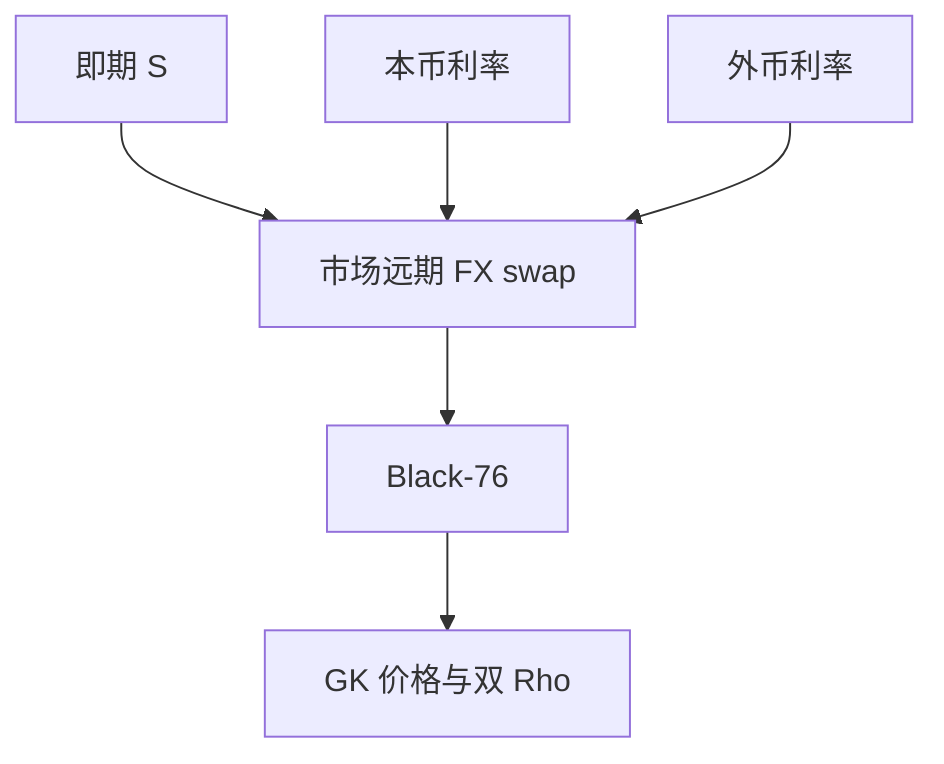

# Garman–Kohlhagen

外汇期权是支付外国货币利率「股息」的股权期权；国内利率是融资，国外利率是持有外币的收益。

<footer>—— Garman and Kohlhagen, Foreign Currency Option Values, Journal of International Money and Finance, 1983</footer>

[上一课](/quant/xva-bridge)结束希腊与模型风险课序。本课打开「股权之外」：FX 的 Black–Scholes 叫 Garman–Kohlhagen（GK）。缺口不是再推 [BSM](/quant/bsm)，而是把 $q$ 换成外国利率 $r_f$，并把即期、远期、Dom/For 惯例对齐。后课 ATM/RR/BF 在 GK 坐标上报价。

## 问题

即期 $S$ 是一单位外币的本币价格。持有外币赚 $r_f$，融资本币付 $r_d$。GK 看涨是 $e^{-r_d T}S$ 项里用 $r_f$ 做「股息」：$Se^{-r_f T}N(d_1)-Ke^{-r_d T}N(d_2)$。这与带连续股息的 BSM 同构。问题是市场交易的是**远期**与 pips，不是这个现货公式的字面输入：Black 公式用 $F=S e^{(r_d-r_f)T}$，波动是远期隐波。把股权股息曲线直接当 $r_f$，会漏掉 FX swap 点与基差。

第二问题是哪一侧是 call：USD call JPY put 与报价方向、$K$ 的单位绑在一起。惯例课已经警告；GK 实现必须先固定 $S$ 的定义。

### 利率平价先于期权

无套利远期由 FX swap 给出，不一定等于教科书 $S e^{(r_d-r_f)T}$（交叉货币基差）。定价应取市场远期，把 $r_d-r_f$ 当隐含，而不是从两个 SOFR/TONA 曲线硬算 $F$ 再标期权。基差对象在 [交叉货币基差](/quant/xccy-basis) 与后课交叉货币互换。

GK 仍是对数正态、常数 vol。微笑、触碰、障碍全部超出本公式；本课只钉无微笑的坐标系。

## 方法

输入：市场即期、市场远期或 FX swap、本外币贴现、到期日计数、是否 premium-adjusted。用 Black-76 对远期定价，输出 GK 希腊值时注意 Delta 是现货 Delta 还是远期 Delta。对冲：现货或远期 FX 对冲 Delta，利率台对冲 $r_d,r_f$ 的 Rho——FX 期权的 Rho 是两个方向。不要用股权指数期货去对冲 quanto 已在 quanto 课写过；普通 FX 期权对冲的是 $S$ 本身。

数字与障碍在 FX 里极常见，GK 闭式可当基准，生产用带微笑的模型。

## 机制

外币像连续支付 $r_f$ 的「股票」，本币是计价。Ito 与贴现后，风险中性漂移是 $r_d-r_f$。这就是利率平价在扩散里的样子。波动是 $S$ 的对数波动，不是「外币资产」另一次。GK 与 BSM 的同构让股权代码可复用，但市场数据适配器不能复用股权的股息估计算法。

## 边界

微笑使每个 Delta 一个 vol，GK 只解释 ATM 水平。负利率下外汇仍可用 lognormal（即期为正），与后课利率移位不同。NDF 货币没有可交割远期，用 NDF 定盘，见 [NDF](/quant/ndf)。周末日历与 Tokyo fixing 等使 $T$ 不是日历差除以 365。

## 小结

- GK 是带外国利率当股息的 BSM；生产用市场远期进 Black-76。
- Delta 惯例与 call/put 方向必须先固定。
- 双 Rho；基差使教科书利率平价不等于市场 $F$。
- 出处：Garman and Kohlhagen, *JIMF*, 1983。
