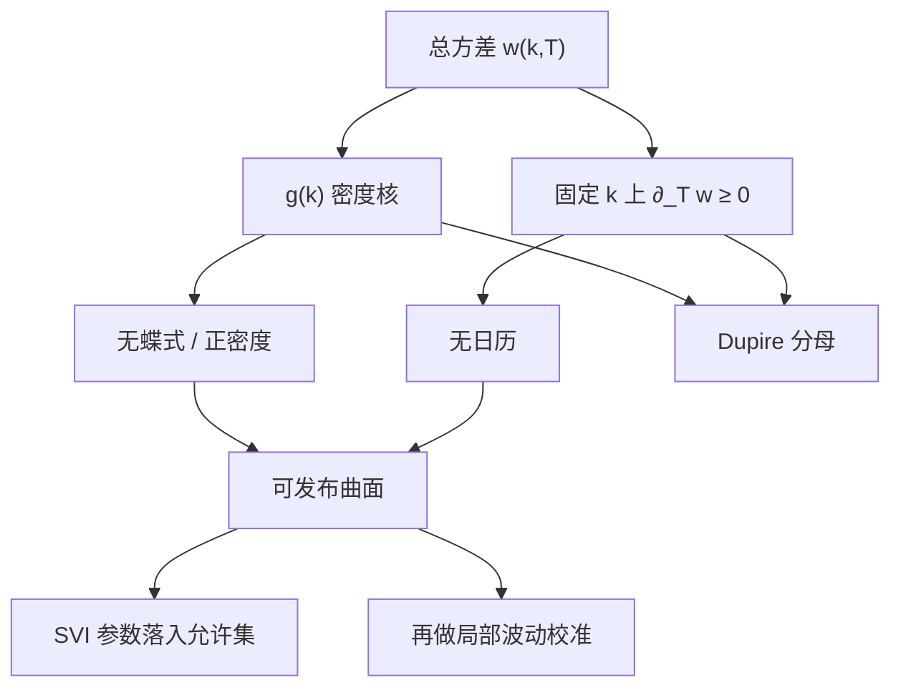

# Gatheral 无套利曲面

    
把隐含波动换成总方差 $w(k,T)=\sigma_{\mathrm{imp}}^2 T$ 之后，无蝶式套利成为 $w$ 的一个二阶微分不等式，无日历套利成为 $w$ 对期限的单调；参数化只要落在这个集合里，Black 坐标本身就不会在内部制造静态套利。

    <footer>—— Gatheral, The Volatility Surface, Wiley, 2006；充分条件见 Gatheral and Jacquier, Quantitative Finance, 2014</footer>

[上一课](/quant/rough-vol)用已实现对数波动的尺度律给出 $H\approx 0.1$，rBergomi 把指数核换成 $(T-t)^{H-1/2}$；Dupire 只管边际，不管这条粗糙路径。[隐含波动率曲面](/quant/vol-surface) 是坐标，[无套利插值](/quant/arb-free-iv) 是从离散报价造 $C(K,T)$ 的工程。缺口是中间这一层：在总方差坐标里，把静态无套利写成对 $w(k,T)$ 的明确不等式。本课写 Gatheral 的 $g(k)$ 与日历单调，不重推粗糙核。充分条件不是必要条件；SVI 五个字母的校准见 [SVI / SSVI](/quant/svi-ssvi)。

## 问题

固定远期 $F_T$，对数货币性 $k=\ln(K/F_T)$，总隐含方差 $w(k,T)\gt 0$。欧式看涨由 Black 公式 $C_{\mathrm{BS}}(k,w)$ 给出。静态无套利要求：作为 $K$ 的函数，$C$ 凸且落在无套利界内；作为 $T$ 的函数，经正确折现与远期对齐后不出现可锁定价差。直接对 $\sigma_{\mathrm{imp}}(K,T)$ 写这些条件会缠进 $T$ 与 $k$ 的耦合。Gatheral 的观察是：Black 公式对 $w$ 单调，日历约束在许多实务设定下接近「固定 $k$ 时 $w$ 对 $T$ 递增」；蝶式约束则等价于风险中性密度非负，而密度可以用 $w$ 的一、二阶导数闭式写出。

于是问题从「报价表有没有负蝶式」换成「我们所使用的函数族 $\{w(\cdot,T)\}$ 是否整条曲线都落在密度为正、日历单调的集合里」。后者才能解释为什么要对 SVI 的 $b(1+|\rho|)$ 设上限、为什么 SSVI 要限制 $\varphi(\theta)$：那些不是审美，是把 Lee 矩与 $g(k)\ge 0$ 翻译进参数空间。

### 密度核 $g(k)$：无蝶式的微分形式

对固定 $T$，记 $w=w(k)$，$w'=\partial_k w$，$w''=\partial_{kk}w$。Black–Scholes 密度与

$$
g(k)=\Biggl(1-\frac{k\,w'}{2w}\Biggr)^2-\frac{(w')^2}{4}\Biggl(\frac{1}{w}+\frac{1}{4}\Biggr)+\frac{w''}{2}
$$

同号。$g(k)\ge 0$ 对所有 $k$ 是切片无蝶式套利的（在光滑情形下的）充要条件。$g$ 的第一项来自 Delta 与货币性的倾斜，第二项来自偏斜的平方，第三项来自微笑的弯曲。翼部 $w(k)\sim \psi |k|$ 时，Lee（2004）要求 $\psi$ 不能超过矩公式给出的上界，否则 $g$ 在远处变负或矩爆炸。SVI 的线性翼把 $\psi$ 写成 $b(1\pm\rho)$，约束因此是对 $(b,\rho)$ 的，不是对「看起来光滑」。

$g(k)\ge 0$ 保证的是这一张切片作为欧式价格的凸性，不是明日微笑如何搬，也不是 Dupire 局部波动作为过程无套利。过程层还要 $\partial_T w$ 与 $g$ 一起给出非负的瞬时方差，见下节。

## 方法

**把市场点投到允许集。** 先把虚值欧式中间价反解成 $w(k_i,T_j)$。若某切片上离散蝶式已负，允许集是空的，应回到报价清洗，而不是找一组 SVI 参数去「平均掉」负密度。若离散蝶式非负，再在满足 $g\ge 0$ 与翼部斜率上限的函数类里拟合，残差留在价差内。

**日历：总方差递增是常用充分条件。** 对固定 $k$，若 $T\mapsto w(k,T)$ 递增，则在零利率、按远期货币性比较的设定下，日历价差不给出静态套利。有利率与分红时，应对齐的是未折现期望或适当测度下的看涨，不能把「$\sigma_{\mathrm{imp}}$ 期限倒挂」当成违例——短端 $\sigma$ 高、长端 $\sigma$ 低但 $w$ 仍递增，是常态。SSVI 的做法是先取递增的 ATM 总方差 $\theta_t=w(0,t)$，再让微笑宽度走一个 $\varphi(\theta)$，并对 $\varphi$ 施加 Gatheral–Jacquier 的不等式，使整张面的日历在该参数族内被管住。

**与 Dupire 公式的接口。** 在 $(k,T)$ 坐标下，局部方差形如

$$
\sigma_{\mathrm{loc}}^2(k,T)=\frac{\partial_T w}{g(k,T)}
$$

（零利率、对远期货币性的标准形式；有漂移时分子加对应项）。因此 Gatheral 的 $g$ 既是无蝶式条件，也是 Dupire 的分母。$g$ 触零或变负，局部波动爆炸或变负，校准管道在插值层就已经坏了。这解释了生产顺序：先保证 $w$ 落在 Gatheral 集合，再送进 [局部波动校准](/quant/dupire-calib)，而不是先差分价格再回头修。

### 充分条件、必要条件和参数族的缝

SSVI 给出的是一族函数上的充分条件：满足则无日历套利（在论文设定下）。市场完全可以无套利却不在 SSVI 里——例如各到期偏斜符号不同、或短端跳主导的形状。强行投影到 SSVI 会留下系统性残差，应记为模型风险，而不是「市场在套利」。反过来，逐到期独立 SVI 很容易 $g\ge 0$ 但 $\partial_T w\lt 0$，日历在参数层失守。Gatheral 的贡献是把这两种失守写成对 $w$ 的可检查条件，而不是写成「Heston 校准过了所以无套利」。

Roper、Tehranchi、Keller-Ressel 等人从数学上刻画「哪些 $\sigma_{\mathrm{imp}}$ 函数对应某个无套利边际族」。工程上不必每次引用存在性定理，但要清楚：满足 $g\ge 0$ 与日历单调，保证的是今日欧式表内部自洽，保证不了存在一个扩散实现——有跳时同一组边际仍然合法，Dupire 比值只是有效局部方差。

## 机制

Black 公式把一对 $(k,w)$ 映到价格。对 $k$ 求二阶导时，链式法则把 $w'$、$w''$ 织进 $g(k)$；指数项给出对数正态骨架， $g$ 是相对这条骨架的修正。若 $g$ 变负，修正把密度翻到负值，状态价格为负，静态套利存在。日历方向上，更长的到期对应把更多的二次变差装进 $w$；若 $w$ 下降，等于市场在卖一份「少波动的更长期权」，与持有更长时间的凸性矛盾（在扩散、无股息奇异的理想情形）。有跳、有离散分红时，严格陈述要改测度、改对齐方式，但总方差语言仍然比 $\sigma_{\mathrm{imp}}$ 语言更接近约束的几何。

做市中间价若自身不在 Gatheral 集合内，对手无需任何波动观点即可收取：蝶式与日历是模型无关的。这与 [波动率套利](/quant/vol-arb) 不同——后者赌实现方差对隐含方差，有方向、有风险溢价。把两件事都叫「套利」，会把风控优先级弄反：先修 $g$ 与日历，再谈是否卖方差。

### 翼部：Lee 矩如何进入 $g$

$k\to\pm\infty$ 时，若 $w(k)/|k|$ 的极限过大，$d_2$ 的尾部与 $g$ 不能同时维持可积的正密度。Lee 的矩公式给出极限与风险中性矩阶的对应；Gatheral 把它收成对 SVI 翼斜率的硬上限。切断翼部或改用饱和翼，是为了留在允许集，不是因为「远翼没人报就不重要」——[方差互换](/quant/variance-swap-vix) 的 $1/K^2$ 积分正是对翼部加权。允许集上的翼可以比流动性更远，但必须合法。

在 $\sigma_{\mathrm{imp}}$ 上做三次样条，再抽查 $g(k)$「大多为正」，不构成 Gatheral 意义下的无套利曲面。$g$ 应作为构造约束或每次发布的强制扫描；压力日的翼部最容易破，而那一天密度最值钱。

## 边界与工程取舍

不等式的推导假设 $w$ 足够可微。离散执行价上 $g$ 只能以差商代理，网格不规则时权重必须正确，否则把伪影报成违例。美式溢价、外汇 Delta 惯例、期货期权乘数，都会让「同一 $k$」对错对象；应先映到欧式价格再谈 $w$。买卖价差使允许集可能是一个区间：买价凸、卖价凸、中间不凸时，不存在穿过全部中间价的 Gatheral 曲面，应报告区间。

SSVI 的充分条件依赖于选定的 $\varphi$ 族；换一个 $\varphi$ 要重证，不能把 2014 年论文的常数套到任意参数化上。Heston 作为扩散，理论价格自动满足这些不等式；校准若在隐含波动残差上插值补点，补丁可以离开允许集——「模型无套利」不等于「发布曲面无套利」。Gatheral（2006）是系统整理与交易语言；定理性的 SSVI 条件以 2014 年论文为准。不要把 1973 年 Black–Scholes 当成曲面无套利的出处：常数 $\sigma$ 的世界里 $g$ 自动为正，正是因为没有曲面问题。

日历单调是充分条件，不是在任意利率—分红设定下的字面必要。扫描仍应在价格空间做可执行检验，见蝶式与日历篇；本篇的 $w$ 不等式是参数层与 Dupire 层的翻译。

把 SABR 单到期 Hagan 公式拼成曲面，通常既不检查 $g$，也不检查 $\partial_T w$。SABR 是标记语言；Gatheral 集合才是跨执行价、跨到期的合法域。

## 小结

- Gatheral 把静态无套利写成总方差 $w(k,T)$ 上的条件：切片上 $g(k)\ge 0$，期限上 $w$ 对 $T$ 单调（充分）。
- $g$ 同时是 Black 密度的符号因子与 Dupire 局部方差的分母；破 $g$ 则插值与局部波动一起坏。
- SSVI 给出参数族内无日历套利的充分条件，不是市场形状的全集。
- 允许集约束的是今日欧式表，不约束动态，也不替代可执行的蝶式—日历扫描。
- 翼部斜率受 Lee 矩限制，并进入方差条带的积分。
- 出处：Gatheral, *The Volatility Surface*, 2006；Gatheral and Jacquier, *Quantitative Finance*, 2014；Lee, *The Moment Formula*, 2004；对照 Breeden and Litzenberger, 1978。
