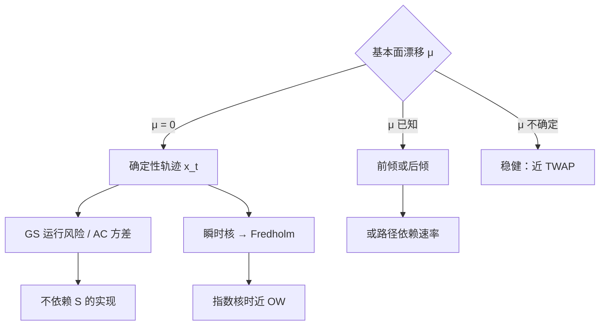

# Gatheral–Schied 无漂移

    
没有可预测的漂移时，把执行做成价格的函数往往并不降低期望成本，只是把风险从一条路径搬到另一条；无漂移基准给出确定性轨迹，并把 TWAP 写成对漂移不确定时的稳健解。

    <footer>—— Gatheral and Schied, Optimal Trade Execution under Geometric Brownian Motion in the Almgren and Chriss Framework, IJTAF, 2011；以及随后关于瞬时冲击与 Fredholm 方程的工作</footer>

Almgren–Chriss 在算术布朗、线性冲击下给出确定性的双曲正弦：最优速率不看价格路径，因为目标是实施成本的期望加方差，而无漂移时价格是鞅，自适应并不能在期望上占便宜。[Obizhaeva–Wang](/quant/obizhaeva-wang) 把状态换成未恢复深度，无漂移时同样是确定性控制。Gatheral 与 Schied 把这条「无漂移 ⇒ 确定性」的逻辑写到几何布朗与瞬时冲击核上，并给出另一类风险惩罚：不是成本方差，而是剩余库存按**当前价格**计值的运行风险。无漂移时最优仍不依赖 $S_t$ 的实现。漂移一旦出现——或你以为出现——自适应才会进入；漂移估计错了，自适应就是在噪声上加速。本篇写无漂移基准、GBM 下的闭式、瞬时冲击的积分方程，以及漂移不确定时 TWAP 的稳健性。它是执行理论，不是「看见价格动了就追」的许可证。

## 问题

执行目标通常含两项：冲击（临时、永久或传播核）与持有余量的风险。风险怎么写，决定你会不会根据 $S_t$ 改速率。AC 的 $\mathrm{Var}(C)$ 在算术布朗、无漂移下，最优 $x_t$ 预先确定。实务算法常改成：价格朝有利方向走就加快（锁定短fall），或朝不利方向走就加快（控制亏损）。这两种自适应都在赌漂移或赌均值回复。问题是：在没有可靠 $\mu$ 时，哪一条轨迹是基准，自适应相对于该基准到底改善了什么。

Gatheral–Schied（2011）把 AC 的价格换成几何布朗，并把风险写成剩余头寸市值的运行惩罚（时间平均的二次变差或等价的运行 VaR 风格项）。无漂移（$\mu=0$）时，他们得到闭式轨迹，且**不依赖当前价格水平**——你不会因为 $S$ 已经跌了 2% 就自动改变计划。这与「实施缺口按到达价计算、但执行中途按标记价加减仓」的直觉冲突，需要把目标函数写清楚才能判断谁对。

### 无漂移时自适应不能降低期望冲击

冲击若只是自身轨迹 $x$ 的泛函（对给定的核与线性结构），期望冲击在无漂移下对所有适应同一终端条件的策略，下界由确定性策略达到。随机地根据 $S$ 快慢，等于在某些世界上多付冲击、在另一些世界上少付，期望上搬不走下界，只改变成本的分布。若你真正关心的是分布的某一尾部，自适应可能有意义，但必须把尾部写进目标，而不是口头说「更灵活」。有漂移时，快交易能捕获 $\mu$，自适应或前倾才进入期望。

「无漂移」是对基本面价格 $F_t$ 或中点的假设，不是对成交价。你的冲击会让成交价有漂移。模型把这一截写成控制的后果，不把它当成可预测的 alpha。

## 方法

**GBM + 运行风险（2011）。** 基本面 $S$ 为几何布朗，$\mu=0$。临时冲击仍可取对速率线性（二次成本）。风险项惩罚 $\int_0^T x_t^2 S_t^2\,\mathrm{d}t$ 一类量：余量的美元波动，而不是股票数量的算术方差。欧拉–拉格朗日仍给出确定性 $x_t$，形状由冲击系数、波动与风险厌恶决定，常为双曲函数族，但曲率与 AC 算术情形不同——因为风险随 $S^2$ 走，而 $S$ 的水平进入系数的期望，无漂移时可以在 $t=0$ 就算死。关键工程含义：不要把「价格已经走了」当作更新 $\kappa$ 的理由，除非你把 $\mu$ 或波动的条件更新写进模型。

**瞬时线性冲击与 Fredholm 方程。** Gatheral、Schied 与 Slynko 把成交对价格的影响写成传播核 $G(t,s)$，剩余冲击是历史速率的积分。无套利要求核的形状受约束（Gatheral 2010）。最优确定性策略满足第二类 Fredholm 积分方程：未来核的影子价格与瞬时冲击的导数相抵。指数核时回到 OW 一类常微分方程；一般核需数值求解。无漂移、风险中性时，解常在端点出现块交易，与 OW 一致；核若允许价格操纵，方程会给出正反馈的循环交易——那是模型被拒绝，不是可执行的最优。

**漂移不确定时的稳健性。** 若 $\mu$ 属于一个不确定集，最坏情形控制往往把最优推向更平滑、更接近匀速的轨迹：你不愿在错误的方向上前倾。TWAP（墙上时钟或交易时钟上的匀速）因此不是「没有模型的懒惰」，而是对 $\mu$ 误设的稳健锚。AC 前倾默认你知道 $\sigma$ 与 $\lambda$ 且 $\mu=0$；一旦 $\mu$ 的符号都不确定，前倾的期望价值会被最坏漂移吃掉。

$$
x_t^{\mathrm{TWAP}}=X\bigl(1-t/T\bigr),\qquad
x_t^{\mathrm{GS}}=X\,\frac{f(\kappa(T-t))}{f(\kappa T)}.
$$

$f$ 在具体风险项下为 $\sinh$ 或与 GBM 系数相匹配的双曲组合。$\kappa\to 0$ 或风险厌恶 $\to 0$ 时回到匀速；无漂移是共用前提。

### 有漂移之后轨迹如何分叉

$\mu\neq 0$ 时，余量的期望损益含 $\mu\int x_t\,\mathrm{d}t$。卖出且 $\mu>0$（价格预期上涨）应更慢，以等待；$\mu<0$ 应更快。自适应策略还可以让 $v_t$ 依赖 $S_t$：这要求漂移或均值回复是条件于价格的。执行算法里的「到达价自适应」常常用一个 urgency 参数把短fall 的未实现部分当成 $\mu$ 的代理——价格走不利就当作负漂移而加速。无漂移基准提醒：那是在用噪声估计 $\mu$。应把自适应的价值放在样本外短fall 分布上检验，而不是用样本内「有利路径上跑赢了 TWAP」来证明。

## 机制

无漂移意味着剩余库存的公允值是鞅，持有它没有期望补偿，只有方差。冲击机制仍在：你交易仍移动价格，但移动来自供给与信息写入，不来自你能预测的 $F_t$ 趋势。确定性计划的机制是：在开盘（或到达时刻）把状态变量（时间、库存、若用 OW 则还有 $D$）映射到速率，盘中只按时钟与库存执行，除非波动或弹性的**条件估计**更新——那是参数更新，不是价格水平本身。

瞬时核的机制是过去交易的记忆：同样的 $v_t$，若不久前刚走过同向，价格更差。无漂移下你不会为了「把核交易回去」而反向交易——无套利条件禁止那种确定利润。Fredholm 方程的解若建议反向，应先怀疑核的估计，而不是下反向单。

### 为何运行风险不依赖当前 $S$ 来改计划

GBM 下 $S_t^2$ 的期望由 $t=0$ 的 $S_0$ 与 $\sigma$ 决定（$\mu=0$ 时 $\mathbb{E}[S_t^2]=S_0^2 e^{\sigma^2 t}$ 一类）。惩罚的期望因此是 $x$ 的确定性泛函。路径上 $S$ 走高，美元风险暂时变大，但对称地走低也会变小；无漂移下对 $x$ 做路径依赖并不能降低期望惩罚，除非风险度量是非期望的（例如路径上的最大回撤）。交易台若用美元 VaR 日内限额，已经不是 2011 年那条期望运行惩罚，自适应会重新出现——此时应显式改写目标，而不是口头说「还是 Gatheral–Schied」。

把「无漂移最优是确定性的」理解成「永远不要看价格」过了头。波动、弹性、成交量曲线、涨跌停都是可观测状态。禁止的是把随机漫步的增量当成 alpha 去加速。

## 边界与工程取舍

算术布朗与几何布朗在短期限、小波动上数值接近，闭式差别小于冲击校准误差。长期限、高 $\sigma$ 的减仓，GBM 运行风险会因 $S^2$ 的期望增长而更前倾。瞬时核的估计对母单重叠、同向拥挤极度敏感：你估到的 $G$ 可能含别人的交易。A 股竞价、T+1、价格笼子让连续轨迹不能原样下单，应先投影到允许的时间集合。

不要用有漂移的样本去证明无漂移公式「失败」，再换自适应——先做漂移的样本外检验。不要把 Fredholm 解的端点块直接送进开盘或收盘拍卖而不重估该时段的核。核对：确定性计划与同 $\kappa$ 的 TWAP、与带价格触发的自适应，在到达价短fall 的均值**与**分位数上的差别；并按有无隔夜信息分层。

$\mu=0$ 是相对执行地平 $T$ 而言。日频因子的预测力对五分钟执行可以当作零；对跨周减仓则不能把因子溢价从漂移里删掉。地平一变，无漂移基准是否成立就要重写。

## 小结

- 无漂移时，线性冲击与标准期望–风险目标下最优执行是确定性轨迹，自适应不降低期望冲击。
- Gatheral–Schied（2011）在 GBM 与剩余市值运行风险下给出闭式，计划不随当前 $S$ 改写。
- 瞬时线性核把最优写成 Fredholm 方程；指数核回到 OW 的块+连续结构。
- 漂移不确定时，匀速（TWAP）是稳健锚，AC 前倾默认 $\mu=0$ 且 $\sigma$ 已知。
- 把到达价算法的价格触发当成 $\mu$ 的代理，必须样本外检验分布，不能只报有利路径。
- 出处：Gatheral and Schied, *Optimal Trade Execution under Geometric Brownian Motion in the Almgren and Chriss Framework*, International Journal of Theoretical and Applied Finance, 2011；Gatheral, Schied and Slynko, *Transient Linear Price Impact and Fredholm Integral Equations*, Finance and Stochastics, 2012；Gatheral, *No-Dynamic-Arbitrage and Market Impact*, Quantitative Finance, 2010。
