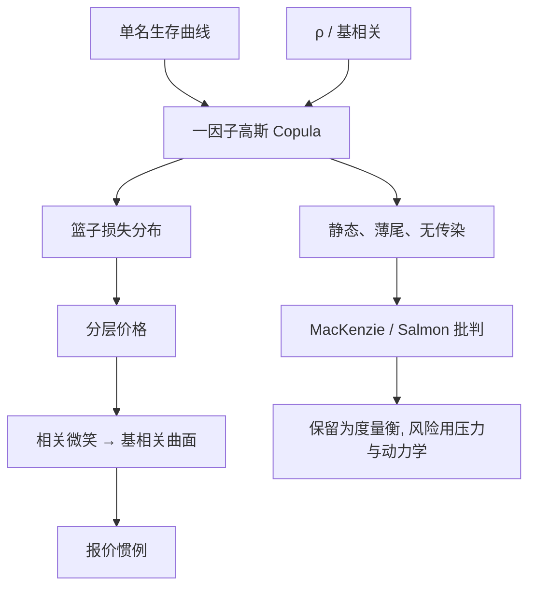

# 高斯 Copula 与批判

    
高斯 Copula 把一篮子违约相关收成一个相关参数，使 CDO 分层可以像用布莱克波动率报期权那样报价；它不是违约怎样在时间里传染的动力学，却曾被当成那种动力学。

    <footer>—— Li, On Default Correlation: A Copula Function Approach, Journal of Fixed Income, 2000；批判见 MacKenzie and Spears, 2014，以及 Salmon 对「杀死华尔街的公式」的叙述</footer>

David Li（2000）把 Copula 引进违约相关：各名字可以有自己的违约期限结构，联合违约用一个高斯 Copula 粘起来。一因子形式尤其适合 CDO：一个系统性因子驱动所有资产价值，条件独立的违约概率再积分出分层损失。市场随后用隐含相关、再改用基相关（base correlation）来报 iTraxx / CDX 分层，就像用隐含波动率报期权。2007–2008 年住房与公司 CDO 的崩塌，使这个工具被写成「杀死华尔街的公式」。MacKenzie 与 Spears（2014）从知识社会学说明：失败的是把报价惯例当成数据生成过程；Felix Salmon 的大众叙述把它简化成「高斯没有尾巴」。本篇写公式做什么、不做什么，以及批判之后分层市场还留下什么。

## 问题

单名 CDS 只给每个名字一条违约期限结构，见 [CDS 定价](/quant/cds-pricing)。一篮子的第 $k$ 笔违约、或损失率落在 $[a,b]$ 的分层，需要联合分布。相关违约的历史样本极少，不能靠共违约次数直接估一个稳定的相关矩阵。需要一种参数很少、能用单名曲线当输入、并能对分层标定的粘合剂。

高斯 Copula 的答案是：把每个名字的违约时点通过其边际变换成均匀变量，再当成多元正态的高斯相关结构。一因子 Vasicek / Li 形式为

$$
A_i=\sqrt{\rho}\,Z+\sqrt{1-\rho}\,\varepsilon_i,
$$

$A_i$ 低于由边际违约概率决定的阈值则违约。$\rho$ 是资产相关。给定 $\rho$，分层期望损失有半解析或快速半解析；反过来，给定分层市价可反解 $\rho$。问题在于：一个 $\rho$ 通常无法同时拟合所有分层，于是出现相关微笑；市场改报基相关——股权到某附着点的相关——把微笑参数化。这已经是惯例，不是「世界是高斯的」的证据。

### 相关微笑说明模型被当作度量衡

若真实世界是一因子高斯，所有分层应给出同一个 $\rho$。它们不。高分层往往需要更高的基相关才能达到市价，类似于期权的波动微笑。交易员用基相关曲面做插值与对冲，并不因此相信资产收益是正态、相关是常数。危机中的错误，是把标定过的 $\rho$ 外推到从未交易的住房 CDO、再打包成新的分层，并在压力里假设 $\rho$ 不变。

「公式杀死华尔街」容易理解成高斯尾巴太薄。更准确的机制是：静态 Copula 没有违约传染与反馈，标定用的是平静期的分层价格，杠杆结构把对 $\rho$ 的误差放大成本金损失。薄尾巴是其中一块，不是全部。

## 方法

定价引擎：输入单名生存曲线与回收，输入 $\rho$ 或基相关曲面，对系统性因子 $Z$ 积分，得到篮子损失分布，再切出分层的期望损失并贴现。对冲：对单名曲线的 CS01（delta）、对 $\rho$ 的相关 vega，以及时间衰减。基相关必须声明附着点、指数系列与回收；不同券商的插值（到期、附着点）会使「同一」曲面不可比。

批判之后的替代并没有消灭 Copula：随机相关、局部相关、Marshall–Olkin 的共同跳跃、强度传染（Copula 之外的动力学）都被用过。它们更会讲故事，标定更不稳。对冲基金与经销商在能交易的指数分层上，至今仍可能用基相关当报价语言，就像利率上仍用布莱克报 swaption。需要动力学时，应换对象：违约强度过程、信用与住房的宏观因子，而不是给静态 Copula 加一个随时间变的 $\rho_t$ 就宣称有了传染。

### 从单因子到「看起来很分散」的错觉

高斯 Copula 在中等 $\rho$ 下，常态里违约显得分散：条件于 $Z$ 不极端，各 $\varepsilon_i$ 很少一起违约。极端 $Z$ 一旦出现，许多名字同时越过阈值。VaR 若取在不够靠后的分位，会把这种结构报成分散化良好；[Expected Shortfall](/quant/expected-shortfall) 或压力 $Z$ 才会收费。CDO 股权层卖出的正是这笔极端 $Z$ 的保险。用正态边际加高斯 Copula 去跑「99% 不会亏」的历史，是在用错误的分位描述真正卖出的风险。

## 机制

Copula 分离边际与相关：单名升水可以每天标定，相关单独由分层或历史资产相关填入。这种分离在工程上极有吸引力，也是 MacKenzie 所说「公式能在组织里旅行」的原因——信用分析员负责曲线，结构化负责 $\rho$。经济上违约相关来自共同资产价值、共同融资、共同评级行动与法律传染，并不保证能被一个常数 $\rho$ 抓住。高斯结构的尾依赖相对弱（渐进独立），极端共违约的概率比 t-Copula 或共同跳跃更瘦。住房按揭池的系统性因子（房价、失业）在全国下跌时接近 $\rho\to 1$，平静期标定的 $\rho$ 没有包含这种体制切换。

Salmon 与随后的大众批判抓住了「用股价相关去代理违约相关」和「高斯」。学术批判还指出：Copula 是对违约时点向量的静态分布，不是滤过的强度过程；它很难与套利自由的动态期限结构一致（ Schönbucher 等人讨论过动态 Copula 的困难）。把 CDO 当「违约相关性产品」没有错；错的是用一个静态、薄尾、可外推的 $\rho$ 去制造高等级。

基相关不是资产相关的估计量。它是把分层价格倒进错误模型里的一个坐标，正如隐含波动率不是真实波动的无偏估计。用基相关去做经济研究里的「市场隐含相关」，必须当作报价，而不是 $\mathrm{Corr}(A_i,A_j)$。

### 批判之后仍要报价

完全抛弃高斯 Copula，分层市场会失去一种共同语言。保留它作为度量衡，同时用压力、历史情景与宏观因子做风险管理，是更诚实的分工。对未交易的 bespoke 篮子，用指数基相关映射（correlation mapping）是 2000 年代的标准，也是损失放大的管道：映射假设了可比较的风险因子。今天若还做类似映射，应把映射误差当成一等风险，而不是操作细节。

## 边界与工程取舍

不要用单一 $\rho$ 给所有分层与所有到期定价。不要把股价历史相关直接塞进违约 Copula 当 $\rho$，再对投委会说这是「市场数据」。不要在回收、构成、摊还与提前还款尚未对齐时比较两个 CDO 的基相关。住房与公司信用的系统性因子不同，CDX 的相关曲面不能无调整地拿到 ABS。

监管与内部模型若仍对证券化用因子公式（如渐近单因子），应明白那是监管资本的 Vasicek 公式，与交易台的基相关不是同一校准。审计要问：哪些分层是可观测的市价，哪些是模型外推。MacKenzie 与 Spears 的要点对工程仍然有效——工具的组织用途会超过它的数学假设，必须在文档里写清「这是报价转换还是损失生成」。

t-Copula 加厚尾依赖，并不能修复静态结构：它仍然没有「A 违约导致 B 的强度跳升」的传染。需要传染时，应显式建模强度跳跃或共同信用事件，而不是只把 $\nu$ 调小。

## 小结

- Li（2000）的高斯 Copula 使单名曲线与一个相关参数能给 CDO 分层定价；一因子形式是市场标准。
- 相关微笑迫使市场改报基相关；它是报价坐标，不是资产相关的估计。
- 批判的核心是把静态薄尾惯例外推成损失生成过程，并在杠杆结构上放大；不只是「正态没有尾巴」。
- 指数未分层产品对相关不敏感，分层才是相关的主市场，见 [指数 vs 单名](/quant/cdx-vs-single)。
- 出处：Li, *Journal of Fixed Income*, 2000；MacKenzie and Spears, *Social Studies of Science*, 2014；Salmon, *Wired*, 2009；动态与套利问题见 Schönbucher 等对 Copula 信用模型的讨论。
