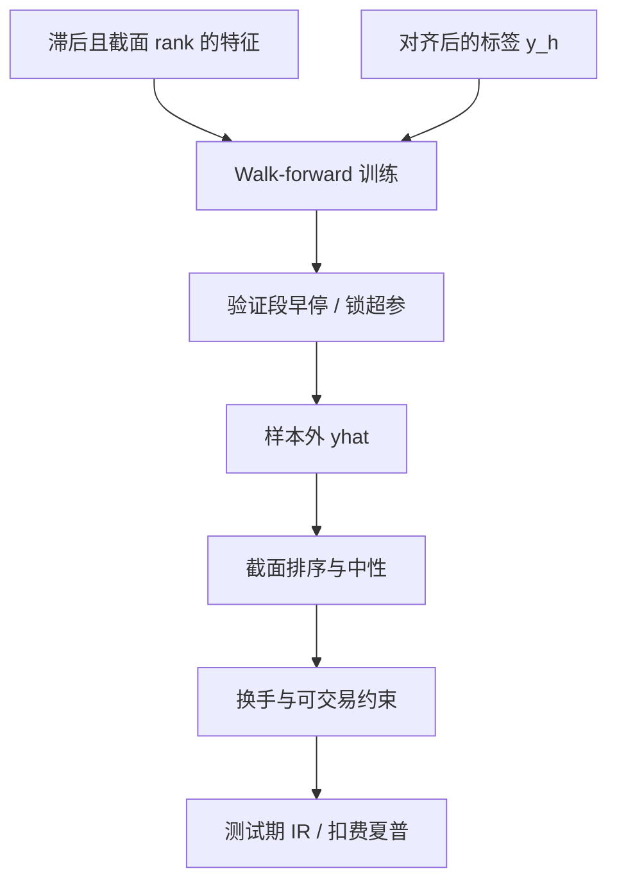

# 树模型：GBDT

截面收益的可预测性可以用一套机器学习工具重新估计；其中树与神经网络在样本外改进线性模型，但经济约束与交易成本会把很大一部分增益收走。

<footer>—— Gu, Kelly and Xiu, Empirical Asset Pricing via Machine Learning, Review of Financial Studies, 2020</footer>

梯度提升树（GBDT）把弱分类回归树加成一个加法模型，用梯度去拟合残差。Friedman（2001）给出梯度提升的统计框架；Chen 与 Guestrin（2016）的 XGBoost、Ke 等（2017）的 LightGBM 使它成为表格数据的默认强基线。Gu、Kelly 与 Xiu（2020）在美国截面上系统比较 OLS、正则线性、随机森林、GBRT 与神经网络，发现非线性方法提高样本外 $R^2$，并强调树能捕捉交互。Leippold、Wang 与 Zhou（2022）在 A 股得到类似的机器学习可预测性图像。Israel、Kelly 与 Moskowitz（2020）问机器能否「学会金融」；Arnott、Harvey、Kalesnik 与 Linnainmaa 以及 Avramov、Cheng 与 Metzker（2023）加上经济约束与可交易性后，增益显著下降。本篇把 GBDT 当作**截面表格的非线性估计器**：它与[滞后和 rank](/quant/cs-rank-features)、[标签重叠](/quant/label-horizon-overlap)绑定，而不是当作自动挖 alpha 的引擎。

## 问题

线性模型假设特征对收益的效应是加性、全局斜率。价值在极便宜端更强、动量与波动交互、规模改变斜率，这些是树自然能切的分区。问题是金融截面的信噪比低、特征共线、标签重叠、以及结构变化。GBDT 的训练损失可以压得很低，样本外 $R^2$ 仍只有几个百分点甚至为负——这在 Gu–Kelly–Xiu 的表里是常态，不是事故。过拟合表现为：深度过大把单只股票的特异路径记下来、时间泄漏把重叠标签两边都放进训练、以及用随机 K 折选超参。Harvey–Liu–Zhu 的多重检验在这里变成「试了一百组 `max_depth` 与 `learning_rate`」。

树对单调变换不敏感，但仍对缺失编码、宇宙变化与极端值敏感。若不做截面 rank，分裂会优先切成交额、价格这种厚尾列，模型变成隐性的小盘过滤器。若做了 rank 却在全样本上算分位，仍有前视。GBDT 不免除特征纪律，它放大特征纪律的后果。

### 提升、随机森林与单棵树

单棵浅树是分区回归，方差小、偏差大。随机森林平均多棵去相关的树，降低方差，Gu–Kelly–Xiu 中森林已强于 OLS。GBDT 顺序拟合残差，同一深度下更易逼近复杂函数，也更易把噪声残差当信号。学习率（shrinkage）与子采样是 Friedman 以来的正则：每棵树只走一小步，并在列或行上随机。XGBoost 的正则项对叶权重做惩罚，LightGBM 的 leaf-wise 生长在金融这种噪声里可以长出很深的不对称树，必须用 `min_data_in_leaf` 与早停锁住。没有早停的 GBDT 几乎总会过拟合。

特征重要性（gain、split count）在共线族上不稳定：价值的十个近亲会把增益拆散或集中到随机一列。应报告置换重要性或 SHAP 的分组值，并检查不同年份的稳定性，而不是把某一列的 gain 写成经济学发现。

## 方法

**设计矩阵。** 行为可交易日与股票，列为滞后且截面变换后的特征，标签为未来 $h$ 期收益或残差，见前两篇。训练只使用 $\mathcal{F}_t$ 可知的行。缺失保持缺失，让实现把缺失当独立路由，或显式加缺失指示——二者选一并固定。

**时间切分。** Walk-forward：例如用过去 $L$ 年训练，随后一年验证做早停，再随后一年测试，滚动。验证与测试之间 purge 重叠标签。超参只在验证上选一次网格（深度、叶最小样本、学习率、树数上限），禁止看测试再回头。这是把 Gu–Kelly–Xiu 的样本外精神落到工程上。

**组合层。** 模型输出 $\hat y_{i,t}$ 后，在 $t$ 做截面 rank 或分位组合，价值加权，控制行业与规模，报告扣费后多空。Avramov–Cheng–Metzker 显示：加上换手惩罚、排除难交易股票后，ML 的优势缩小。应把这一约束放进验证目标，而不是只在测试末尾「顺便」扣一次费用。Bryzgalova、Pelger 与 Zhu 讨论树与资产定价结构的联系：若关心的是定价核而不是交易，评估应包括对因子模型残差的解释，而不是只看多空夏普。

### 损失与不平衡

平方损失被极端收益主导，可用 Huber 或对标签做波动标准化。分类（涨跌）在类别不平衡与重叠下会报出虚假准确率，且与 P&amp;L 不对齐；若用分类，阈值必须在训练窗内生成。分位回归（预测下侧）对风控更有意义，但对 alpha 排序未必更好。Gu–Kelly–Xiu 的主结果是收益预测的 $R^2$，组合评估是另一步；不要用训练 $R^2$ 代替[信息比率](/quant/ic-ir-timing)。

早停要用验证段的**截面**损失或 rank IC，不要用逐点 MSE 的绝对水平：市场波动高的年份 MSE 都会变大，早停会误判。IC 或 Spearman 更接近排序交易的目标。

## 机制

GBDT 的第 $m$ 棵树拟合损失对当前预测的负梯度。平方损失下就是拟合残差。金融残差含一个巨大的不可预测成分，提升在后期专攻这个成分，样本内 $R^2$ 上升、样本外下降——这就是必须早停的机制。子采样使每棵树看不到全部噪声模式，类似收缩。列采样减少对某一共线特征的依赖，但会让重要性更随机。

交互：树用一次分裂序列逼近 $x_1\times x_2$ 型效应，这是相对线性模型的主要经济借口（例如高波动时动量失效）。检验交互是否真实，应看分样本 IC 是否与分裂给出的分区一致，并在测试年保持，而不是只看 SHAP 交互图的漂亮。Regime 切换时，旧分区失效，必须靠滚动训练更新；全样本训练一张「永恒的树」与金融非平稳不相容，见体制风险类讨论。

与正则线性的分工：线性模型在低信噪、近线性的特征（beta、规模）上更稳；GBDT 把预算留给真正的弯曲与交互。把两者做成残差学习（先线性，再对残差提升）往往比单用深度树更可审计，也更接近 Friedman 的梯度提升本意——在一个可解释的均值上修非线性。

### 中国市场与约束

Leippold–Wang–Zhou（2022）表明 A 股上 ML 可预测性存在，但涨跌停、T+1、散户占比与会计质量改变特征含义。验证目标必须含不可交易日：预测涨停打开前无法买入的标签，应在损失里视为不可实现，否则树会去学「涨停余波」。借券与融券限制使空头腿与美股论文不可比，多空夏普要拆开报告。

## 边界与工程取舍

不要用随机森林/GBDT 的默认参数在全样本拟合一次然后报告夏普。不要把测试期的早停当合法（那是用测试做训练）。不要把新闻、卫星、卡、货运几十列无纪律地堆进同一棵树：共线与体制共动让 importance 变成供应商排行榜，增量 $R^2$ 应逐族加入。计算上，日频全宇宙 millon 级行需要按年分块与列抽样，但这是工程，不能成为减少 purge 的理由。

可解释性：给投资过程的应是分位组合与分样本 IC，而不是 400 棵树的图。监管与风控要的是暴露，GBDT 输出必须再映射回可加的因子与残差，否则[闸门](/quant/trading-kill-switch)无法对「模型觉得该空」设限。

Gu–Kelly–Xiu 没有声称 GBDT 击败了成本与拥挤。把他们的样本外 $R^2$ 翻译成实盘杠杆，是把论文里的统计对象当成了 Kelly 公式里的 $\mu$。

## 小结

- Friedman（2001）的梯度提升与 XGBoost / LightGBM 实现，使 GBDT 成为表格截面的标准非线性基线；正则与早停是必需品，不是可选项。
- Gu–Kelly–Xiu（2020）表明树与网络在样本外改进线性模型；Avramov–Cheng–Metzker（2023）与成本、经济约束表明可交易增益更小。
- 时间切分、purge、截面验证指标、按列滞后与 rank，比树的深度更决定是否泄漏。
- 重要性不等于经济学；交互必须在测试年的分样本 IC 上复核。A 股须把涨跌停与 T+1 写进损失（Leippold–Wang–Zhou, 2022）。
- 出处：Friedman, *Annals of Statistics*, 2001；Chen and Guestrin, *KDD*, 2016；Ke et al., *NeurIPS*, 2017；Gu, Kelly and Xiu, *RFS*, 2020；Leippold, Wang and Zhou, *JFE*, 2022；Israel, Kelly and Moskowitz, *Journal of Investment Management*, 2020；Avramov, Cheng and Metzker, *Management Science*, 2023。
