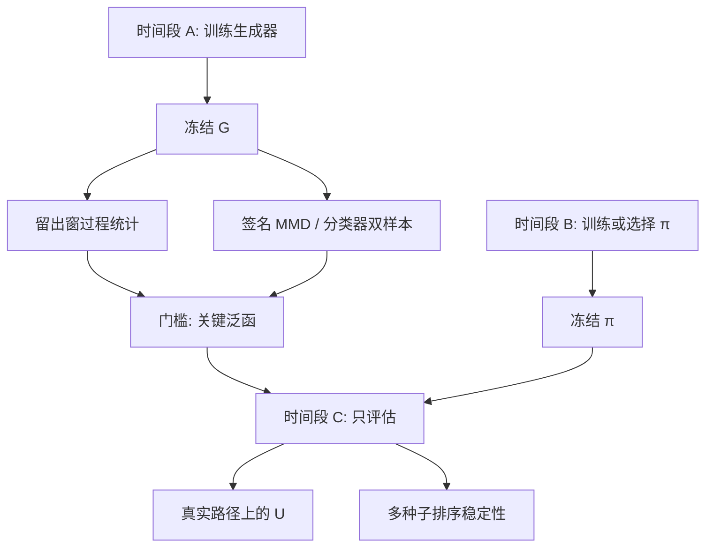

# 生成式回测的评估

    
生成器损失下降，只说明它在自己的特征空间里更接近训练窗；策略在合成路径上的夏普，若不经过过程级检验与样本外协议，量的是生成器的伪影，不是可交易的边。

    <footer>—— 生成式市场模型的下游评价；对照 Bailey et al. 对回测过拟合、Lopez de Prado 的 CPCV</footer>

有了 [VAE 市场生成器](/quant/market-generator-vae)、[Sig-WGAN](/quant/sig-wasserstein-gan) 或 [Neural SDE](/quant/neural-sde)，最容易犯的错是：在合成数据上调策略，再把同一生成器上的绩效写成研究报告。[回测过拟合](/quant/backtest-overfitting) 在历史一条路径上已经足够严重；生成器把「一条路径」变成「无穷条看起来像的路径」，过拟合从记住日期，升级为记住生成器的癖好——假周期、假流动性、假的可预测残差。本篇写评估必须分成三层：过程统计、双样本检验、下游决策稳定性，以及训练生成器与训练策略的样本如何切开；不重复 CPCV 的折法细节，见 [CPCV](/quant/cpcv)，也不把某个 MMD 数值当通行证。

## 问题

记真实样本路径为 $X$，生成器为 $\widehat{\mathbb{P}}_\theta$，策略为 $\pi$。经典回测估计的是 $\pi$ 在经验测度下的泛函 $U(\pi,X)$。生成式回测估计的是 $\mathbb{E}_{\widehat{\mathbb{P}}_\theta}[U(\pi,\widehat{X})]$。两个对象只有在 $\widehat{\mathbb{P}}_\theta$ 弱收敛到真实路径测度、且 $U$ 对该收敛连续时才接近。生成器训练损失——ELBO、WGAN、签名 MMD——对应的是某种积分概率度量下的接近，通常**不是** $U$ 连续所需的那种拓扑。对冲误差、换手、尾部亏损，对网格、跳跃和价差伪影极度敏感，而这些往往是生成器最先学不像、或最先学过头的部分。

因此「损失小 ⇒ 回测可信」不成立。需要的是：显式列出 $U$ 依赖的路径泛函；检验这些泛函在真假样本上的分布；再检验 $\pi$ 的排名是否随生成器种子、超参和训练窗移动。缺任何一层，生成式回测只是一种新的样本内优化。

### 伪影可被策略当成 alpha

生成器常引入三类可被利用的结构。一是**时钟正则**：固定长度窗口、平滑的日内形状，执行算法会找到并不存在的稳定成交量曲线。二是**过弱的噪声**：VAE 重建偏糊，短滞后自相关偏高，均值回复策略虚高。三是**过强的对抗锐度**：GAN 模式崩塌到几种典型日，趋势策略在典型日上稳定盈利，在未覆盖的危机日上失效。这些都不是市场边缘，是模型边缘。评估必须包含「故意用简单策略去攻击生成器」：若滞后一阶自相关策略在合成数据上显著、在真实样本外不显著，生成器不合格，而不是策略合格。

把生成路径与历史路径拼成更长的回测，会在拼接处制造虚假的状态跳变。生成式回测应在生成器自己的轨迹上做完整 episode，或在条件生成下从真实前缀续写，并单独报告续写段的统计，而不是无缝粘贴。

## 方法

**过程级清单。** 至少覆盖：收益边际（峰度、分位数）、平方收益 ACF、杠杆相关 $\mathrm{Corr}(r_t,r_{t+1}^2)$、已实现波动的尺度、隔夜/日内方差比、最长回撤分布。期权生成器还要切片凸性与日历单调。订单流生成器要间隔、取消成交比、队列消耗。清单应事前写死，禁止生成器训练后再删「没对齐」的条目。对齐不是每个矩都 t 检验不显著——多重检验会自我安慰——而是预先规定的关键泛函的效应量低于阈值。

**特征空间双样本。** 在截断签名上做 MMD 或能量距离，与 [Sig-WGAN](/quant/sig-wasserstein-gan) 的训练目标可以同类，但必须在**留出窗**上算，不能用训练同一批路径的经验签名。还可以用分类器双样本：训练一个与生成器架构不同的判别器，看它在留出真假上是否仍显著可分。可分并不自动判死刑——总有高阶细节可分——但若简单线性分类器即可分，生成器连低阶矩都没对齐。

**样本切开。** 时间切成三段：A 训练生成器，B 训练或选择策略，C 只评估。生成器不得见 B+C 的未来；策略不得在 C 上调参。若生成器是条件模型，条件变量在 B、C 必须严格因果。交叉验证应用组合净化，见 CPCV，且每一折都要重训生成器，而不是只重训策略、生成器用全样本——后者把未来的制度编码进了情景。

### 下游：对冲与排序稳定性

对 [Deep Hedging](/quant/deep-hedging-buehler)，报告的不是合成数据上的效用均值，而是：在真实留出路径上，用生成器训练的对冲，对比用参数模型训练的对冲，残差分布如何。若只有合成数据上的效用，对冲网络可能在利用伪影。对交易策略，报告策略在多颗生成器种子上的排序 Kendall $\tau$：种子一换排名就翻，说明边来自生成器噪声。容量与冲击模型应独立于价格生成器；用同一网络既生成价格又生成可成交量，策略会学会「自己的量不影响价」，评估无效。

## 机制

积分概率度量 $d_{\mathcal{F}}(\mathbb{P},\widehat{\mathbb{P}})=\sup_{f\in\mathcal{F}}|\mathbb{E}f-\widehat{\mathbb{E}}f|$ 由函数类 $\mathcal{F}$ 决定。签名 MMD 对应的 $\mathcal{F}$ 是签名坐标的球；WGAN 判别器对应另一类 Lipschitz 函数；策略效用 $U(\pi,\cdot)$ 往往不在这些类里，尤其当 $\pi$ 本身是在 $\widehat{\mathbb{P}}$ 上优化出来的——此时 $U$ 会主动走向生成器最容易被利用的方向，等于把 $\mathcal{F}$ 换成了对抗性的策略类。这是生成式回测比普通回测更危险的结构原因：评价泛函被训练成了攻击生成器的函数。

缓解不是禁止在合成数据上训练，而是把「攻击成功」当成诊断。保留一组**探针策略**（滞后符号、波动目标、固定 delta），它们的真假绩效差是生成器偏差的坐标。探针在合成数据上赚、在真实留出上不赚，生成器有可交易伪影；探针两边都接近零，只说明这组探针弱，还要看对冲残差与尾部。

### 续写、条件与泄漏

条件生成「给定过去 60 日，抽未来 20 日」看起来像无泄漏的回测单元。泄漏有三条暗道：条件统计用了整段窗口的归一化常数；生成器训练时用了未来窗的对抗批次；评估时用了未来才知道的制度标签当 $c$。任何全局标准化（全样本均值方差、全样本 PCA）都会把 C 段信息渗进 A。正确做法是标准化器只在 A 上拟合，冻结后用于 B、C 与生成。制度标签若来自事后聚类，不能当条件。

报告「合成夏普 2.1、历史夏普 0.4」却不报告探针策略与双样本，等于承认生成器比市场好预测。更常见的真相是生成器比市场好被拟合。

## 边界与工程取舍

过程统计通过不能推出期权、执行、多资产同时可用。每个下游状态变量都要进清单。生成器更新后，旧策略的合成绩效作废，必须重跑 C 段真实评估；把生成器当持续学习的数据源，会把非平稳的模型漂移写成 alpha 衰减。监管或投资委员会若要看生成式压力，应提交：时间切开图、关键泛函表、探针策略表、多种子排序，而不是一张合成净值曲线。

计算上，重训生成器的 CPCV 很贵。可以先用廉价生成器做折内筛选，再用冻结的昂贵生成器只在外层评估；但筛选阈值必须在协议里固定，不能看完 C 再改。不要用 LLM 多智能体路径冒充已校准的 $\widehat{\mathbb{P}}$ 去算夏普，见 [LLM 仿真](/quant/llm-multiagent-market-sim)：那一层没有弱收敛承诺。

签名训练损失与签名评估 MMD 若用同一阶数、同一批归一化、同一训练窗，评估没有独立信息。评估签名至少换窗；更好是换阶或加原空间分位数。

Bailey 的过拟合概率、deflated Sharpe 针对的是在**同一条**历史上搜索策略。生成器把搜索空间换成路径测度上的期望，公式不能原样套用，但精神不变：试验次数、选择偏差、样本外衰减仍要记账。

## 小结

- 生成器损失与策略效用一般不对齐；评估要过程统计、留出双样本、真实路径上的下游 $U$ 三层。
- 时间上切开训练生成器、训练策略与最终评估；生成器不得用全样本再给策略供数。
- 探针策略用来检测可交易伪影；多种子排序检测边是否来自生成器噪声。
- 条件生成的标准化与标签必须因果；禁止把真假路径无记录拼接。
- LLM 仿真与未锚定微观结构的智能体路径，不能当作已校准测度去做夏普。
- 出处：生成距离见 Chevyrev–Lyons 期望签名与 Sig-WGAN；回测选择偏差见 Bailey et al.；样本切开见 Lopez de Prado, CPCV。
