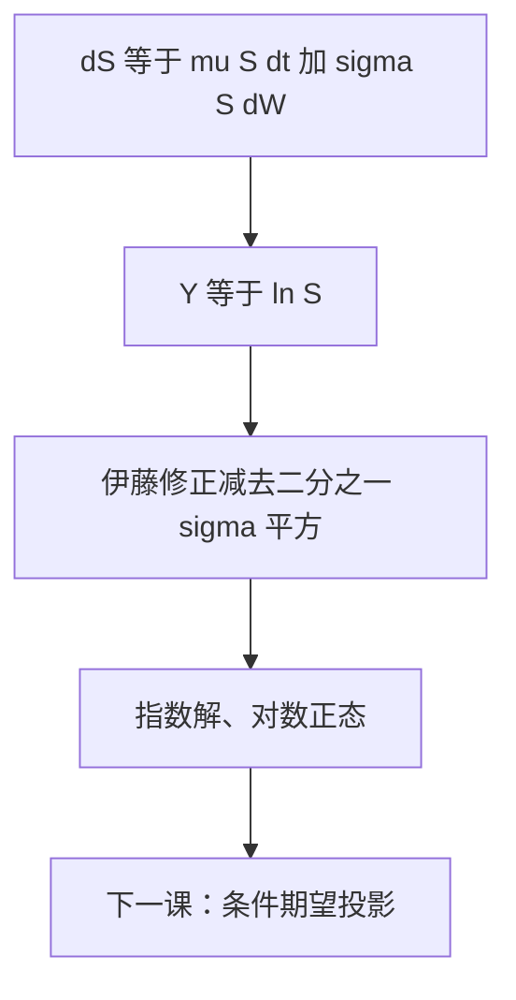

# 几何布朗运动

股价取几何布朗运动：$\mathrm d S_t=\mu S_t\,\mathrm d t+\sigma S_t\,\mathrm d W_t$，解是对数正态，正性由指数自动保证。

<footer>—— 据 Black and Scholes, J. Political Economy, 1973；Merton, Bell Journal of Economics, 1973；Shreve, Stochastic Calculus for Finance II, 第 5 章整理</footer>

上一课[随机微分方程的含义](/quant/sde-meaning)把 SDE 读成积分方程。缺口是金融主干上最常用的那一条：价格要正、冲击按比例、还要能显式解出。算术布朗运动可取负，Bachelier 的模型在这里不够。本课只解 GBM，并把 $\tfrac12\sigma^2$ 修正钉死；期权公式、风险中性替换 $\mu\mapsto r$ 都还没出场。

## 问题

价格水平 $S$ 若走 $\mathrm d S=\mu\,\mathrm d t+\sigma\,\mathrm d W$，下一时刻可以穿过零。收益率按比例冲击更自然：同样大小的 $\mathrm d W$，高价股票对应更大的绝对变动。缺口是写出线性乘性系数的 SDE，并用[伊藤引理](/quant/ito-lemma)解出来，而不是把「对数正态」当成分布假设另起炉灶。

显式解还要回答：$\mathbb E[S_t]$ 的增长率是 $\mu$ 还是 $\mu-\tfrac12\sigma^2$。两者都对，对象不同——一个是 $S$，一个是 $\ln S$。后课换测度、写 Black 公式，会反复踩这块。

### $\tfrac12\sigma^2$ 不是风险溢价

对数坐标里的漂移 $\mu-\tfrac12\sigma^2$ 来自 $\ln$ 的二阶导，是 Itô 修正，不是投资者要求的超额回报。风险溢价是 $\mu-r$，要等[风险中性测度](/quant/risk-neutral-measure)才出现。把两者说成同一件事，会在贴现期望时把凸性调整和测度变换搅在一起。

Samuelson 1965 建议用 GBM 替代算术布朗，目的就是正性。Black–Scholes 与 Merton 1973 把它写成定价引擎的原生动力学。

## 方法

GBM：$\mathrm d S_t=\mu S_t\,\mathrm d t+\sigma S_t\,\mathrm d W_t$，$S_0\gt 0$，$\sigma$ 常数。令 $Y=\ln S$，Itô 给出

$$
\mathrm d Y_t=\bigl(\mu-\tfrac12\sigma^2\bigr)\mathrm d t+\sigma\,\mathrm d W_t,
$$

故

$$
S_t=S_0\exp\bigl((\mu-\tfrac12\sigma^2)t+\sigma W_t\bigr).
$$

$S_t$ 对数正态：$\ln S_t\sim\mathcal N(\ln S_0+(\mu-\tfrac12\sigma^2)t,\sigma^2 t)$。均值 $\mathbb E[S_t]=S_0 e^{\mu t}$。二次变差 $[S]_t=\int_0^t\sigma^2 S_s^2\,\mathrm d s$。这是强解，轨道唯一。多维时把 $W$ 换成相关布朗、把 $\sigma$ 换成矩阵，形式相同。

## 机制

乘性扩散让相对冲击平稳：$\mathrm d S/S$ 的系数不依赖 $S$ 的水平。这是后课 Black 公式用远期、用 $\ln(S/K)$ 的几何来源。指数映射把 $\mathbb R$ 上的算术布朗送进 $(0,\infty)$，零是自然边界、达不到（$\sigma$ 有限时）。$\mu$ 只出现在漂移，不出现在 $[S]$——波动率输入是 $\sigma$，不是 $\mu$。真实测度下 $\mu$ 进入期望增长率；定价改测度后它会被取消，本课先把动力学本身写对。

离散实现：$S_{t+\Delta}=S_t\exp((\mu-\tfrac12\sigma^2)\Delta+\sigma\sqrt{\Delta}Z)$，$Z\sim N(0,1)$。这是精确转移，不是 Euler 近似。后课蒙特卡洛对 GBM 应走这条，避免 Euler 把正性破坏。

## 边界

本课不推导期权价格，不谈波动率微笑，不把 $\sigma$ 写成随机过程。常数 $\sigma$ 是强假设，[波动率是输入不是输出](/quant/vol-as-input)会回来拆它。本课程是定价数学，不重写限价簿里的价格形成。后课默认：标的在需要闭式或 PDE 时先当作 GBM；真实测度下均值用 $e^{\mu t}$，对数漂移带 $\tfrac12\sigma^2$。下一课离开路径，把[条件期望作为投影](/quant/conditional-expectation-proj)装进 $L^2$。

## 小结

- GBM 是乘性漂移与乘性扩散；解为正的对数正态。
- $\ln S$ 的漂移少 $\tfrac12\sigma^2$，这是 Itô 修正不是风险溢价。
- $\mathbb E[S_t]=S_0 e^{\mu t}$；二次变差由 $\sigma S$ 决定。
- 精确离散用指数映射，不要用会穿零的 Euler。
- 出处：Black–Scholes 1973；Merton 1973；Shreve SDE II 第 5 章。
