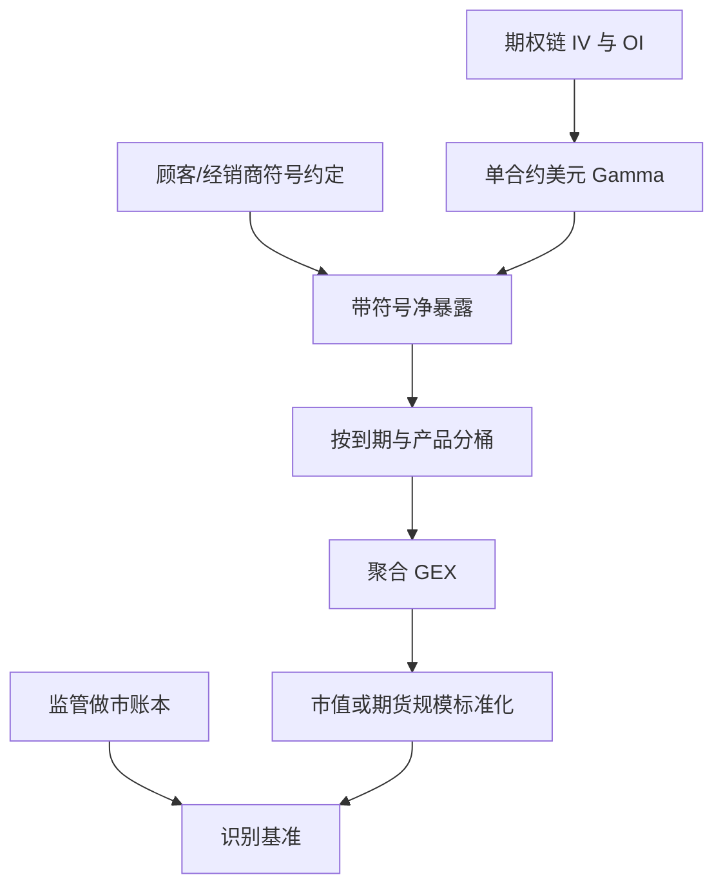

# GEX 计算与聚合

公开未平仓量乘以期权 Gamma，只能得到市场的凸性存量，不能直接读出做市商账本；要把存量译成经销商对冲压力，必须加上谁持有这些合约的符号约定。

<footer>—— 需求与做市存货的期权定价见 Gârleanu, Pedersen and Poteshman, Review of Financial Studies, 2009；公开 GEX 口径的从业整理见 Mixon 对隐含定位的讨论与 SqueezeMetrics 的 Gamma Exposure 定义</footer>

指数期权的 Gamma 决定了，现货动一元时，对冲者要在标的或期货上买卖多少。把全市场未平仓合约的 Gamma 加总，得到一条可每日重算的存量，从业者称为 **GEX**（Gamma Exposure）。SqueezeMetrics 把这一加总写成公开指标；Scott Mixon 的工作强调：未平仓是双边的，**符号来自「顾客相对经销商谁是净多头」的假设**，而不是来自交易所公布的 OI 本身。Gârleanu、Pedersen 与 Poteshman（2009）从需求侧给出同一逻辑的均衡版本：无法对冲的做市存货会进入价格。本篇写 **如何从期权链计算与聚合 GEX**，以及公开口径相对监管账本缺什么。它不是根据 GEX 符号去抢经销商对冲单的流程；正负体制的市场含义见 [经销商正负 gamma 体制](/quant/dealer-gamma-regime)，零点见 [Gamma Flip](/quant/gamma-flip-level)。

## 问题

一张乘数为 $M$ 的期权，Black–Scholes（或曲面指定的）$\Gamma=\partial^2 V/\partial S^2$，现货 $S$ 变动时，Delta 变动约为 $\Gamma\,\Delta S$。对冲者若要保持 Delta 中性，需交易约 $-n\Gamma\Delta S$ 的标的（$n$ 为张数）。**美元 Gamma** 常写成

$$
\Gamma_{\$}= \Gamma\cdot S^{2}\cdot 0.01\cdot M,
$$

表示标的变动百分之一时，Delta 的美元变化（惯例因台而异，有的不用 $0.01$）。把链上每个执行价、每个到期的 $\Gamma_{\$}$ 与未平仓 $OI$ 相乘再求和，得到总量。问题立刻出现：$OI$ 没有符号。同一张未平仓，顾客多头则经销商空头 Gamma，顾客空头则相反。公开 GEX 必须选择一种 **符号规则**，否则加总只是「市场有多少凸性」，不是「经销商要买还是卖」。

Mixon 指出，把「OI 全部当作经销商空头」会在顾客净卖出（备兑、结构化发行）的区段把符号弄反。更干净的公共近似是：用 OCC 等披露的 customer / firm / market-maker 分类，或至少把看涨与看跌分开假设（例如顾客倾向买保护性看跌与投机性看涨，则经销商在看跌上偏多 Gamma、在看涨上偏空 Gamma——这仍是假设，须单独敏感性分析）。监管账本（Mixon 一类可及的定位数据）才接近「谁是残余做市」。公开研究能做的是：把假设写进公式，而不是把某一厂商的 GEX 时间序列当成观测到的账本。

### 合约乘数、标的与到期切片

S&P 500 上同时有 SPX（乘数 100、现金交割）、SPXW 周期权、以及 SPY 期权（乘数 100、标的为 ETF）。GEX 若只加 SPX 标准月，会漏掉目前占成交主导的周期权与 0DTE，见 [0DTE 微观结构](/quant/zero-dte-microstructure)。若把 SPY 与 SPX 的 $\Gamma_{\$}$ 直接相加，须把 ETF 与指数的美元暴露对齐（约十分之一的指数点位，且有创建赎回）。到期上，临近到期的 $\Gamma$ 在平值附近极尖，远月平坦：不加衰减地加总，会使 GEX 被当天到期的执行价主导——这有时正是想要的（对冲流量的即时压力），有时不是（存量风险）。应同时报告：**全日历加总**、**按到期分桶**、以及 **0DTE 单独一列**。

隐含波动来自中间价还是买卖价、是否剔除宽价差执行价，会改变虚值 Gamma。GEX 对翼部不敏感（Gamma 小），对平值附近的 IV 与 OI 极敏感。先清洗期权链，再谈符号。

## 方法

**单合约。** 对每个 $(K,T)$、看涨与看跌，用该点隐含波动算 $\Gamma$，再算 $\Gamma_{\$}$。利率、股息用与曲面一致的远期。美式 ETF 期权的 Gamma 与欧式指数期权不可混用同一公式而不加注。

**符号。** 记 $q^{c}_{K,T}$、$q^{p}_{K,T}$ 为看涨、看跌未平仓。一种公开常用的经销商约定（须在文中声明，不是定理）是：经销商对看涨为 $-\,q^{c}$、对看跌为 $+\,q^{p}$（即假设顾客净多看涨、净多看跌）。则

$$
\mathrm{GEX}=\sum_{K,T}\Big(-q^{c}_{K,T}\Gamma^{c}_{\$}+q^{p}_{K,T}\Gamma^{p}_{\$}\Big).
$$

另一种约定是全部取负（顾客净多期权、经销商净空 Gamma）。两种加总会改号、改零点。稳健做法是：**同时发布「无符号凸性存量」** $\sum |q|\Gamma_{\$}$ 与 **带约定的净 GEX**，并做符号翻转的敏感性。Mixon 的识别态度是：没有定位数据时，净 GEX 是带模型的估计量，不是会计科目。

**聚合。** 先对执行价求和，再对到期求和；或先按 $T$ 分桶（0DTE、周期权、标准月、远月）再加总。现货用指数现货还是期货，应与对冲工具一致：经销商多用 ES 期货对冲 SPX，GEX 对 $S$ 的定义应是期货可交易价格。OI 为日终快照，盘中 GEX 只能把 $\Gamma(S_t)$ 在日终 OI 上重估，**不能假装 OI 在盘中已知**。这是 [时点](/quant/point-in-time) 约束。

### 单位、标准化与跨日可比

原始 GEX 是美元 Delta / 百分之一现货，量级随 $S$ 与上市合约数漂移。跨日比较应除以指数市值、或除以期货合约美元价值、或除以无符号存量。标准化后的 GEX 才能谈「今天比去年高」。不要把不同厂商的 GEX 数值直接对比：乘数、$0.01$、是否含 SPY、符号约定都可能不同。复制应以公式与期权链为准，而不是以某张图的纵轴为准。

GEX 用的是 Gamma，不是 Vega。把隐含波动水平叫做「GEX」是口径错误。波动风险走 Vanna / Vega 存量，见 [Vanna / Charm 到期流](/quant/dealer-vanna-charm-flows)。

## 机制

GEX 要回答的机制问题只有一句：若经销商是 Gamma 的残余持有人，现货变动时他们为维持 Delta 中性而必须交易的标的数量，符号与规模是多少。正的经销商 Gamma 意味着现货上涨时经销商变多 Delta、需卖出标的，下跌时需买入，反馈偏抑制；负则相反。这是公开文献里对冲反馈的标准叙述，见下一篇体制。GEX **不**回答：下一笔零售市价单往哪走、某家银行在三点的执行算法、或如何排队抢在对冲之前。把加总存量当成盘口预测器，超出了 Mixon / GPP 给出的识别。

OI 日终、成交盘中，使 GEX 是慢变量加快速重估：一天之内变的是 $S$ 与 IV 进入 $\Gamma$ 的部分，不是仓位。0DTE 上市后，仓位本身也可以在一天内从开盘建到收盘消失，日终 GEX 对当日路径的解释力下降，必须用盘中成交与持仓代理，或承认指标有滞后。

### 与需求压力、买卖压的关系

Bollen 与 Whaley（2004）用净买入压力解释偏斜形状；GPP（2009）用无法对冲的存货解释溢价。GEX 是存货的 Gamma 投影，不是需求流本身。流是成交的增量，GEX 是存量。二者相关但不互换：大额成交若很快平掉，GEX 不变而短期对冲流很大。公开链上能较稳估计的是存量；流需要成交方向分类，误差更大。研究设计应预指定看存量还是看流，不要事后把「GEX 变化」改叫「流」。

## 边界与工程取舍

公开 GEX 的硬边界是符号不可观测。OCC 分类、CFTC 期货定位、基金 N-PORT 里的期权明细，只能局部改善，不能还原全市场经销商。跨上市（指数、ETF、个股期权、灵活合约 FLEX）会漏记。隔夜跳空使 $\Gamma$ 在开盘重估，日终 GEX 不描述跳空瞬间的对冲。A 股与港股的做市与持仓披露不同，不可把 SPX 的符号惯例搬过去。

本篇只定义计算。用 GEX 做交易信号会把估计误差、符号约定与拥挤一齐买进，且容易滑向「抢对冲单」的叙事；那不是公开文献支持的研究设计。公开文献支持的是：把 GEX 当状态变量，检验已实现波动、日内均值回复与尾部是否随体制变化，并报告对符号假设的稳健性。

同一日终 OI，用开盘价与收盘价重估的 GEX 可以变号，若现货穿过了大量平值 Gamma。这不是数据错误，而是 Gamma 对 $S$ 的依赖。报告时应注明用哪一个 $S$。

## 小结

- GEX 是期权美元 Gamma 按未平仓聚合的存量；符号来自经销商相对顾客的持仓假设，不是来自 OI 字段本身。
- Mixon 与 GPP 的要点是识别：公开链给出凸性规模，监管账本才接近残余做市。
- 聚合须声明产品（SPX/SPXW/SPY）、到期分桶、乘数与标准化；0DTE 应单独列。
- 日终 OI 加盘中 $\Gamma(S)$ 重估，不等于盘中持仓。
- 出处：Gârleanu, Pedersen and Poteshman, *RFS*, 2009；Bollen and Whaley, *JF*, 2004；Mixon 对隐含定位与公开 Gamma 口径的讨论；SqueezeMetrics Gamma Exposure 定义（公开从业口径）。
